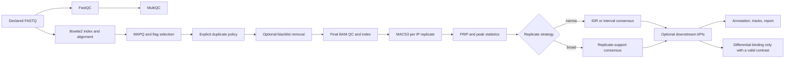

# HelixForge ChIP-seq benchmark design

This directory freezes the ChIP-seq benchmark **before any scientific result is
observed**. It deliberately separates narrow transcription-factor enrichment
from broad histone-mark enrichment. The design is not a validation result and
does not change any workflow, module, scientific schema, default or output
semantic.

## Frozen scientific subject

| Item | Frozen value |
|---|---|
| HelixForge version | `1.0.0-rc.1` |
| Benchmark target commit | `0829c7c154dc634ffd4e13672b95ad4fbdc5957f` |
| Last ChIP-seq feature commit | `a7b939fadc22f17db0c0517759a3985a9f2c25cf` (`Emit ChIP run manifest`) |
| Last ChIP-seq code maintenance commit | `731a2b6c71c4f52c71c690b47b2e6204ccd8f6b2` |
| Nextflow / Java | `25.10.7` / `21` |
| Simulator | ChIPs `v2.4`, commit `766c92cbb50783a537c897431b77e6bff8dba506` |
| MACS3 | `3.0.4` |

The target is the current `master` immediately before this design branch. It
contains the current ChIP-seq code, immutable OCI references, terminal run
manifest and the documentation-only reference update. The more specific
feature and maintenance commits are recorded so an auditor can distinguish
scientific evolution from editorial history.

## Frozen benchmark arms

1. **Synthetic narrow:** 1,500 true 400 bp regions with known summits, two
   paired-end ChIP replicates and one matched Input.
2. **Synthetic broad:** 360 true domains balanced across three width and three
   signal classes, two paired-end ChIP replicates and one matched Input.
3. **Real narrow:** ENCODE K562 CTCF `ENCSR000AKO`, two single-end biological
   replicates and Input `ENCSR000AKY`.
4. **Real broad:** ENCODE K562 H3K27me3 `ENCSR000AKQ`, biological replicates 1
   and 2 and the same Input experiment.

The public datasets intentionally share organism, cell line, laboratory,
assembly and Input experiment. This limits reference and download variability
without treating Input as biological ground truth.

## Current official path

There is no native ChIP-seq trimming step. The official aligner is Bowtie2.
`full` also composes differential binding, which is scientifically inapplicable
to the selected single-condition experiments; the benchmark therefore uses
`idr` for narrow and `consensus` for broad and does not manufacture a contrast.

## Documents

- [Complete protocol](protocol/benchmark_protocol.md)
- [Design freeze report](protocol/design_freeze_report.md)
- [Implementation audit](protocol/implementation_audit.md)
- [Feature matrix](protocol/chipseq_feature_matrix.tsv)
- [Metric definitions](protocol/metrics.md)
- [Interpretation criteria](protocol/interpretation_criteria.md)
- [Frozen run matrix](configs/run_matrix.tsv)
- [Frozen MACS3 parameters](configs/macs3_parameters.json)
- [Operational policy](protocol/operational_policy.md)
- [Cost estimate](protocol/cost_estimate.md)
- [Risks and limitations](protocol/risks_and_limitations.md)
- [Dataset registry](datasets/dataset_registry.md)
- [Future script contracts](scripts/README.md)
- [Truth contracts](truth/README.md)
- [Provenance contract](provenance/README.md)
- [Planned reports](reports/README.md)

No FASTQ, BAM, reference, work directory or scientific result is versioned
here. The next action requires maintainer review; this branch must not start a
benchmark automatically.

**Design status: `CHIPSEQ_BENCHMARK_DESIGN_FROZEN`.**
