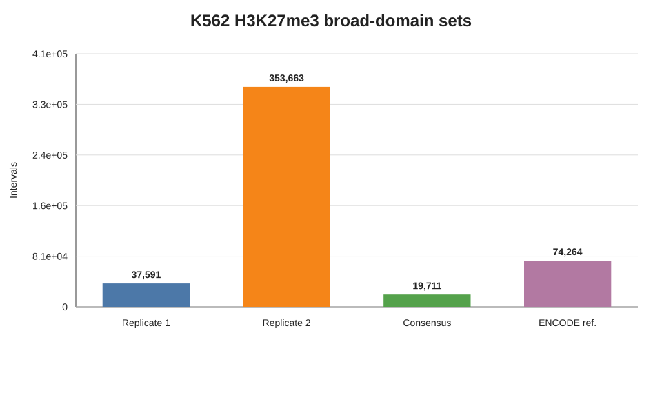
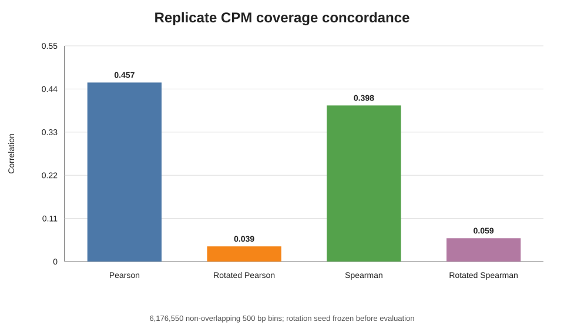
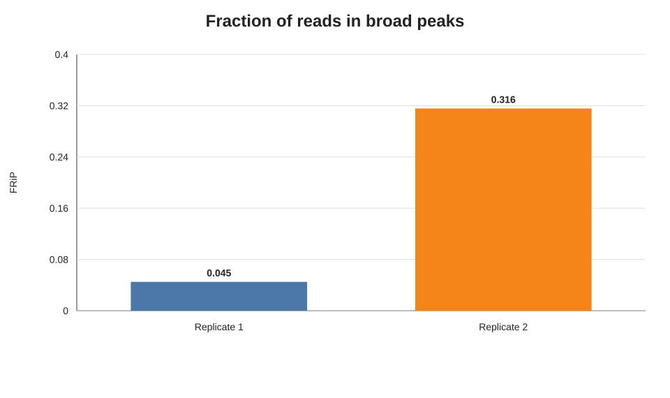
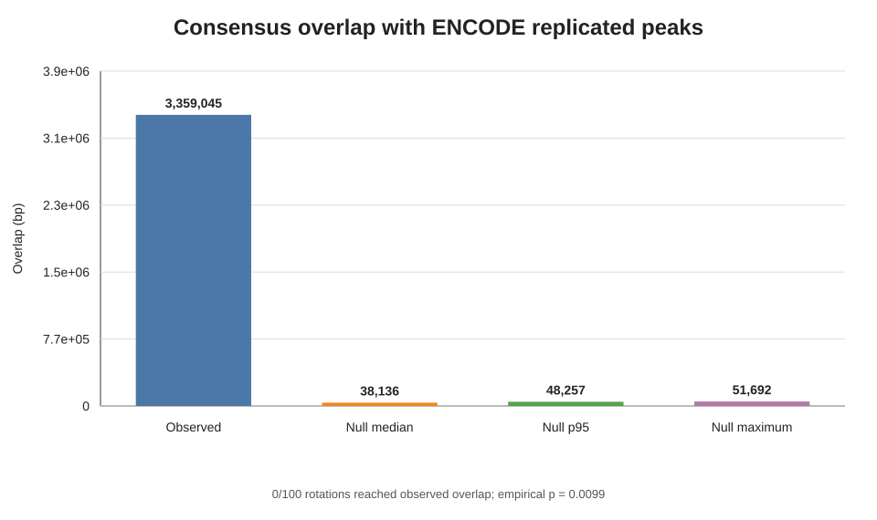
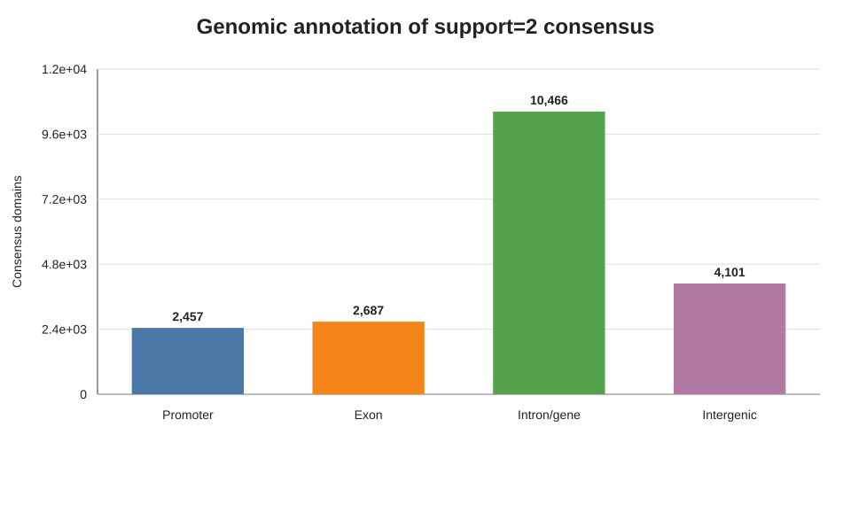
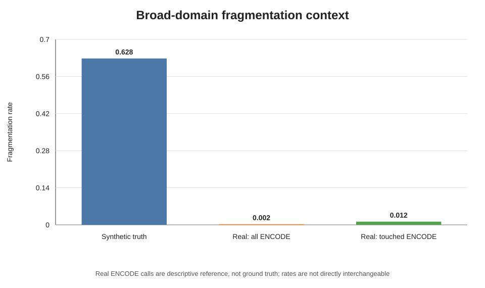

# Real Broad biological benchmark

## Classification

**PASS_WITH_LIMITATIONS**

The native HelixForge ChIP-seq broad-peak path completed on Slurm from public
K562 H3K27me3 FASTQs through QC, Bowtie2, BAM processing, MACS3, FRiP and a
replicate-support=2 consensus. An independent implementation started from the
same raw FASTQs and produced coordinate-identical replicate broadPeak sets and
consensus domains (`base Jaccard = 1.0` for all three comparisons).

RB1, RB2 and RB3 passed without changing a frozen threshold. RB4 and RB5 are
descriptive by design. The classification retains limitations because ENCODE
flags the historical libraries for insufficient usable depth, one replicate
contains mixed 36/47 bp reads, replicate results are markedly asymmetric, and
the external BigWig concordance component of RB5 was not computed without a
reader in the frozen runtime.

## Frozen execution

| Item | Value |
|---|---|
| Scientific target | `0829c7c154dc634ffd4e13672b95ad4fbdc5957f` |
| Dataset | ENCODE `ENCSR000AKQ`, K562 H3K27me3 |
| Replicates | `ENCFF000BXP`, `ENCFF000BXN` |
| Shared Input | `ENCFF000BWK` from `ENCSR000AKY` |
| Reference | GENCODE 50, GRCh38.p14 primary assembly |
| Blacklist | `ENCFF356LFX` |
| External processed peaks | `ENCFF049HUP`, descriptive reference rather than ground truth |
| External signal | `ENCFF366NNJ`, retained but not interpreted by the frozen runtime |
| Runtime | Nextflow 25.10.7, Java 21, Slurm |
| Peak calling | MACS3 3.0.4, broad mode, q=0.01, default broad cutoff=0.1 |
| Consensus | replicate support=2; broad IDR intentionally disabled |

## Technical execution

| Check | Result |
|---|---:|
| HelixForge tasks | 37/37 completed |
| Failed HelixForge tasks | 0 |
| Replicate broadPeak sets | 2/2 non-empty |
| Support=2 consensus domains | 19,711 |
| Independent end-to-end path | completed |
| Replicate 1 concordance | exact coordinates; base Jaccard 1.0 |
| Replicate 2 concordance | exact coordinates; base Jaccard 1.0 |
| Consensus concordance | exact coordinates; base Jaccard 1.0 |
| MultiQC | produced |
| Nextflow trace and execution artifacts | produced |

The HelixForge path took approximately 1 h 44 min wall time, including a new
Bowtie2 index, and its largest recorded task RSS was 9.3 GiB. The independent
path took 1 h 57 min 26 s with maximum RSS near 16.0 GiB. The frozen evaluator
completed in 2 min 14 s with maximum RSS near 1.3 GiB. These shared-cluster
measurements are descriptive rather than comparative performance claims.

## Broad-domain QC

| Metric | Replicate 1 | Replicate 2 | Support=2 consensus |
|---|---:|---:|---:|
| Intervals | 37,591 | 353,663 | 19,711 |
| Median width | 323 bp | 175 bp | 185 bp |
| Mean width | 386.9 bp | 269.7 bp | 217.7 bp |
| Maximum width | 6,298 bp | 5,247 bp | 3,373 bp |
| FRiP | 0.0450 | 0.3157 | — |

The marked replicate asymmetry is not hidden: replicate 2 has many more,
shorter calls and substantially higher FRiP. Base Jaccard between the two full
replicate peak unions is 0.0406. Nevertheless, genome-wide CPM coverage across
6,176,550 non-overlapping 500 bp bins is positively concordant (Pearson
`0.4565`; Spearman `0.3980`). The frozen chromosome-preserving rotation yields
only Pearson `0.0386` and Spearman `0.0594`, so RB2 passes.

## External biological concordance

The consensus overlaps 3,359,045 bp of ENCODE replicated peaks `ENCFF049HUP`,
with base Jaccard `0.1417`. None of 100 chromosome-preserving rigid rotations
reached that observed overlap. With the predeclared `(1 + exceedances) / 101`
calculation, empirical `p = 0.00990099`; RB3 therefore passes exactly at the
smallest attainable p-value for 100 rotations.

The ENCODE file remains an external plausibility reference, not ground truth.
Of 74,251 reference domains on shared canonical contigs, 15,043 had a
substantial consensus neighbour and 182 had two or more. The resulting
fragmentation context is 0.245% across all external domains and 1.210% among
touched domains. Both are far below the frozen synthetic broad fragmentation
rate of 62.8%. This supports the interpretation that the synthetic topology
limitation was not strongly reproduced here, but the rates are not treated as
formally interchangeable because the biological reference is not truth.

Consensus annotations comprise 2,457 promoter, 2,687 exon, 10,466
intron/gene-body and 4,101 intergenic domains. This genome-wide distribution is
descriptive and no post-hoc locus panel is used as a gate.

## Frozen criteria

| Criterion | Type | Result |
|---|---|---|
| RB1: two replicates, matched Input, broadPeak and support=2 consensus | release gate | PASS |
| RB2: positive CPM correlation exceeding frozen rotation | sanity check | PASS |
| RB3: ENCODE overlap exceeding 100 matched rotations | expected range | PASS (`p=1/101`) |
| RB4: genome-wide annotation distribution | descriptive | REPORTED |
| RB5: domain widths, FRiP and signal concordance | descriptive | PARTIALLY REPORTED |

RB5 includes counts, widths and FRiP. Concordance against external BigWig
`ENCFF366NNJ` is recorded as not computed because the frozen runtime contains
no BigWig reader. A new environment was not introduced after execution solely
to complete a non-gating metric.

## Figures

The dependency-free SVG figures are generated exclusively from the frozen
compact evidence under [`results/real_broad/`](../results/real_broad/).

## Interpretation boundary

This benchmark validates the real-data K562 H3K27me3 broad path, including
native orchestration, support-based consensus, independent implementation
concordance and external biological plausibility. It does not establish broad
peak accuracy against biological ground truth, eliminate the documented
library-quality limitations, or generalize automatically to other histone
marks, organisms or sequencing depths.
