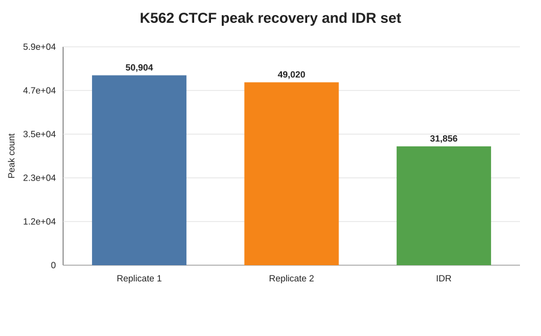
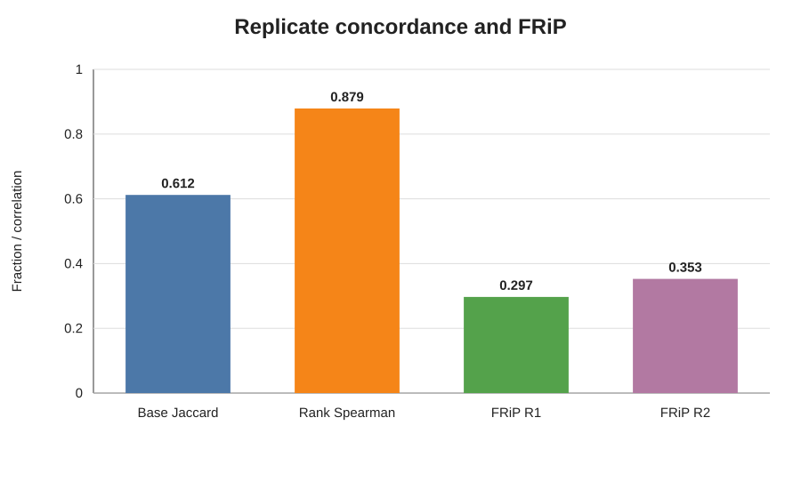
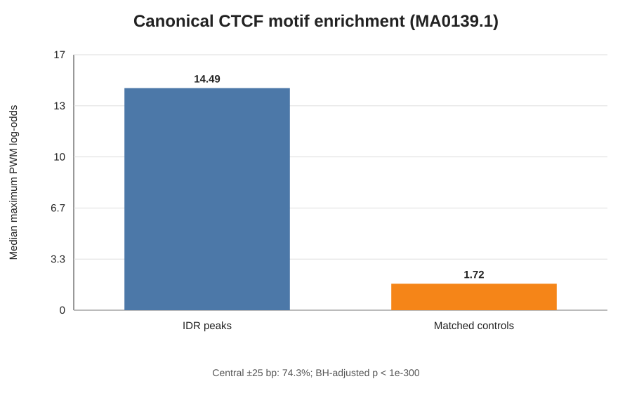
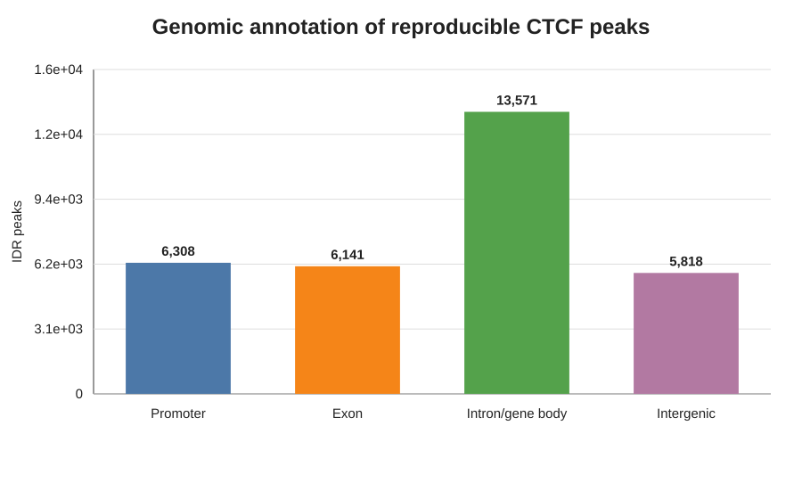
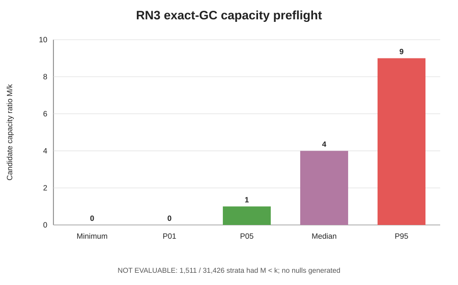
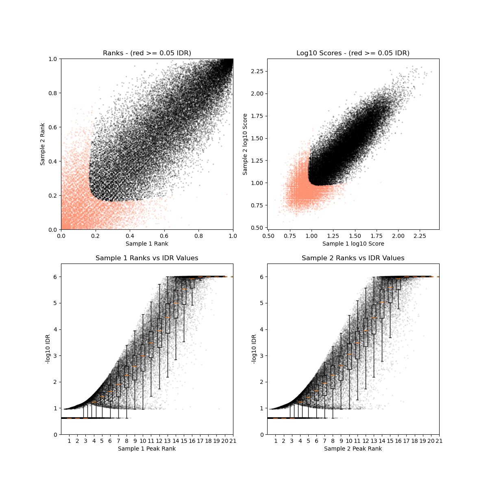

# Real Narrow biological benchmark

## Classification

**PASS_WITH_LIMITATIONS**

The native HelixForge ChIP-seq narrow-peak path completed on Slurm from public
K562 CTCF FASTQs through QC, Bowtie2, BAM processing, MACS3, FRiP and IDR. An
independent implementation started from the same FASTQs and produced
semantically identical replicate peaks and a byte-identical final IDR set.

The applicable release gates passed. Canonical CTCF motif enrichment and
replicate concordance were strong. RN3, the inferential comparison with the
ENCODE reference peak set, is `NOT_EVALUABLE_UNDER_FROZEN_CONTROL_REQUIREMENTS`:
the final pre-registered exact-GC null failed its capacity-only preflight before
null generation. This narrows the external-reference interpretation but does
not indicate a HelixForge execution error.

## Frozen execution

| Item | Value |
|---|---|
| Scientific target | `0829c7c154dc634ffd4e13672b95ad4fbdc5957f` |
| Dataset | ENCODE `ENCSR000AKO`, K562 CTCF |
| Replicates | `ENCFF000BWM`, `ENCFF000BWR` |
| Shared Input | `ENCFF000BWK` from `ENCSR000AKY` |
| Reference | GENCODE 50, GRCh38.p14 primary assembly |
| Blacklist | `ENCFF356LFX` |
| External processed peaks | `ENCFF519CXF`, descriptive reference rather than ground truth |
| Runtime | Nextflow 25.10.7, Java 21, Slurm |
| Peak calling | MACS3 3.0.4, narrow mode, q=0.01 |
| Reproducibility | IDR 2.0.4.2, threshold 0.05, rank by signal value |

## Technical execution

| Check | Result |
|---|---:|
| HelixForge tasks | 37/37 completed |
| Failed HelixForge tasks | 0 |
| Replicate peak sets | 2/2 non-empty |
| Final IDR peaks | 31,856 |
| Independent end-to-end path | completed |
| Replicate peak concordance | semantic identity for both replicates |
| IDR concordance | byte-identical |
| MultiQC | produced |
| Nextflow report, timeline, trace and DAG | produced |

The HelixForge run took approximately 1 h 45 min 40 s wall time, including a
new Bowtie2 reference index. The independent path took 1 h 03 min 24 s. Maximum
Slurm RSS was approximately 10.0 GiB for a HelixForge task and 19.7 GiB for the
independent job. These shared-cluster measurements are descriptive, not release
gates.

## Peak QC and reproducibility

| Metric | Replicate 1 | Replicate 2 |
|---|---:|---:|
| MACS3 peaks | 50,904 | 49,020 |
| FRiP | 0.2969 | 0.3527 |

Across replicates, 41,934 peaks were matched. Base-level Jaccard was 0.6120 and
the matched-peak rank Spearman correlation was 0.8792. IDR retained 31,856
reproducible peaks.

## Biological plausibility

The canonical CTCF motif `MA0139.1` was strongly enriched around IDR summits.
Median maximum PWM log-odds score was 14.49 in peak windows and 1.72 in matched
controls; the adjusted Mann–Whitney p-value underflowed to zero. Of evaluable
peak windows, 74.35% placed the maximum motif score within ±25 bp of the
summit.

IDR peaks were annotated as 6,308 promoter, 6,141 exon, 13,571 intron/gene-body
and 5,818 intergenic records. These categories are descriptive and may overlap
the biological concepts used by other annotation frameworks.

The preregistered beta-globin region remained a qualitative positive-control
definition, but no separate locus-panel image was retained in the compact
evaluation. No locus-specific conclusion or post-hoc gate is claimed here.

The observed overlap with ENCODE `ENCFF519CXF` was 10,246,893 bp, with base
Jaccard 0.4352 across the shared contig universe. This value remains useful as
a descriptive reference. Its original nominal empirical p-value is invalid for
inference because the corresponding null generator failed diversity audit.

## RN3 limitation

Three attempted null contracts were retained transparently:

1. rigid chromosomal rotation could not preserve the observed GC composition;
2. nearest-GC relocation and GC-decile balancing failed structural diversity;
3. the final chromosome × exact width × exact integer GC-count contract failed
   the pre-inference capacity gate.

The final preflight evaluated 31,426 operational strata. In 1,511 strata,
candidate capacity `M` was below demand `k`, affecting 1,546 observed peaks.
Consequently, no final null sets were generated, RN3 was not calculated, and no
fourth ad hoc model is permitted. The limitation is explicitly methodological;
it neither changes the observed overlap nor weakens the independent-path
concordance.

## Frozen criteria

| Criterion | Type | Result |
|---|---|---|
| RN1: replicates, matched Input, peaks and IDR output | release gate | PASS |
| RN2: canonical CTCF motif enrichment | sanity check | PASS |
| RN3: ENCODE overlap versus matched null | expected range | **NOT EVALUABLE** |
| RN4: positive rank correlation and non-empty IDR subset | expected range | PASS |
| RN5: QC, peak count, FRiP and annotation | descriptive | REPORTED |

No frozen threshold was relaxed. The Real Narrow arm is classified
`PASS_WITH_LIMITATIONS` because execution, reproducibility and biological
plausibility passed while RN3 could not be evaluated under its final frozen
control requirements.

## Figures

The dependency-free SVG summary figures are accompanied by a checksum
manifest. Compact metrics, execution trace and the final capacity
evidence are retained under
[`results/real_narrow/`](../results/real_narrow/).

## Interpretation boundary

This benchmark validates the real-data K562 CTCF narrow-peak path, including
native orchestration, reproducibility, independent implementation concordance
and canonical motif recovery. It does not establish performance for broad
histone marks, other organisms or every sequencing depth. ENCODE processed
peaks provide external plausibility context and are not treated as biological
ground truth.
