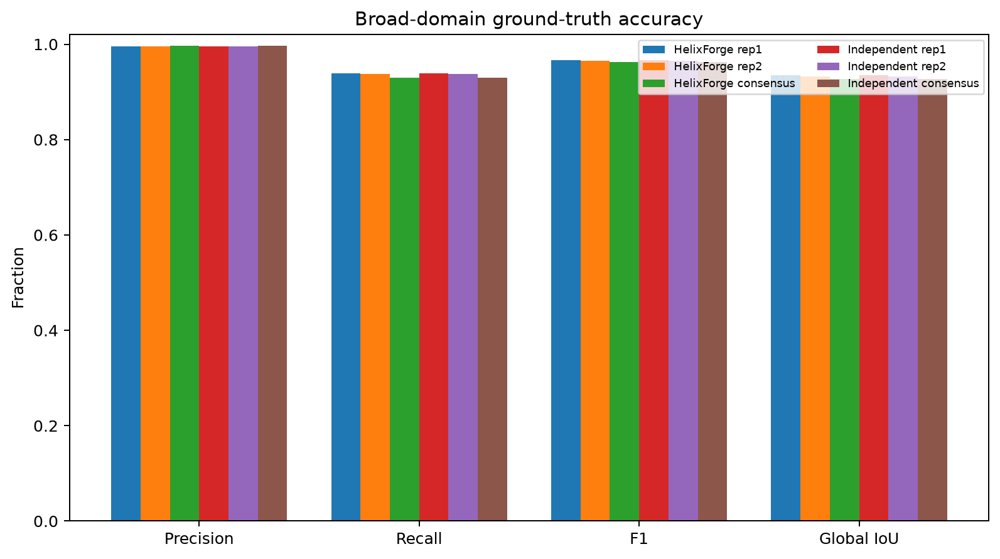
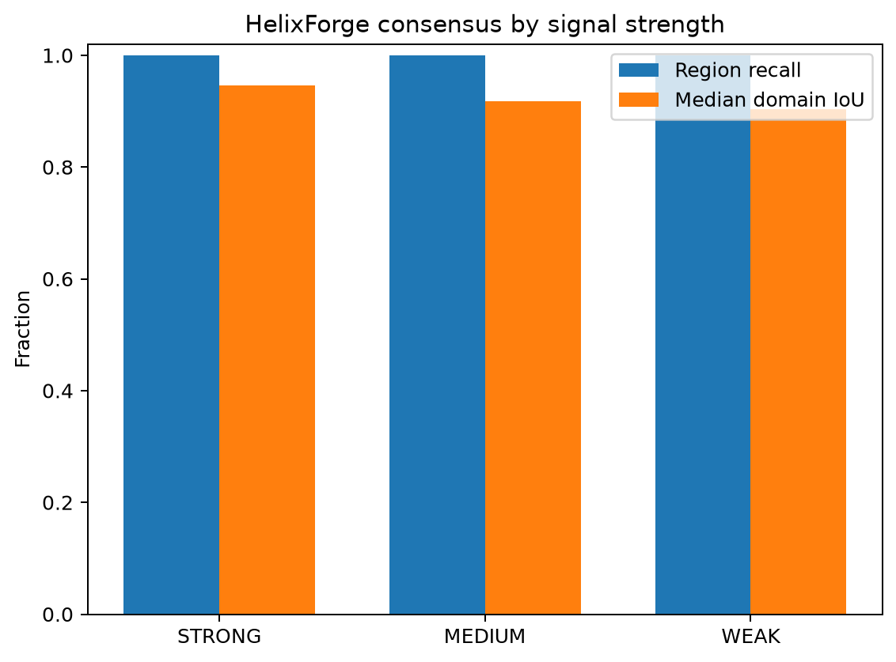
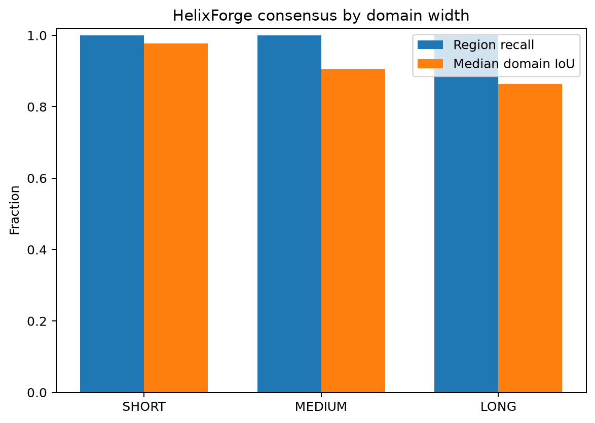
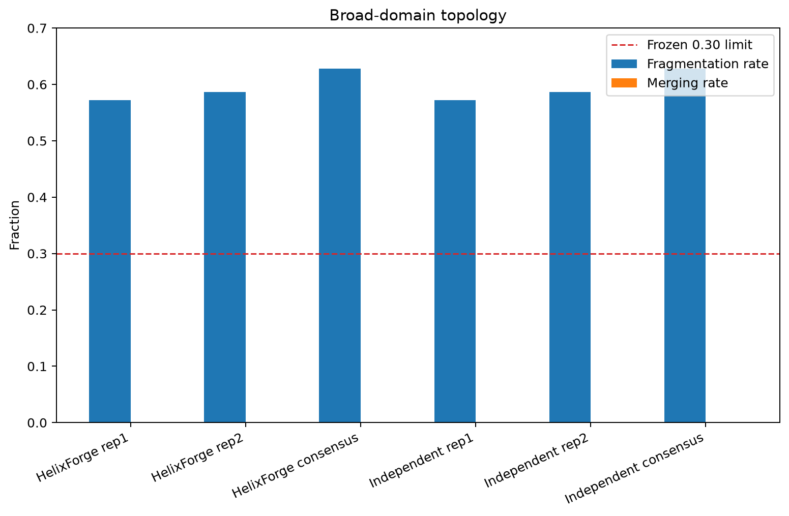
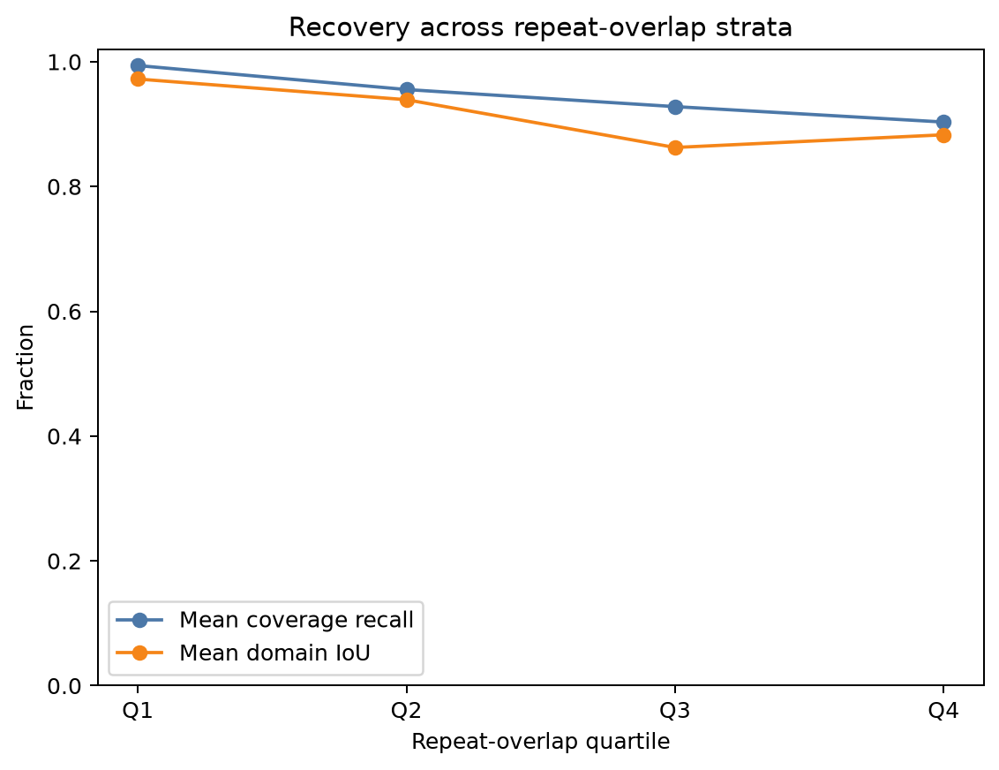
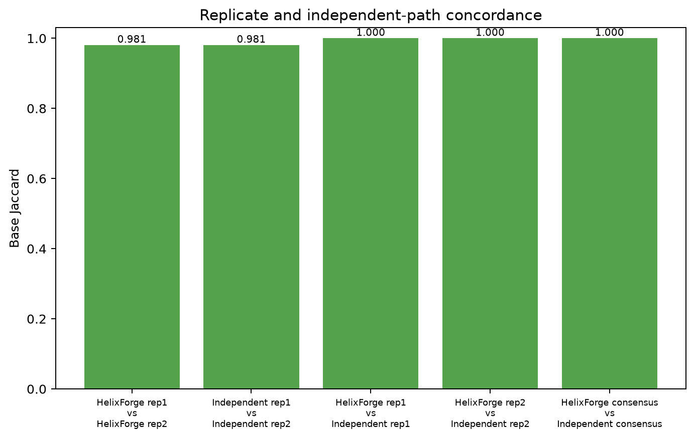
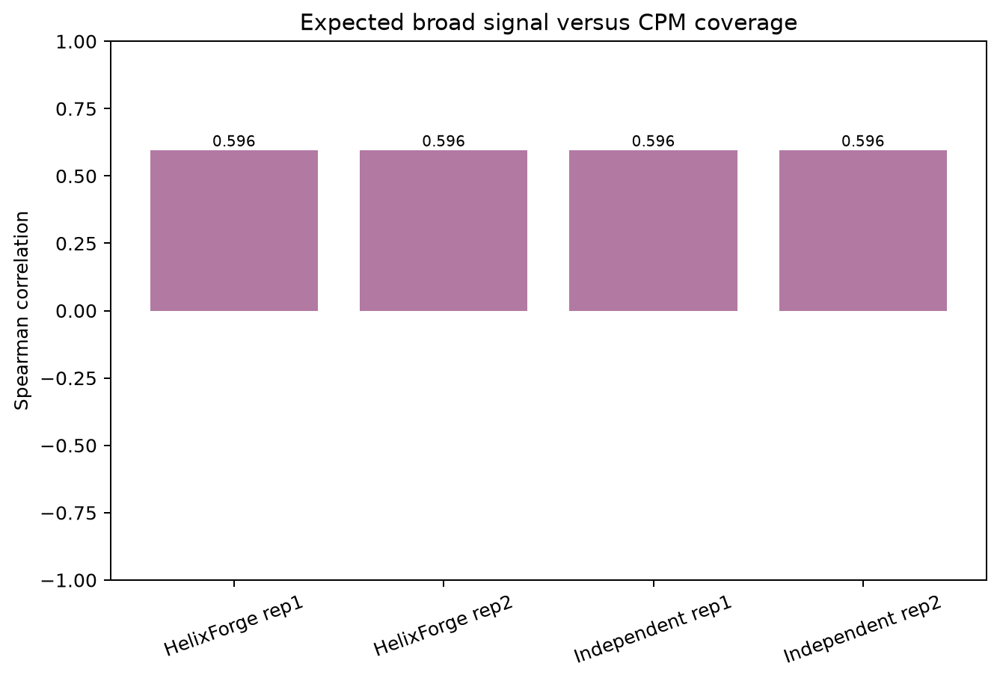

# Synthetic broad-domain benchmark

## Classification

**PASS_WITH_LIMITATIONS**

The complete native HelixForge ChIP-seq broad-domain path ran successfully on
Slurm from paired-end FASTQ through FastQC/MultiQC, Bowtie2, BAM processing,
MACS3 broad peak calling, FRiP and replicate-support consensus. An independent
implementation started from the same raw FASTQs and rebuilt its own index,
alignments, filtered BAMs, broad peaks and consensus. It did not reuse
HelixForge scientific work products.

Every applicable release gate passed, and HelixForge was exactly concordant
with the independent path for both replicate peak sets and the final
consensus. The frozen `B3` expected range did not pass: 62.8% of truth domains
were represented by more than one consensus component, above the maximum of
30%. The criterion remains unchanged. This is a documented topology
limitation, not evidence of orchestration divergence; the independent path
produced the same fragmentation result.

## Frozen execution

| Item | Value |
|---|---|
| Scientific target | `0829c7c154dc634ffd4e13672b95ad4fbdc5957f` |
| Design freeze | `bb8db940ee137fee67fe5f13530521326c96dfc0` |
| Pre-execution amendment | `55edf32` — broad-domain repeat traversal |
| Runtime | Nextflow 25.10.7, Java 21, Slurm |
| Dataset | ChIPs v2.4 synthetic broad, 3 × 20 Mb genome |
| Truth | 360 domains, balanced across 3 widths × 3 signal classes |
| Libraries | two ChIP replicates and one matched Input, PE75, 12 M pairs each |
| Peak caller | MACS3 3.0.4, `BAMPE`, broad mode, q=0.01, effective genome 54 M |
| Reproducibility | interval consensus with support from both replicates |

The ChIPs source was frozen at upstream v2.4 commit
`766c92cbb50783a537c897431b77e6bff8dba506`. The cluster upgrade exposed an
x86-64-v3 incompatibility in the initial Conda-built binary. The executed
hybrid build compiled C++ with GCC 12 and linked against the Debian 13 system
runtime, passed a smoke test on the execution node and had SHA-256
`ca13e1ef16687efa8698c4a13f0d3a541952fdf5d4c6d8d6f5cfa9f73e766713`.

## Protocol amendment

Before truth generation or result inspection, the frozen rule excluding
repeat traversal was found geometrically impossible for medium and long
domains. The approved amendment permits domain interiors to traverse repeats,
keeps both boundaries in eligible sequence with the frozen buffer and records
repeat overlap per domain. Counts, widths, signals, seeds, tools, thresholds
and acceptance criteria were not changed. No domain was excluded after the
results were observed.

## Technical execution

| Check | Result |
|---|---:|
| HelixForge Nextflow tasks | 40/40 completed |
| Replicate broadPeak sets | 2/2 non-empty |
| HelixForge consensus regions | 1,026 |
| Independent consensus regions | 1,026 |
| HelixForge vs independent base Jaccard | 1.000 |
| MultiQC report | produced |
| Nextflow report, timeline, trace and DAG | produced |
| Independent end-to-end path | completed in 1 h 08 min 36 s |

The authoritative technical evidence is in
[`technical/`](../results/synthetic_broad/technical/).

## Ground-truth accuracy

| Peak set | Regions | Precision | Recall | F1 | Global IoU | Domain recall | Median domain IoU |
|---|---:|---:|---:|---:|---:|---:|---:|
| HelixForge replicate 1 | 957 | 0.9951 | 0.9389 | 0.9662 | 0.9346 | 1.000 | 0.9296 |
| HelixForge replicate 2 | 975 | 0.9952 | 0.9372 | 0.9653 | 0.9329 | 1.000 | 0.9296 |
| HelixForge consensus | 1,026 | 0.9965 | 0.9302 | 0.9622 | 0.9272 | 1.000 | 0.9226 |
| Independent consensus | 1,026 | 0.9965 | 0.9302 | 0.9622 | 0.9272 | 1.000 | 0.9226 |

All 360 truth domains were recovered by the final consensus. Median absolute
boundary error was 51.5 bp (P90 81.3 bp; P95 91 bp), and no call merged two or
more truth domains.

## Signal and width strata

| Signal | Domains | Recall | Mean covered fraction | Median IoU | Fragmentation |
|---|---:|---:|---:|---:|---:|
| STRONG | 120 | 1.000 | 0.9675 | 0.9465 | 0.5500 |
| MEDIUM | 120 | 1.000 | 0.9422 | 0.9176 | 0.6667 |
| WEAK | 120 | 1.000 | 0.9258 | 0.9039 | 0.6667 |

| Width | Domains | Recall | Mean covered fraction | Median IoU | Fragmentation |
|---|---:|---:|---:|---:|---:|
| SHORT_BROAD | 120 | 1.000 | 0.9939 | 0.9770 | 0.0000 |
| MEDIUM_BROAD | 120 | 1.000 | 0.9124 | 0.9051 | 0.9167 |
| LONG_BROAD | 120 | 1.000 | 0.9292 | 0.8647 | 0.9667 |

The `B1` sanity check passed: STRONG recall was not lower than WEAK recall.
Fragmentation is concentrated in medium and long domains, while all short
domains remained unfragmented. The repeat-overlap covariate is retained in
[`repeat_overlap_metrics.tsv`](../results/synthetic_broad/metrics/repeat_overlap_metrics.tsv)
and was not used to exclude difficult domains.

## Coverage and replicate concordance

| Comparison | Pearson | Spearman |
|---|---:|---:|
| Expected signal vs HelixForge replicate 1 | 0.9953 | 0.5965 |
| Expected signal vs HelixForge replicate 2 | 0.9953 | 0.5965 |
| HelixForge replicate 1 vs replicate 2 | 0.9908 | 0.3561 |
| HelixForge vs independent replicate 1 | 1.0000 | 1.0000 |
| HelixForge vs independent replicate 2 | 1.0000 | 1.0000 |

Replicate broad-peak base Jaccard was 0.9806. FRiP was 0.54160 for replicate
1 and 0.54147 for replicate 2, measured in fragment units after MAPQ 30
filtering. These shared-cluster and synthetic-signal metrics are descriptive.

## Frozen criteria

| Criterion | Type | Result |
|---|---|---|
| B1: STRONG recall not materially below WEAK | sanity check | PASS |
| B2: consensus base F1 ≥0.60 | expected range | PASS |
| B2: median per-domain IoU ≥0.40 | expected range | PASS |
| B3: fragmentation ≤0.30 | expected range | **NOT MET** (0.628) |
| B3: merging ≤0.30 | expected range | PASS (0.000) |
| B4: replicates and consensus evaluable and non-empty | release gate | PASS |
| B4: broad evaluation does not assume summits | release gate | PASS |

No frozen criterion was relaxed after observing the results. The failed B3
range triggers future topology review, not threshold tuning in this benchmark.

## Figures

Each figure is also available as PDF. The manifest records source checksums,
the Python and Matplotlib versions and output checksums.

## Descriptive performance

The HelixForge trace contains 40 completed tasks, 0 failures and 0 cached
tasks. Summed task duration was 6,745.7 s, summed CPU time was 29,843.3 s and
the maximum task RSS reported by Nextflow was approximately 7.3 GB. The
independent path peaked at approximately 9.58 GiB by Slurm accounting.

At collection time, the dataset occupied 14.31 GB, the HelixForge execution
12.04 GB, the independent path 4.19 GB and the compact evaluation 25.91 MB.
These values include NFS and shared-cluster effects and are not release gates.
Detailed trace and accounting data are in
[`performance/`](../results/synthetic_broad/performance/).

## Interpretation boundary

This arm validates native broad-domain orchestration, base-level recovery,
replicate-support consensus and exact agreement with an independent
implementation under the amended frozen synthetic design. It also identifies
a reproducible topology limitation for long and medium domains. It does not
establish performance on public biological H3K27me3 data, narrow transcription
factor peaks or the Integrative workflow; those are separate benchmark arms.
