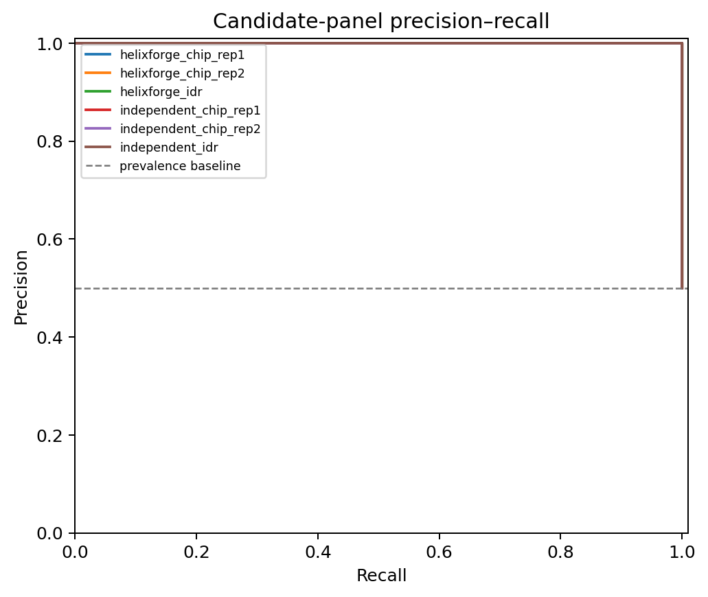
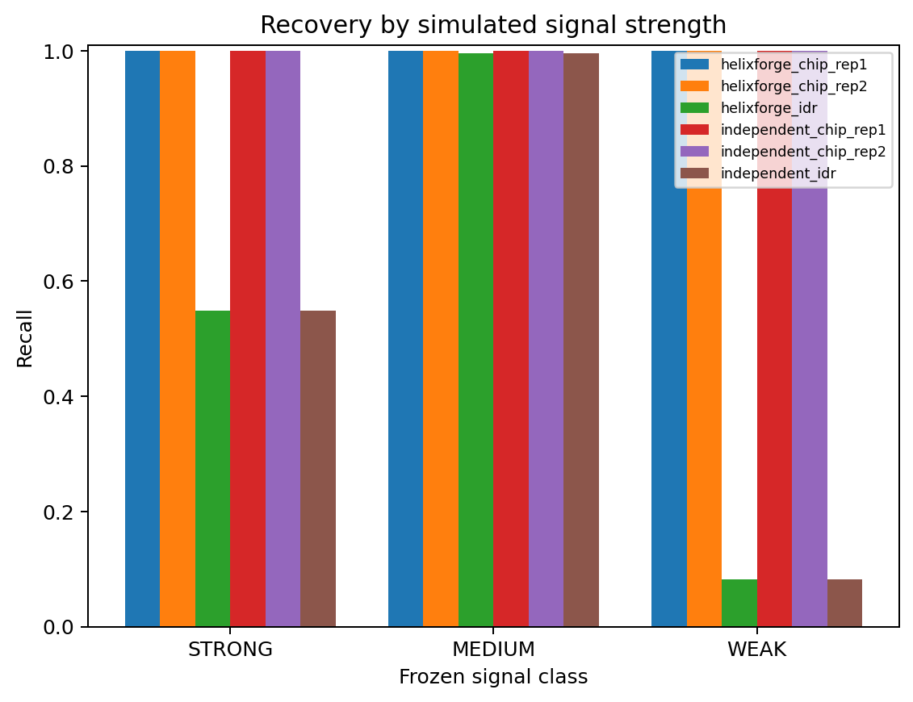
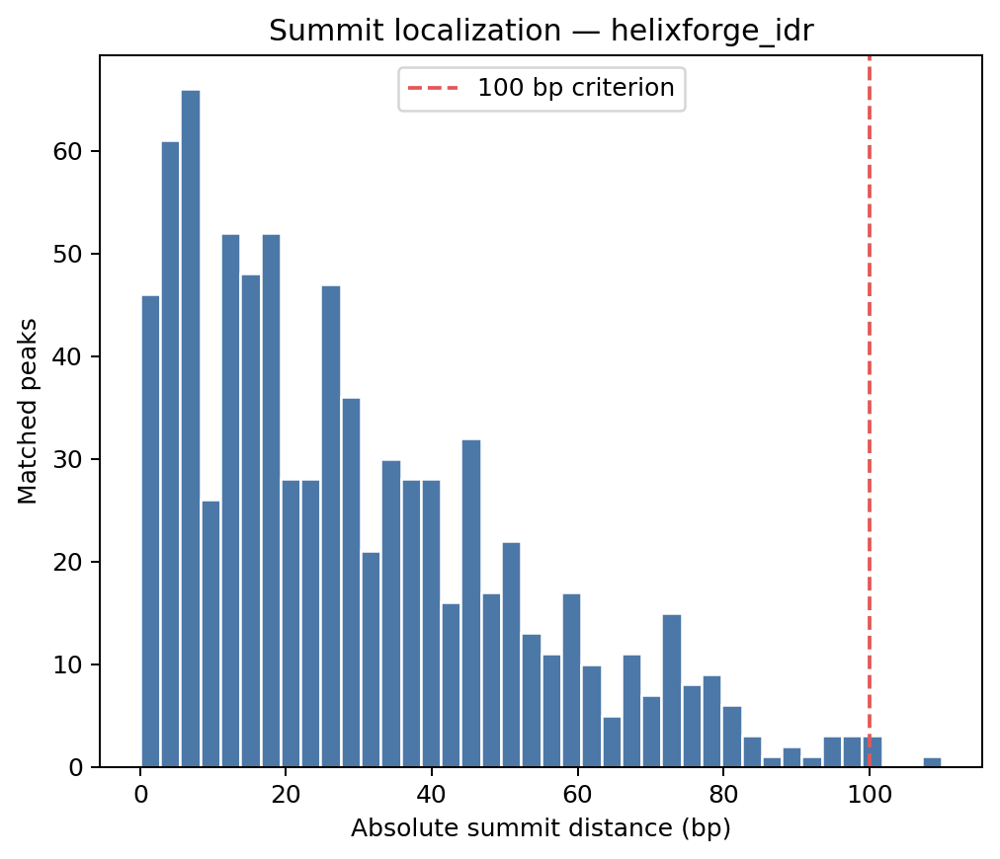
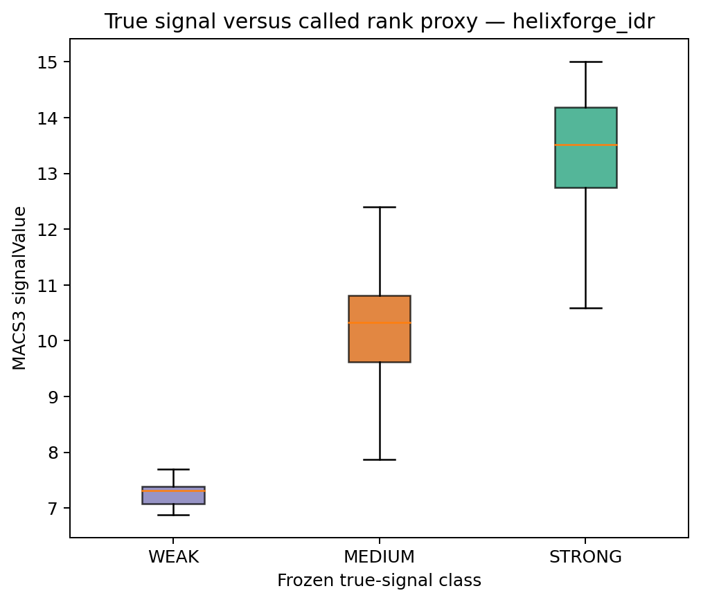
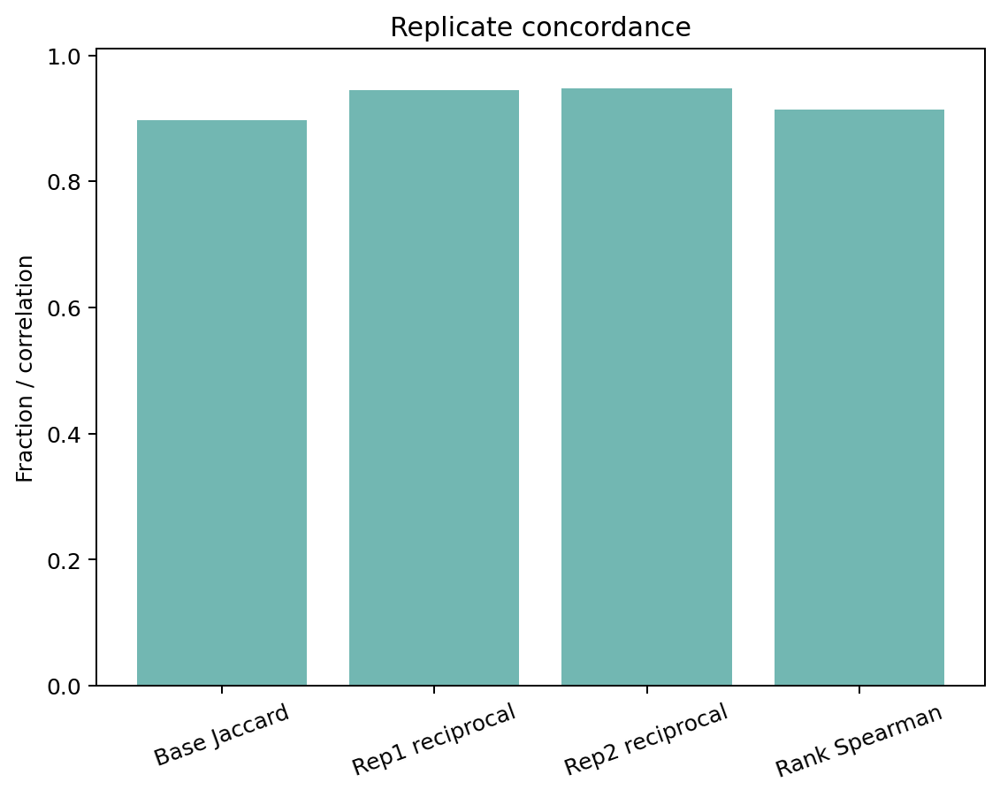
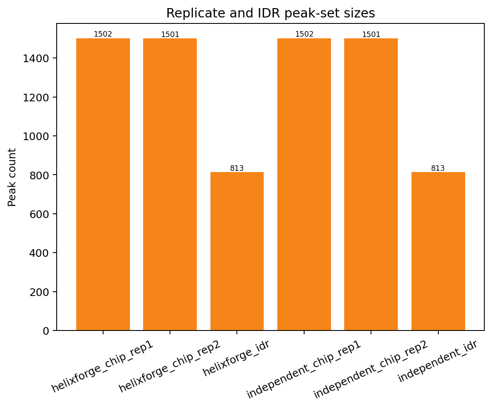

# Synthetic narrow-peak benchmark

## Classification

**PASS_WITH_LIMITATIONS**

The complete native HelixForge ChIP-seq narrow-peak path ran successfully on
Slurm from paired-end FASTQ through FastQC/MultiQC, Bowtie2, BAM processing,
MACS3, FRiP and IDR. An independent implementation started from the same raw
FASTQs and rebuilt its own index, alignments, filtered BAMs, peaks and IDR set.
It did not reuse HelixForge work products.

All applicable release gates passed. The predeclared `N2` expected range did
not pass because STRONG-class recall in the final IDR set was 0.548 rather than
the expected minimum of 0.80. The criterion remains unchanged. This result is
classified as a limitation rather than an implementation discrepancy because
HelixForge and the independent path produced byte-identical IDR peak sets and
identical scientific metrics.

## Frozen execution

| Item | Value |
|---|---|
| Scientific target | `0829c7c154dc634ffd4e13672b95ad4fbdc5957f` |
| Protocol commit | `bb8db940ee137fee67fe5f13530521326c96dfc0` |
| Runtime | Nextflow 25.10.7, Java 21, Slurm |
| Dataset | ChIPs v2.4 synthetic narrow, 3 × 20 Mb genome |
| Truth | 1,500 peaks: 500 STRONG, 500 MEDIUM, 500 WEAK |
| Libraries | two ChIP replicates and one matched Input, PE75, 8 M pairs each |
| Peak caller | MACS3 3.0.4, `BAMPE`, q=0.01, effective genome 54 M |
| Reproducibility | IDR 2.0.4.2, `signal.value`, threshold 0.05 |

The ChIPs source was the frozen upstream v2.4 commit
`766c92cbb50783a537c897431b77e6bff8dba506`. It was compiled with GCC 12.4.0
using the upstream default CMake build because forced optimized builds exposed
undefined behaviour in the upstream WCE path. The exact source checksum,
compiler and smoke-test evidence are retained in the audit archive.

## Technical execution

| Check | Result |
|---|---:|
| HelixForge Nextflow tasks | 40/40 completed |
| Peak sets from biological replicates | 2/2 non-empty |
| Final HelixForge IDR peaks | 813 |
| Final independent IDR peaks | 813 |
| HelixForge vs independent IDR SHA-256 | identical |
| MultiQC report | produced |
| Nextflow report, timeline, trace and DAG | produced |
| Independent end-to-end path | completed in 30 min 09 s |

The authoritative technical evidence is in
[`technical/`](../results/synthetic_narrow/technical/).

## Ground-truth accuracy

| Peak set | Peaks | Precision | Recall | F1 | FDP | Median summit error | AUPRC |
|---|---:|---:|---:|---:|---:|---:|---:|
| HelixForge replicate 1 | 1,502 | 0.9987 | 1.000 | 0.9993 | 0.0013 | 41 bp | 1.000 |
| HelixForge replicate 2 | 1,501 | 0.9993 | 1.000 | 0.9997 | 0.0007 | 40 bp | 1.000 |
| HelixForge IDR | 813 | 1.000 | 0.542 | 0.7030 | 0.000 | 24 bp | 0.771 |
| Independent IDR | 813 | 1.000 | 0.542 | 0.7030 | 0.000 | 24 bp | 0.771 |

The complete values, matching evidence and checksum manifest are in
[`metrics/`](../results/synthetic_narrow/metrics/).

## Signal classes and IDR limitation

| Signal class | Truth peaks | IDR recovered | Recall | Median called signal |
|---|---:|---:|---:|---:|
| STRONG | 500 | 274 | 0.548 | 13.519 |
| MEDIUM | 500 | 498 | 0.996 | 10.328 |
| WEAK | 500 | 41 | 0.082 | 7.311 |

The called-signal medians preserve the declared STRONG > MEDIUM > WEAK order,
and the correlation between declared signal and called rank in the final set
is positive (`Spearman = 0.831`). Thus no global sign/rank inversion is
observed. Nevertheless, the unexpectedly higher retention of MEDIUM peaks by
IDR remains a simulator/IDR interaction that narrows interpretation of this
controlled arm. It must be investigated in future robustness work rather than
hidden by changing the frozen threshold.

## Replicate concordance and FRiP

| Metric | Result |
|---|---:|
| Replicate base Jaccard | 0.8977 |
| One-to-one matched peaks | 1,500 |
| Replicate rank Spearman | 0.9132 |
| Replicate 1 FRiP | 0.06570 |
| Replicate 2 FRiP | 0.06573 |

FRiP is reported in fragment units after the frozen MAPQ 30 filtering policy.
It is descriptive and is not interpreted against a universal biological ChIP
threshold for this synthetic dataset.

## Frozen criteria

| Criterion | Type | Result |
|---|---|---|
| N1: STRONG recall not materially below WEAK | sanity check | PASS |
| N2: IDR F1 ≥0.70 | expected range | PASS |
| N2: STRONG recall ≥0.80 | expected range | **NOT MET** |
| N3: median summit error ≤100 bp | expected range | PASS |
| N3: observed FDP ≤0.25 | expected range | PASS |
| N4: replicates and IDR evaluable and non-empty | release gate | PASS |

No frozen criterion was relaxed after observing the results.

## Figures

Each figure is also available as PDF. Source tables and rendering checksums are
stored beside the figures.

## Descriptive performance

The HelixForge trace records 40 completed tasks, a summed task duration of
4,581.9 s and a maximum observed task RSS of approximately 4.8 GB. Individual
Bowtie2 alignments took 13 min 28 s to 13 min 59 s and used approximately
6.2–6.4 GiB according to Slurm accounting. The three major storage footprints
at collection time were 9.58 GB for the synthetic dataset, 10.01 GB for the
HelixForge run and 4.13 GB for the independent path.

These are descriptive shared-cluster measurements affected by scheduling and
NFS. They are not release gates. Full accounting is in
[`performance/`](../results/synthetic_narrow/performance/).

## Interpretation boundary

This arm validates deterministic orchestration, narrow-peak recovery,
replicate agreement, IDR integration and agreement with an independent
implementation under the frozen synthetic design. It does not establish
performance for broad histone domains, public biological datasets or the
Integrative workflow. Those are separate benchmark arms and were not started
by this run.
