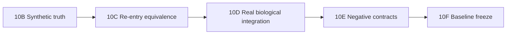

# Integrative benchmark protocol

## Scope and scientific questions

This protocol evaluates Integration API 1.0, Evidence Model 1.1, Evidence
Providers, Cross-Assay Harmonization 1.0, Molecular Evidence Integration 1.0,
Regulatory Interpretation 1.0, Candidate Score 1.0, statistics, report and
terminal manifest. Upstream assay algorithms are out of scope because their
frozen baselines are inputs to this benchmark.

The preregistered questions are correctness, harmonization, missingness,
directional interpretation, numerical statistics, ranking behavior, manifest
re-entry, explicit failure behavior and biological plausibility.

## Frozen execution order



An arm stops on `PROTOCOL_IMPLEMENTATION_CONFLICT`,
`DATASET_AVAILABILITY_CONFLICT`, `REFERENCE_COMPATIBILITY_CONFLICT`,
`TRUTH_GENERATION_CONFLICT` or `RESOURCE_BLOCKED`. A protocol amendment must
record the original rule, problem, discovery time, whether results were seen,
the correction, bias risk and preserved parameters.

## 10B — Synthetic ground truth

The primary synthetic input is integration-level evidence-provider data, not
FASTQ. Exactly 1,000 canonical genes are frozen in
`datasets/synthetic_truth.tsv`:

| Truth class | Count | Expected HelixForge pattern |
|---|---:|---|
| `ACTIVATING_CONCORDANT` | 200 | `CONCORDANT_ACTIVATION` |
| `REPRESSIVE_CONCORDANT` | 200 | `CONCORDANT_REPRESSION` |
| `ACTIVATING_DISCORDANT` | 100 | `DISCORDANT` |
| `REPRESSIVE_DISCORDANT` | 100 | `DISCORDANT` |
| `RNA_ONLY` | 100 | `RNA_ONLY` |
| `CHIP_ONLY` | 100 | `CHIP_ONLY` |
| `NO_CHANGE_BACKGROUND` | 200 | frozen subcases: `NO_REGULATORY_INTERPRETATION` or `INSUFFICIENT_CROSS_ASSAY_EVIDENCE` |

The truth generator uses only the Python standard library and never imports
the HelixForge integration package. A future independent evaluator must also
remain separate and reproduce the documented formulas rather than call the
implementation under test.

### Effects and difficulty

Significance remains `padj <= 0.05` and `abs(log2FC) >= 1` for both assays.
Frozen tiers are:

| Tier | Absolute log2FC | padj | Structure |
|---|---:|---:|---|
| EASY | 3.0 | 1e-6 | strong pairing, commonly a single promoter peak |
| MODERATE | 1.75 | 1e-3 | multiple peaks or medium effects |
| HARD | 1.10 | 0.04 | near-threshold, discordant, missing or complex evidence |
| BACKGROUND | 0.25 | 0.5 | measured non-significant evidence |

H3K27ac/H3K4me3 exercise activating semantics; H3K27me3/H3K9me3 exercise
repressive semantics. HP1→SmHP1 and one unknown mark occur in unilateral
cases, where their context-dependent or unknown roles cannot make the truth
ambiguous.

### Peak–gene and evidence states

The fixture generator must materialize single and multiple promoter peaks,
proximal/distal links, mixed promoter/gene-body/distal links, no-peak genes and
explicit one-region→multiple-gene pairs. Aggregation is presence/count based:
all IDs are retained and no max, mean, sum or best-peak score is selected.

The master table uses `MEASURED`, `NO_PEAK` and `NOT_MEASURED`. Individual
observations additionally use `MISSING`; `NOT_APPLICABLE` belongs to fields
such as mark, context or contrast when no such concept exists. Accuracy is
calculated per field and scope, never by flattening these states into one
fictional column.

### Harmonization

The compatible synthetic reference is:

```text
reference_id  synthetic_integrative_v1
genome_id     synthetic_integrative_genome_v1
assembly      synthetic_integrative_assembly_v1
annotation_id synthetic_integrative_annotation_v1
organism      synthetic_organism
```

Entity cases cover exact IDs, literal `gene:` removal, an explicit alias map
and opt-in terminal version removal without collision. Case folding, fuzzy
matching and punctuation guessing are forbidden. Semantic contrasts map
`treated_vs_control` and `treatment_effect` to
`condition__treated_vs_control`. Histone capitalization and the supported HP1
aliases are normalized; unknown marks remain explicit.

## 10C — Manifest/re-entry equivalence

Route A consumes the frozen RNA and ChIP terminal manifests directly. Route B
copies the same artifacts to a different declared root and consumes the two
manifests through `manifest_relative` bindings. Input bytes, policies and
scientific target commit remain identical.

Compare Master Molecular Evidence, long evidence, peak aggregation,
harmonization maps, regulatory classes, Fisher/correlation tables, Candidate
Score/ranking, functional-analysis input, report source tables and the
integrative terminal manifest. Canonicalized deterministic TSVs require
identical entity/column/order semantics and SHA-256. JSON ignores only declared
volatile execution fields; HTML is compared semantically, not byte-for-byte.

## 10D — Real biological integration

The selected study is GEO `GSE133183` / SRA `SRP211748` / BioProject
`PRJNA550207`: K562 DMSO versus 5 µM GSK343, with two biological replicates for
RNA-seq, H3K27me3, H3K27ac and IgG in each condition. This selection is frozen
because assays share study, cell line, perturbation, replication and reference
context. It was not selected after observing HelixForge integration results.

The exact selected GSM accessions and preregistered biological expectations
are in `datasets/`. Reference materialization is frozen to GENCODE release 50,
GRCh38.p14 primary-assembly FASTA, transcripts and primary-assembly GTF, plus
the ENCODE GRCh38 exclusion list already used by the ChIP baseline. Official
and computed checksums must agree before execution. Both assay manifests must
carry the same complete Reference object. Peak→gene rules are the current ChIP
annotation contract; no remapping is invented in this benchmark.

Real data have no absolute truth. Evaluation uses technical compatibility,
class distributions, activating/repressive directional associations,
predeclared examples, Candidate Score plausibility and descriptive functional
analysis. Review sets are frozen at top 20 overall, top 10 concordant
activation and top 10 concordant repression. Post-hoc findings must be labeled
exploratory.

## 10E — Negative contract validation

`datasets/negative_contract_cases.tsv` is authoritative. Reference, genome,
assembly and annotation mismatches, malformed manifests, missing provenance,
invalid artifact types, invalid/unknown artifact contrasts and version-strip
collisions must fail loudly at the declared validation layer.

A valid RNA contrast and a different valid ChIP contrast are not a fatal
cross-assay mismatch in v1: harmonization preserves them as `RNA_ONLY` and
`CHIP_ONLY`. Unknown marks and contexts are also preserved rather than guessed.
These are explicit `NORMALIZE_OR_PRESERVE` cases, not weakened failures.

## 10F — Baseline freeze

Only after all arms are reviewed may the final matrix, provenance archive and
annotated `integrative-benchmark-v1.0.0-rc.1` tag be created. Global outcomes
are `PASS`, `PASS_WITH_LIMITATIONS`, `FAIL` or `BLOCKED`. Candidate ranking and
descriptive real-biological metrics cannot override a failure in evidence
correctness, compatibility, missingness or re-entry.
