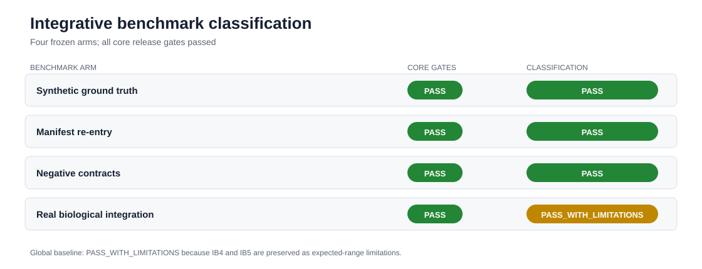
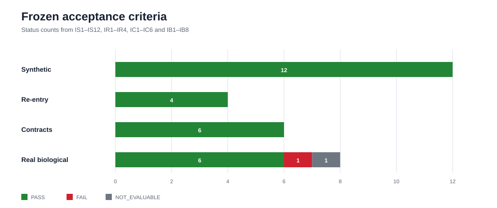
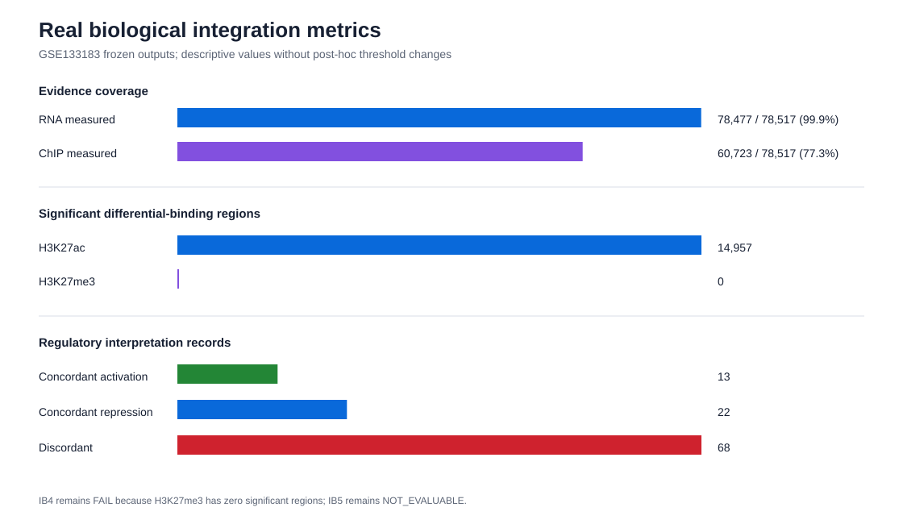
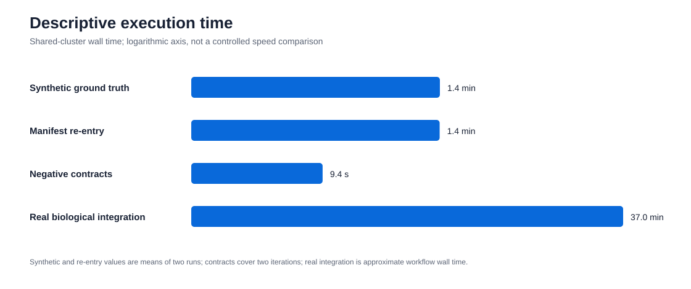

# HelixForge integrative benchmark — final baseline report

## Final classification

The HelixForge `v1.0.0-rc.1` integrative benchmark is frozen as
**`PASS_WITH_LIMITATIONS`**. All core release gates passed. The classification
retains one unmet expected biological range and one non-evaluable expected
analysis from the real arm; neither result was reclassified or tuned after
observation.

| Benchmark arm | Classification | Main conclusion |
|---|---|---|
| Synthetic ground truth | `PASS` | Exact entity/state semantics, regulatory classification, statistics and Candidate Score against independent truth. |
| Manifest re-entry | `PASS` | Results can be reconstructed from relocated manifests without the originating workdir or cache. |
| Negative contracts | `PASS` | All 14 fixtures behaved as preregistered in two executions, with no critical false acceptance or rejection. |
| Real biological integration | `PASS_WITH_LIMITATIONS` | The complete GSE133183 RNA-seq plus H3K27ac/H3K27me3 route executed and passed every core technical gate. |

The machine-readable consolidation is available in
[`integrative_benchmark_matrix.tsv`](../results/integrative_benchmark_matrix.tsv)
and [`integrative_benchmark_summary.json`](../results/integrative_benchmark_summary.json).

## Evidence by arm

### Synthetic ground truth

The frozen 1,000-gene truth was executed twice on Slurm. All `IS1`–`IS12`
criteria passed. Entity preservation, full-outer-join behavior, missing-state
semantics, critical regulatory patterns and harmonization maps were exact.
Independent statistical and Candidate Score comparisons remained within the
frozen tolerances, and deterministic scientific tables were byte-identical.

### Manifest re-entry

All `IR1`–`IR4` gates passed. The direct terminal-manifest route and a
relocated manifest-backed route produced the same entities, schemas, missing
states, regulatory classes, numeric results, rankings and canonical TSV
checksums. This demonstrates that the integration can be reconstructed without
the original Nextflow cache or work directory.

### Negative contracts

All `IC1`–`IC6` criteria passed. Fourteen preregistered fixtures were executed
twice. Invalid references, annotations, manifests, contrasts, provenance and
entity collisions failed at the expected validation layer. Supported
normalization and valid unmatched contrasts were preserved. No invalid final
integration output was silently accepted.

### Real biological integration

The complete terminal-manifest route joined RNA-seq, H3K27ac and H3K27me3
evidence from GSE133183 and completed all 12 processes on Slurm. The final
model contains 78,517 canonical genes; 78,477 have measured RNA evidence and
60,723 have measured ChIP evidence. All technical release gates passed.

H3K27ac contributed 14,957 significant differential regions under the frozen
policy, with 14,847 decreased and 110 increased. H3K27me3 contributed no
significant region under the same preregistered thresholds. The final model
reported 13 concordant-activation, 22 concordant-repression and 68 discordant
records without forcing preregistered examples into favorable classes.

## Preserved limitations

- **IB4 — `FAIL` (`EXPECTED_RANGE`):** the frozen expectation that significant
  H3K27me3 evidence would be dominated by loss/decrease could not be met because
  no H3K27me3 region passed the frozen differential-significance thresholds.
  The independent upstream summary confirms this is an observed biological or
  assay result, not an integration failure. Follow-up: issue #68.
- **IB5 — `NOT_EVALUABLE` (`EXPECTED_RANGE`):** the current Integrative
  statistics contract emits global but not directional-concordance Fisher
  tests. No directional odds-ratio claim is made. Follow-up: issue #67.

These findings do not override the successful core evidence, compatibility,
missingness, safety or re-entry gates. No threshold, sample, contrast or
observed output was changed post hoc.

## Performance scope

The synthetic and re-entry routes each completed in about 83 seconds per run;
the negative-contract suite completed two iterations in about 9.4 seconds.
The 12-process real integration route completed in approximately 37 minutes on
the shared Slurm cluster. `REGULATORY_INTERPRETATION` dominated runtime at 25
minutes 10 seconds, while `MOLECULAR_EVIDENCE_INTEGRATION` had the largest
observed RSS at 10.6 GB. These are descriptive shared-cluster measurements,
not a controlled performance comparison.

## Provenance and freeze

The frozen scientific target is
`dc0218ce902302da476910595bb133c82fee927c`; the Integration workflow target is
`d0d1e7499e5b42be8294da3d85e402fa90a1cfe2`. Compact reviewed evidence and
checksums are versioned. Private audit archives remain outside Git because
their execution logs may contain cluster-specific paths; only sanitized archive
identities are committed.

The administrative state is `BASELINE_FROZEN`. After CI review and merge, the
validated merge commit is identified by the annotated tag
`integrative-benchmark-v1.0.0-rc.1`.
