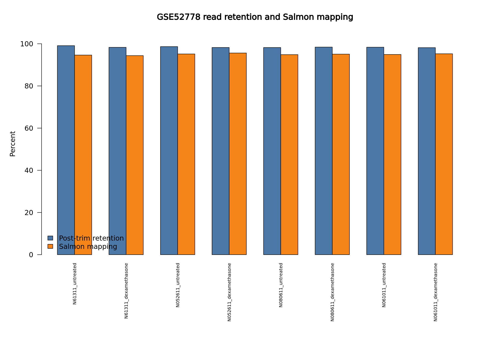
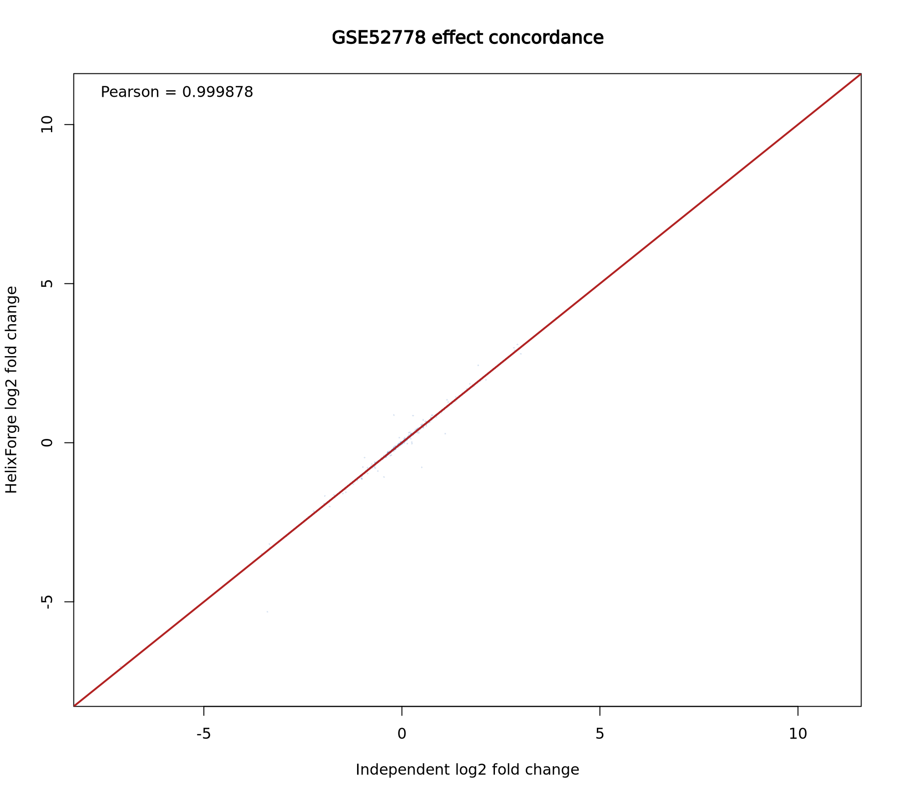
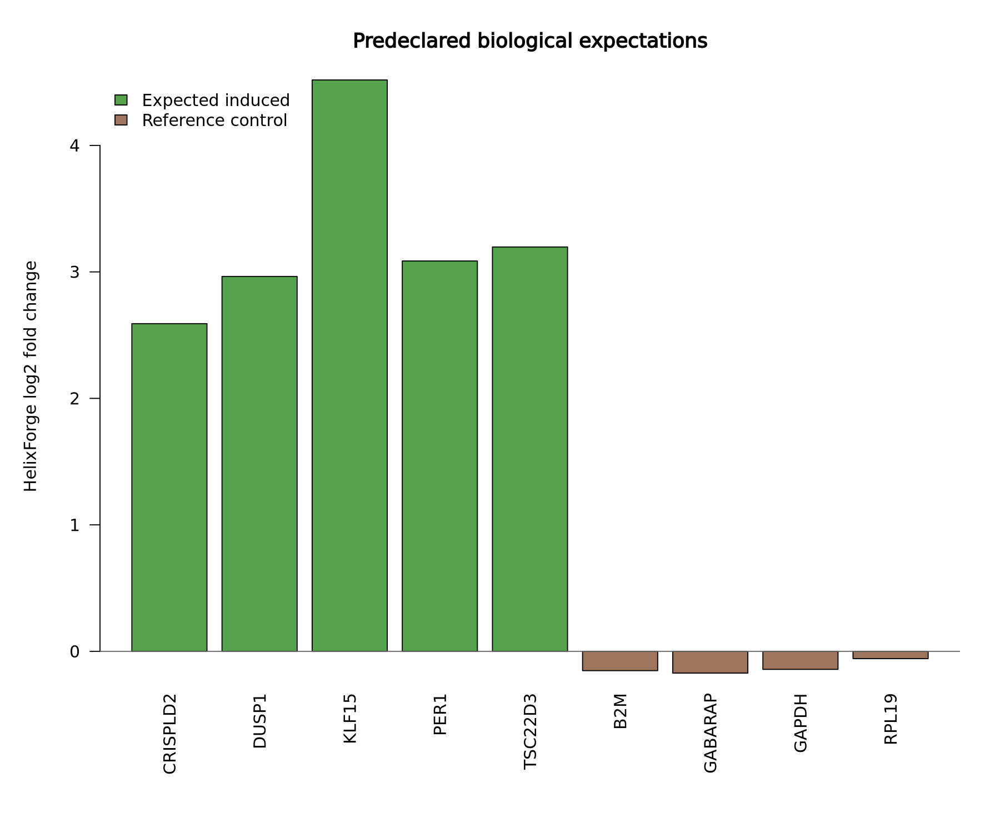
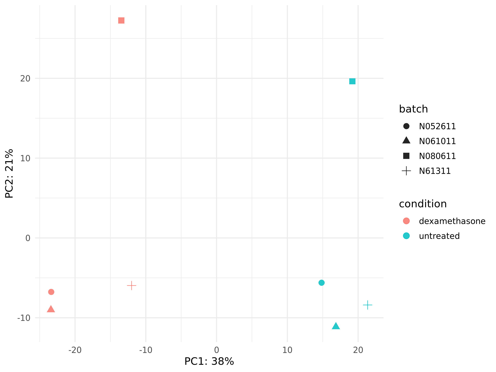

# GSE52778 full RNA-seq benchmark

## Decision

**Final classification: `PASS_WITH_LIMITATIONS`.**

HelixForge completed the production RNA-seq path on all eight full paired-end
GSE52778 libraries and produced valid QC, Salmon quantification, tximport,
DESeq2, gene-report and terminal-manifest artifacts. An independently launched
Salmon/tximport/DESeq2 analysis recovered the same scientific conclusion with
near-identical effect estimates, rankings and DEG sets. Strict numerical
identity failed because the independent Salmon execution used eight threads
while HelixForge used four; this expected floating-point reduction difference
is retained as a limitation rather than hidden by relaxed thresholds.

This result validates the tested release-candidate path. It is not evidence
that every dataset, executor or optional provider is valid.

## Scope and frozen analysis

- Dataset: GSE52778, human airway smooth-muscle response to dexamethasone.
- Samples: eight libraries from four donors, each represented in untreated and
  dexamethasone conditions; no subsampling was used.
- Production path: FASTQ → QC/Trim Galore → Salmon → tximport → DESeq2 → gene
  report → run manifest. STAR was excluded by the frozen production policy.
- Differential model: `~ batch + condition`, with donor encoded as batch;
  contrast `dexamethasone` versus `untreated`.
- Base release candidate: `v1.0.0-rc.1` (`fc38ada`).
- Certified runtime: Nextflow 25.10.7, Java 21, Salmon 1.10.3, R 4.3.3,
  tximport 1.30.0 and DESeq2 1.42.0.
- Executor: university Slurm cluster with NFS-mounted home/scratch storage.

The terminal result is a controlled composite recovery. The 97-task scientific
run reached differential expression but exposed a report-only bug involving
versioned Ensembl IDs. The report was recovered with the focused fix at
`e913ac6`; the terminal manifest was then recovered with code verified equal to
the RC implementation. Structural validation counted 100 terminal task records
across the scientific run and the two recovery segments. The original failed
attempt and all recovery identities remain in the private audit package.

## Quality control

All eight samples passed descriptive QC; no sample was automatically excluded.
Across 195,411,576 raw read pairs, 192,350,096 pairs were retained after
trimming. Per-sample retention ranged from 98.16% to 99.09% (median 98.33%), and
Salmon mapping ranged from 94.38% to 95.61% (median 95.00%). MultiQC produced a
real report, although its software-version table was absent; this is a known
reporting limitation and does not invalidate the scientific outputs.

Detailed values are available in
[`sample_qc.tsv`](../results/gse52778/sample_qc.tsv).

## Independent quantitative comparison

The independent reference was launched outside the HelixForge workflow while
retaining the frozen transcriptome, index, input reads, tximport policy and
DESeq2 design. Artifact identities and row order were preserved for all eight
quantifications and the three imported matrices.

| Quantity | Result |
|---|---:|
| Gene-count Pearson correlation (per sample) | 0.999999949–0.999999981 |
| Gene-TPM Pearson correlation (per sample) | 0.999007–0.999985 |
| log2 fold-change Pearson correlation | 0.999878 |
| log2 fold-change Spearman correlation | 0.999877 |
| log2 fold-change direction concordance | 99.948% |
| Adjusted-p-value ranking Spearman | 0.999963 |

At adjusted p-value below 0.05, HelixForge identified 3,519 genes and the
independent analysis 3,511 genes. They shared 3,507 genes (Jaccard 0.99546;
overlap coefficient 0.99886), with 100% direction agreement among shared DEGs.
The top 25, 50 and 100 genes ranked by adjusted p-value were identical; 249 of
the top 250 were shared. With the additional `|log2FC| >= 1` criterion, 937 of
940 genes in the union were shared (Jaccard 0.99681).

Strict tolerance (`1e-8 + 1e-6 × |reference|`) remains recorded as failed. The
independent Salmon run used eight threads and HelixForge used four, producing
small numerical differences during parallel floating-point accumulation. No
row-identity, sample-identity, direction or biological-conclusion discrepancy
was found. The project explicitly accepts this as a documented numerical
nondeterminism exception for this benchmark; it does not redefine exact
regression tests generally.

## Biological expectations

The five response genes declared before evaluation—`CRISPLD2`, `DUSP1`,
`KLF15`, `PER1` and `TSC22D3`—were induced in the expected direction and were
significant at adjusted p-value below 0.05. The four high-expression reference
controls—`B2M`, `GABARAP`, `GAPDH` and `RPL19`—remained high, had absolute
log2 fold change below one and were not significant. These checks support
biological plausibility but do not replace a general validation cohort.

The native PCA shows the expected condition separation while retaining
donor-level structure, consistent with modelling donor as batch rather than
feeding an automatically batch-corrected matrix into DESeq2.

## Descriptive Slurm performance

The main 97-task segment spanned approximately 2 h 18 min. Report recovery took
approximately 5 min and terminal-manifest recovery 18 s. These wall times are
descriptive: scheduler latency, concurrent task execution and NFS effects are
included. The largest per-task resident-memory observation in the HelixForge
trace was about 4.49 GB (`TX2GENE_BUILD`); the recovered gene report peaked at
about 4.40 GB. The independent run's Slurm batch peak (about 25.6 GB) aggregates
an eight-quantification concurrent launch and is not directly comparable to a
single Nextflow process.

Storage observed before cleanup was approximately 21.7 GB for downloads,
8.5 GB for the reference area, 213.6 GB for the complete HelixForge case,
169.3 GB for its Nextflow work directory, 152 MB for published results and
254 MB for the independent-reference directory. These measurements explain why
only compact metrics, figures and audit evidence—not work directories—are
version controlled.

## Findings and limitations

- **Scientific path:** passed for the tested full dataset and frozen provider.
- **Independent concordance:** passed descriptively, with strict numerical
  identity explicitly failed due to the controlled Salmon thread-count
  difference.
- **Biological sanity checks:** passed for all nine preregistered genes.
- **Report defect:** a real versioned-gene-ID handling bug was found and fixed;
  scientific matrices and DE results were not recomputed by the recovery.
- **Execution continuity:** the final deliverable is composite, not one
  uninterrupted top-level invocation.
- **MultiQC:** report present; software-version table absent.
- **Performance:** descriptive only on a shared cluster; it is not a comparative
  speed or cost claim.
- **Excluded scope:** no STAR validation, subsampling, nf-core comparison,
  ChIP-seq or integrative execution is represented by this benchmark.

The supporting small artifacts are in
[`benchmark/rnaseq/results/gse52778`](../results/gse52778/README.md). Complete
logs, checksums, failure evidence and recovery identities are retained in the
cluster audit archive rather than committed to Git.
