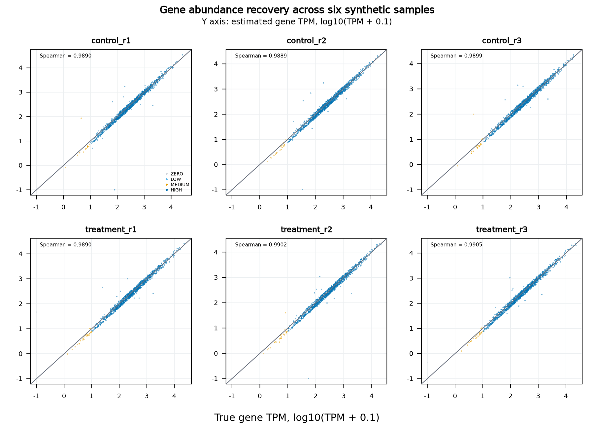
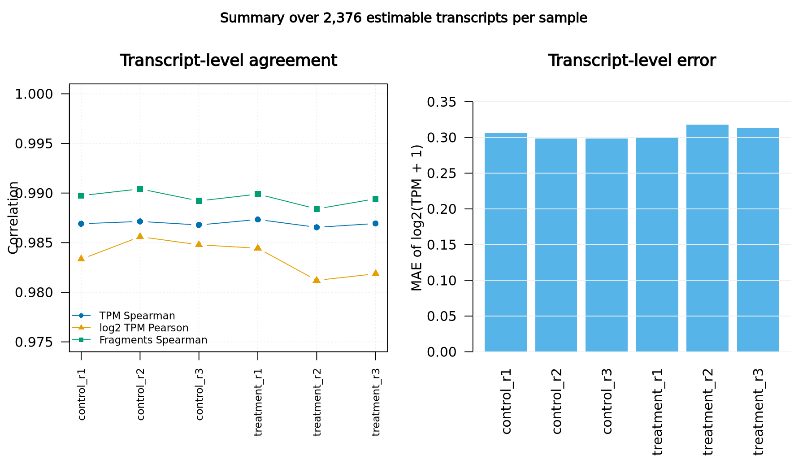
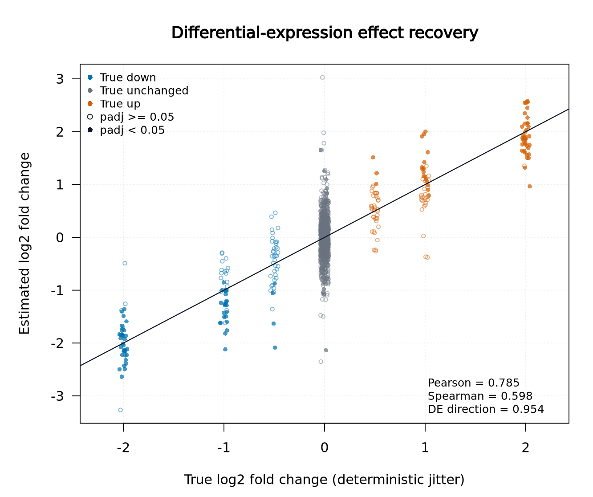
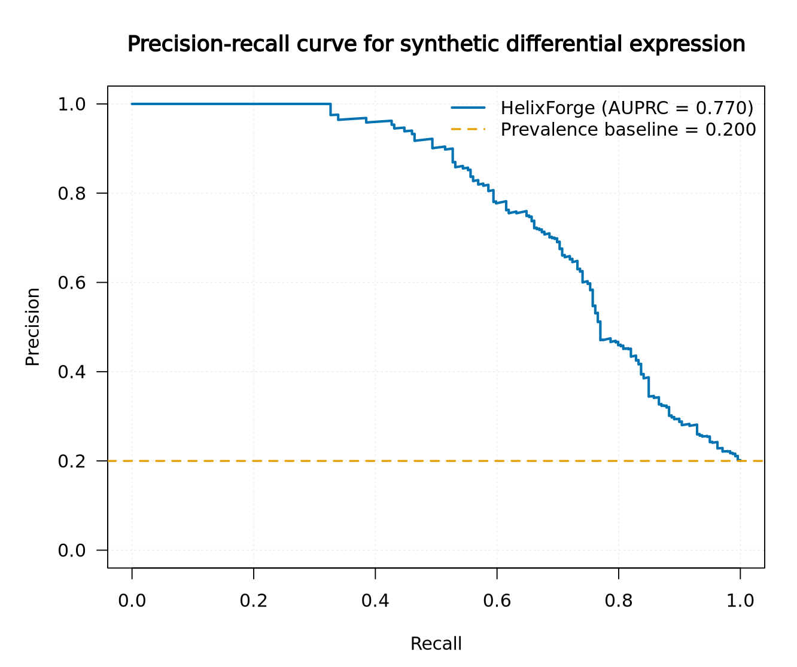
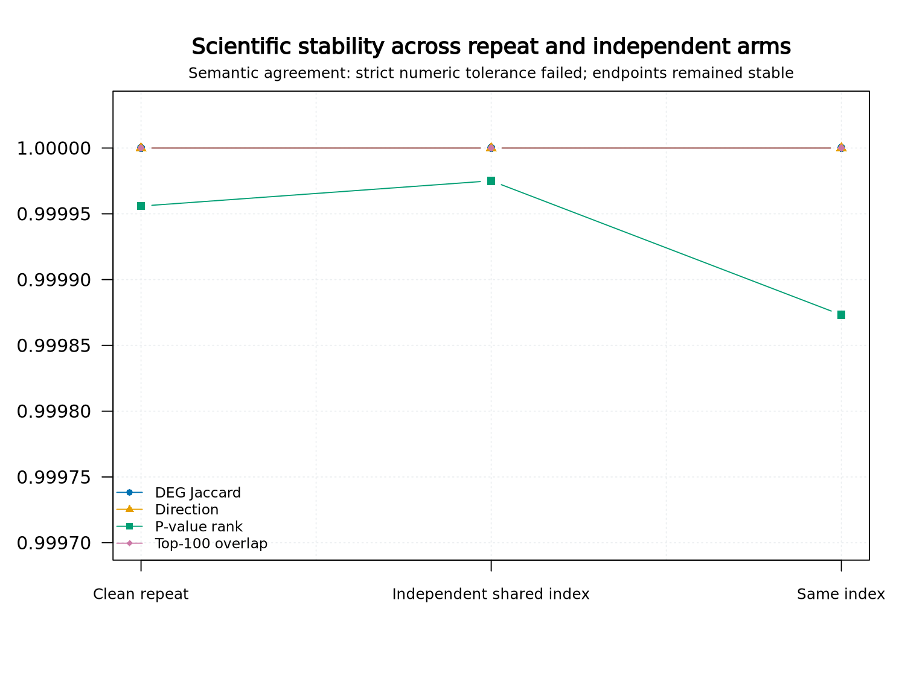
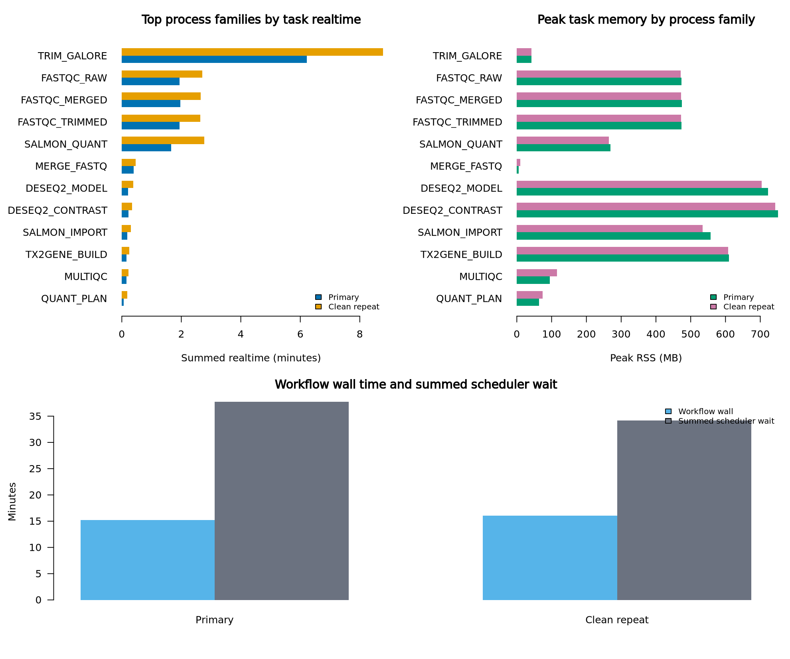

# Polyester controlled synthetic RNA-seq benchmark

## Identity and scope

This report records the controlled ground-truth validation of the immutable
HelixForge RNA-seq release candidate. It does not include the public biological
dataset or the coverage-depth robustness extension.

| Item | Validated value |
|---|---|
| HelixForge | `v1.0.0-rc.1` |
| Commit | `fc38ada8f592bb57a13467965a718ce0df7fb6ce` |
| Workflow | RNA-seq `full`, Salmon production path, STAR disabled |
| Import | `production_v1`, `lengthScaledTPM`, versioned IDs preserved |
| Differential expression | DESeq2 Wald, `~ condition`, treatment/control |
| Nextflow / driver JVM | `25.10.7` / Java 21 |
| Execution | institutional Slurm cluster, 25–26 August 2026 |
| Maximum workflow concurrency | five jobs |

No HelixForge scientific module, algorithm, parameter, schema or statistical
threshold was changed during this benchmark. Corrections were confined to the
benchmark harness; the resulting protocol decisions are consolidated in
[`benchmark_protocol.md`](../protocol/benchmark_protocol.md).

## Dataset and reference

The frozen Polyester 1.38.0 fixture contains six paired-end samples: three
control and three treatment replicates, each with 2,000,000 simulated fragment
pairs of 75 bp. The design contains 1,200 genes and 2,400 real GENCODE v49
transcript sequences, with 240 configured DE genes (120 up and 120 down) and
960 unchanged genes. Effects are balanced at absolute log2 fold changes 0.5,
1.0 and 2.0. Selection, expression and read generation use the frozen seeds in
`configs/synthetic_design.json`.

Key frozen checksums are:

| Artifact | SHA-256 |
|---|---|
| Synthetic design | `f9e09533d210ebe1a285ad49c5a9759f2e8714c9844ffe7b0d0abaa5a92822ee` |
| Transcriptome / pseudo-genome | `4a83bf6b38b29ea3881c364aafdd780548f1f51f314adaf34d840073cef5ecd3` |
| Annotation GTF | `a41d744e7fef3558eb8156f47e5121aab5957d2d6205f37dcf43576f8309c5a1` |
| tx2gene | `625fb7660740c13d75f5efe2f4e6c19f5238ea9fa97e6ac8aba24dc20370fcba` |
| Gene DE truth | `2d64c9b9493cd38dd4d921ce8beeb3eaddb721259586d9ec0131035f95fe8801` |
| Transcript truth | `f18a773752dee7797d863a7e2236f6aa53d4c93a16331388412504eb5721ebbb` |

All twelve FASTQ checksums and sizes are retained in the audit copy of
`simulation_manifest.json`.

## Execution outcome

Two clean top-level executions completed successfully. Each produced 77
completed tasks, no cached tasks and no observed failed or retried scientific
task. Both structural validation reports passed with all six samples and both
published terminal manifests were byte-identical within each run.

The implemented path was:

```text
Metadata → Reference Bundle → FastQC raw → Trim Galore → FastQC trimmed
→ FASTQ merge → FastQC merged → MultiQC → Salmon index → Salmon quant
→ tx2gene → tximport → DESeq2 model → contrast → aggregation → run manifest
```

Salmon's frozen `keep_duplicates=false` policy removed 24 sequence-identical
transcripts. The index therefore contained 2,376 transcripts and the complete
estimable universe contained 1,195 genes. Import and DESeq2 preserved all
1,195. Five input genes were not estimable and are explicitly listed in the
machine-readable metrics.

## Quantification against truth

| Level | Features/sample | Spearman range | Pearson `log2(TPM+1)` range | MAE `log2(TPM+1)` range |
|---|---:|---:|---:|---:|
| Gene | 1,195 | 0.9889–0.9905 | 0.9874–0.9928 | 0.2277–0.2392 |
| Transcript | 2,376 | 0.9865–0.9873 | 0.9812–0.9856 | 0.2986–0.3177 |

Transcript fragment-count Spearman correlation ranged from 0.9884 to 0.9904.
All declared abundance strata were emitted. These results exceed the frozen
gene (0.90) and transcript (0.80) sanity thresholds.



*Figure 1. Gene-level abundance recovery for every sample. Points are colored
by the frozen abundance stratum and the diagonal represents exact agreement.
The matching publication-quality file is available as
[PDF](figures/figure_1_gene_abundance.pdf).*



*Figure 2. Transcript-level correlation and error summary over all 2,376
estimable transcripts in each sample
([PDF](figures/figure_2_transcript_quantification.pdf)). This figure is derived
from metrics calculated against the primary `quant.sf` outputs before the
audited cleanup. Those per-sample intermediates were not part of the published
terminal contract and were subsequently removed, so this is an aggregate
summary rather than a transcript-by-transcript scatter plot.*

## Differential expression against truth

The tested estimable universe contains 239 true DE genes and 956 non-DE genes.
At `padj < 0.05`, the pipeline called 129 genes:

| Metric | Result |
|---|---:|
| TP / FP / FN / TN | 118 / 11 / 121 / 945 |
| Precision | 0.9147 |
| Recall | 0.4937 |
| Specificity | 0.9885 |
| F1 | 0.6413 |
| Observed FDP | 0.0853 |
| AUROC | 0.8651 |
| AUPRC / prevalence baseline | 0.7703 / 0.2000 |
| True/estimated log2FC Pearson | 0.7850 |
| True/estimated log2FC Spearman | 0.5982 |
| Direction concordance among true DE genes | 0.9540 |

AUROC and AUPRC exceed their frozen random/prevalence baselines; log2FC
correlation is positive; and the required abundance, effect-size and nominal
FDR strata are all present. Observed FDP was 0.0381, 0.0853 and 0.1429 at
nominal thresholds 0.01, 0.05 and 0.10, respectively.



*Figure 3. Recovery of the configured differential-expression effects. Filled
points pass `padj < 0.05`; color indicates the frozen true state
([PDF](figures/figure_3_log2fc_recovery.pdf)).*



*Figure 4. Precision-recall performance against the synthetic DE truth. The
prevalence line is the frozen random baseline
([PDF](figures/figure_4_precision_recall.pdf)).*

## Independent reference and clean-repeat behavior

The independent harness used the same Salmon 1.10.3, tximport 1.30.0 and
DESeq2 1.42.0 semantics without invoking HelixForge. Rebuilt-index,
shared-index and same-index repeat arms all failed the deliberately strict
numeric tolerance `1e-8 + 1e-6 × abs(reference)`.

The same behavior occurred between two clean top-level HelixForge executions:
all twelve post-trim FASTQs were byte-identical and normalized manifest
structure matched, but Salmon quantification and dependent numeric tables did
not meet the strict tolerance. Salmon 1.10.3 exposes no global quantification
seed, and divergence persisted with one thread and the same immutable index.
This is therefore recorded as a demonstrated runtime repeatability limitation,
not hidden by widening the tolerance.

Despite the numeric divergence, all compared arms retained:

- the same 129 significant genes (`Jaccard = 1.0`);
- direction concordance of 1.0 among common significant genes;
- exact top-50, top-100, top-250 and top-500 sets;
- p-value rank Spearman of 0.99987–0.99998.

The strict numeric comparison remains technically failed. On 26 August 2026,
the project owner explicitly reviewed and accepted this documented Salmon
runtime limitation for the synthetic benchmark. The acceptance applies to the stable
scientific semantics demonstrated here; it does not redefine the tolerance or
claim byte/numeric identity.



*Figure 5. Semantic agreement across the clean HelixForge repeat, independent
shared-index comparison and same-index reference repeat. The narrow vertical
scale makes the residual p-value-rank variation visible while the other
endpoints remain exactly stable ([PDF](figures/figure_5_reproducibility.pdf)).*

## MultiQC sanity finding

MultiQC 1.17 completed in both runs and aggregated 24 FastQC sources. In the RC
DAG it receives FastQC ZIPs before Salmon quantification; consequently its
report contains no Trim Galore/Cutadapt or Salmon section. Duplicate FastQC
sample labels also collapse the 36 supplied ZIPs to 24 report records. This is
a non-gating sanity finding for this frozen RC. A future terminal aggregation
should use collision-safe labels and include trimming and quantification logs.

## Performance and storage

| Run | Wall time | Summed task realtime | Summed CPU | Peak task RSS | Trace tasks | Work | Results |
|---|---:|---:|---:|---:|---:|---:|---:|
| Primary | 15m15s | 15m17s | 20m27s | 751 MB | 77 | 5.05 GB | 30.3 MB |
| Clean repeat | 16m04s | 22m03s | 28m02s | 743 MB | 77 | 5.05 GB | 30.3 MB |

Summed scheduler wait was 37m44s and 34m11s across tasks, respectively; it is
reported separately and must not be interpreted as pipeline runtime. Aggregate
task I/O was approximately 29.7 GB read and 24.7 GB written per run. The exact
runtime-prefix collection occupied 7.80 GB and the compact synthetic reference
7.96 MB. Values are descriptive for this shared cluster, not performance gates.



*Figure 6. Descriptive task realtime, peak resident memory and workflow wall
time for the primary and clean-repeat executions. Scheduler wait is shown
separately and is not treated as pipeline runtime
([PDF](figures/figure_6_performance.pdf)).*

## Gate assessment and classification

| Criterion | Synthetic benchmark result |
|---|---|
| Exact RC/runtime, complete terminal contract | `PASS` |
| Synthetic sample/input integrity | `PASS` |
| Independent strict numeric tolerance | `ACCEPTED_LIMITATION` — failed with demonstrated Salmon runtime cause |
| Clean-repeat strict numeric tolerance | `ACCEPTED_LIMITATION` — semantic outputs stable, numeric tolerance failed |
| Informative synthetic DE | `PASS` |
| All declared strata and calibration metrics | `PASS` |
| No hidden scientific changes | `PASS` |
| Public eight-sample evidence | `PASS_WITH_LIMITATIONS` — reported separately for GSE52778 |
| Coverage-depth evidence | `FUTURE_EXTENSION` |

**Synthetic benchmark classification:** `PASS_WITH_LIMITATIONS`. Correctness, contracts
and truth recovery passed. The explicitly accepted limitations are Salmon's
failure to provide byte/numeric repeatability at the frozen tolerance and the
documented MultiQC aggregation scope.

**RNA-seq baseline classification:** `PASS_WITH_LIMITATIONS` after combining
this controlled synthetic evidence with the separately reported full GSE52778
benchmark. Coverage-depth characterization remains a non-blocking future
extension.

## Audit artifacts

The compact audit package is retained outside Git in private archival storage.
Its adjacent `.sha256` file is authoritative because embedding the ZIP's own
checksum inside the ZIP would be circular. Heavy FASTQs and Nextflow work
directories are intentionally excluded; their checksums, manifests, traces,
logs, results metadata and truth tables are retained.

The six report figures were rendered from the retained evidence in Slurm job
`15624` using R 4.3.3 and Python 3.12.4. Their PNG/PDF checksums and immutable
RC subject are recorded in
[`figures_manifest.json`](figures/figures_manifest.json); runtime versions are
recorded in [`render_versions.txt`](figures/render_versions.txt). No
coverage-depth figure is presented because that predeclared benchmark arm was
not run for this baseline.

| Archive | SHA-256 | Independent verification |
|---|---|---|
| Main evidence archive | `693700ccf512f118572a2647c6f9f34b4923a56287c210e470c6034240a449cb` | `PASS`, 1,145 members, Slurm job `15595` |
| Superseded-attempt archive | `acb4ee299c30436f7bfeaa513be3e9b5766a4fffa7276e88da57e486d2da7cdf` | `PASS`, 875 members, Slurm job `15600` |

Only after both archives passed checksum and ZIP integrity verification, the
four superseded case roots and the `work/` and staged-FASTQ `scratch/`
directories of the two successful runs were removed. Cleanup jobs `15602` and
`15605` removed 13,073,901,128 bytes in total. This removal is not recoverable
from scratch, but all retained evidence is in home and the frozen raw dataset,
reference, exact environments, published results, independent comparisons,
metrics, validation reports and provenance remain available for review and
future benchmark extensions.
