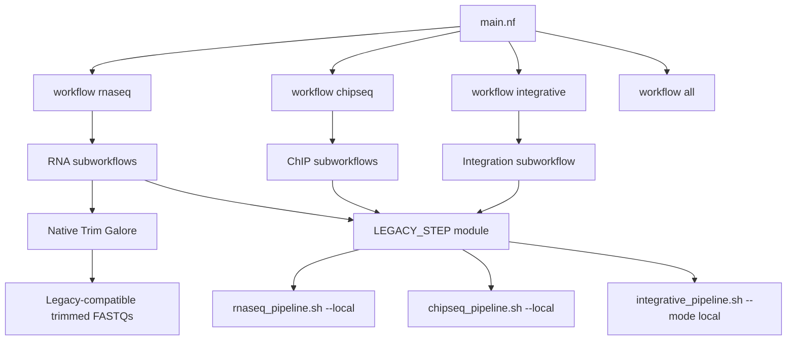

# Implementation architecture

The module emits a small status JSON and a log. Scientific outputs remain in
the directories defined by each unchanged `pipeline_config.sh`.

The RNA-seq QC subworkflow reads its scientific parameters from that same
configuration, fans out one native Trim Galore task per technical run, and then
calls the legacy QC coordinator. Its trimming script sees the completed files
and skips, while FastQC, merge, and MultiQC retain their original behavior.
