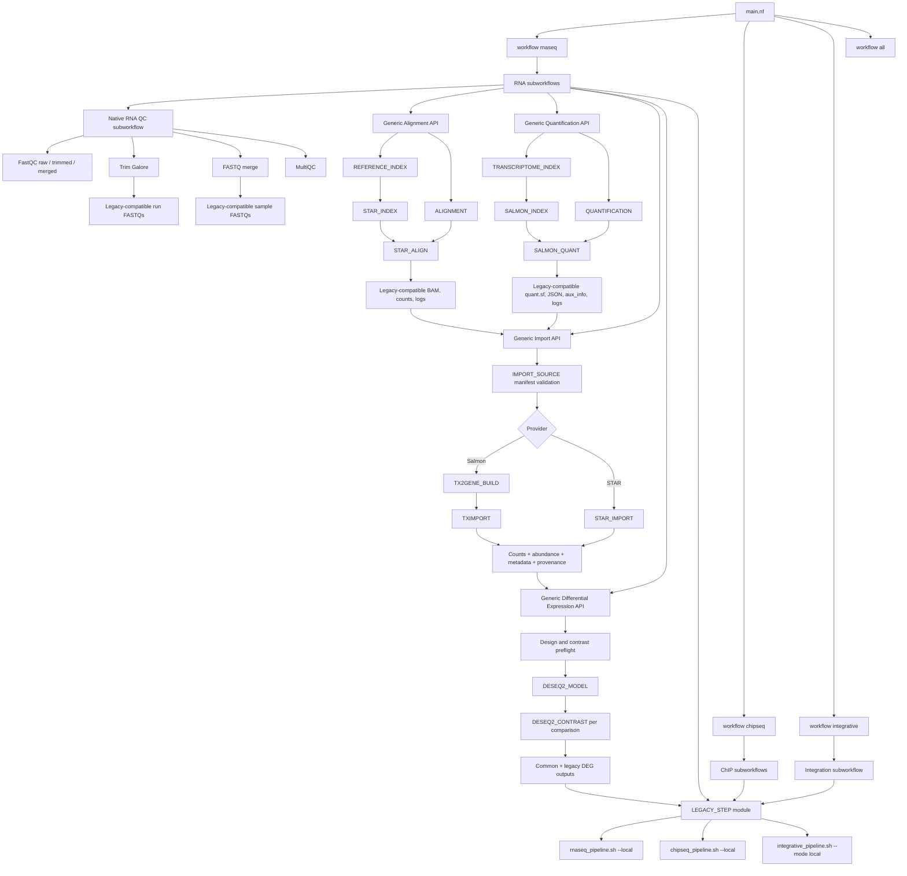

# Implementation architecture

Native modules emit primary artifacts, reports, versions, and status tuples.
Scientific outputs remain in the directories defined by each unchanged
`pipeline_config.sh`.

The RNA-seq QC subworkflow reads its scientific parameters from that same
configuration, fans out one FastQC task per FASTQ and one Trim Galore task per
technical run, groups trimmed runs by biological sample for byte-concatenation,
and runs a reusable MultiQC process. The legacy QC coordinator is used only
when native QC is explicitly disabled.

The alignment adapter converts the unchanged STAR plan into Alignment API
tuples. The quantification adapter converts the unchanged Salmon plan into
Quantification API tuples. Each API owns an independent content-tracked index
and per-sample provider. `rnaseq_analysis_mode=both` fans merged FASTQs into
both branches; no STAR output is an input to Salmon.

The Import API consumes only the provider selected by authoritative
`QUANT_METHOD`. It validates upstream manifests, builds a sample table, then
normalizes Salmon through `TX2GENE_BUILD` + `TXIMPORT` or STAR gene counts
through `STAR_IMPORT`. The Differential Expression API consumes only the
common matrix, metadata, and manifest. Batch correction and final reports
remain compatibility wrappers.
