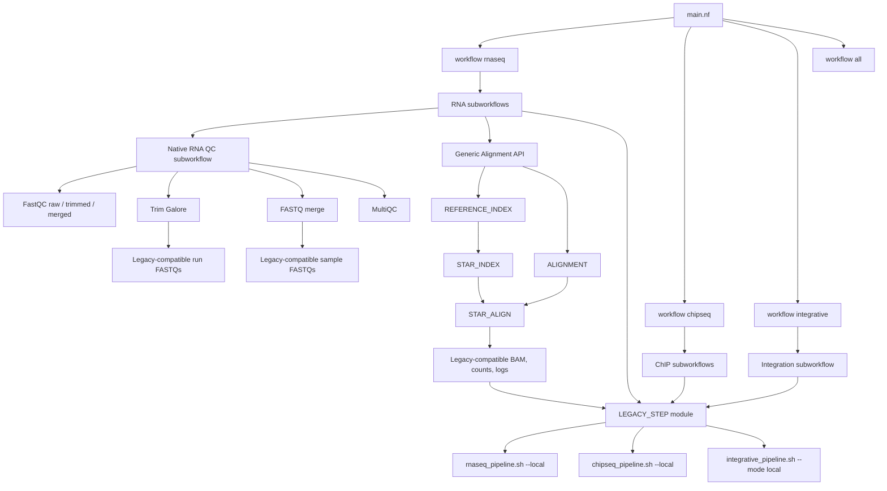

# Implementation architecture

Native modules emit primary artifacts, reports, versions, and status tuples.
Scientific outputs remain in the directories defined by each unchanged
`pipeline_config.sh`.

The RNA-seq QC subworkflow reads its scientific parameters from that same
configuration, fans out one FastQC task per FASTQ and one Trim Galore task per
technical run, groups trimmed runs by biological sample for byte-concatenation,
and runs a reusable MultiQC process. The legacy QC coordinator is used only
when native QC is explicitly disabled.

For `QUANT_METHOD=star`, the alignment adapter converts the unchanged legacy
plan into the formal Alignment API, builds one reference index per project,
and joins each sample to its project index before per-sample alignment. Salmon
and all downstream analytical stages remain compatibility wrappers.
