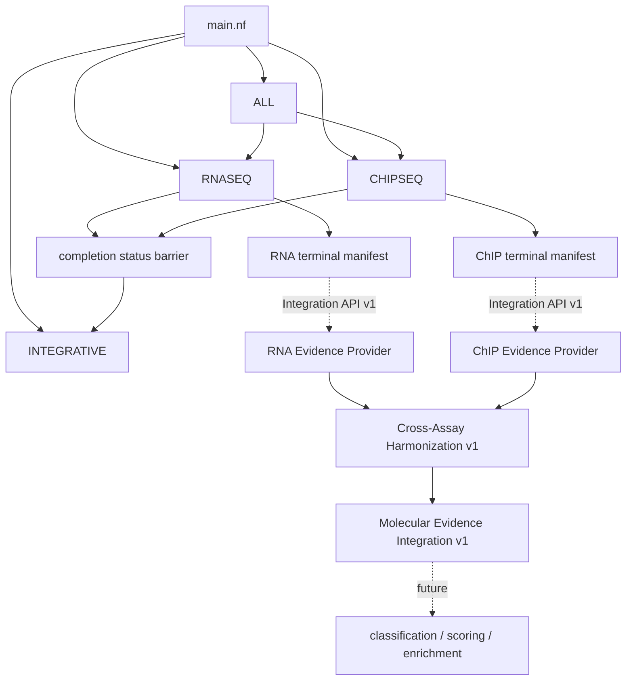
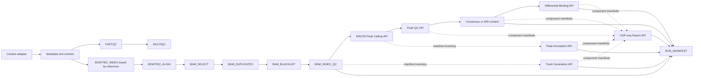

# HelixForge implementation architecture

HelixForge is a compatibility-first Nextflow DSL2 platform. Native APIs exchange
typed channels and versioned manifests; unchanged pipeline coordinators remain
behind `LEGACY_STEP` only where migration or scientific validation is pending.
RNA-seq and ChIP-seq have crossed that boundary: their active DAGs are fully
native and the former implementations are archived in `rnaseq-legacy-v1.0.0`
and `chipseq-legacy-v1.0.0`.

## Top-level composition

`ALL` starts RNA-seq and ChIP-seq independently and exposes both Integration
API v1 terminal manifests. It still waits for the completion channels before
invoking the unchanged Integrative coordinator. That coordinator remains a
legacy boundary and does not consume the new manifests yet. Independent RNA
and ChIP providers convert explicitly bound terminal artifacts to the
[Standardized Evidence Model v1](evidence_model.md). The native
[Cross-Assay Integration v1](cross_assay_integration.md) validates reference
compatibility, harmonizes explicit identities and constructs lossless long-form
and full-outer gene-level molecular evidence tables. The unchanged Integrative
coordinator is not yet replaced by this testable Stage 4 boundary.

## RNA-seq native DAG

```mermaid
flowchart LR
    CTX["RNA context adapter"] --> META["RNASEQ_METADATA"]
    META --> REF["REFERENCE_BUNDLE"]
    META --> PLAN["Native QC plan"]
    PLAN --> RAW["FASTQC raw"]
    RAW --> TRIM["TRIM_GALORE"]
    TRIM --> POST["FASTQC trimmed"]
    POST --> MERGE["MERGE_FASTQ"]
    MERGE --> MQC["MULTIQC"]
    MQC --> FAN{"analysis mode"}
    FAN -->|alignment or both| SI["STAR_INDEX"]
    SI --> SA["STAR_ALIGN"]
    FAN -->|quantification or both| QI["SALMON_INDEX"]
    QI --> SQ["SALMON_QUANT"]
    SA --> IMP{"Import provider"}
    SQ --> IMP
    IMP -->|STAR| STARIMP["STAR_IMPORT"]
    IMP -->|Salmon| TX2["TX2GENE_BUILD"]
    TX2 --> TXI["TXIMPORT"]
    STARIMP --> DE["Differential Expression API"]
    TXI --> DE
    DE --> PRE["preflight"]
    PRE --> MODEL["DESEQ2_MODEL"]
    MODEL --> CONTRAST["DESEQ2_CONTRAST"]
    CONTRAST --> AGG["DE_AGGREGATE"]
    AGG --> RCTX["RNASEQ_REPORT_CONTEXT"]
    TXI --> RCTX
    STARIMP --> RCTX
    RCTX --> RPT["RNASEQ_GENE_REPORT"]
    AGG --> RM["RUN_MANIFEST"]
    SQ --> RM
    TXI --> RM
    RPT --> RM
```

The default production path executes Salmon. `rnaseq_run_mode=alignment`
explicitly selects the experimental STAR stage; `quant`/`quantification`
executes only Salmon. `rnaseq_analysis_mode=both` fans the same merged reads to
independent providers. `config` retains legacy `QUANT_METHOD` compatibility but
is not the production default. Import and DE
never infer the provider from filenames: they consume provider manifests and
channels. Metadata validation and Reference Bundle construction are native;
the small context adapter only translates the existing shell configuration.
Data acquisition is outside the scientific DAG. `rnaseq_native_import=false` has no supported fallback
because the former tximport wrapper was intentionally removed.
The terminal report is optional in `full` and explicit in `report` mode. It
joins Import and DE artifacts through channels and manifest checksums; it does
not search published result directories or alter the DESeq2 inference path.
In `full`, `RUN_MANIFEST` projects those known artifacts, normalized metadata,
the Reference Bundle and contrast specification into
`rnaseq_run_manifest.json`.

## ChIP-seq native DAG

Records and Bowtie2 indices are paired by an explicit reference key, preventing
cross-reference Cartesian products. Each BAM transformation records the hash
of its upstream manifest, so the final BAM can be traced back to alignment.
Standalone `annotation`, `tracks`, and `report` modes require explicit inventory
manifests and do not search result directories.

Native staged modes are `qc`, `alignment`, `post_alignment`, `peaks`,
`peak_qc`, `consensus`, `idr`, `differential_binding`, `annotation`, `tracks`,
and `report`. ChIP-seq `full` composes those native APIs in one Nextflow session,
passing typed channels and manifests from QC through the final report. It has no
legacy fallback. IDR is optional and selected explicitly; its completed
provider-neutral artifacts flow through Differential Binding, Annotation and
Report without special filename discovery.
The complete path also emits `chipseq_run_manifest.json` from explicit channels,
including controls, marks/factors, terminal BAMs, consolidated peaks,
differential binding, peak-gene annotation, tracks and report artifacts.

## Contracts and provenance

All new modules follow [module contracts](module_contracts.md). API manifests
use the common envelope in `schemas/manifest-v1.schema.json`:
`schema_version`, `type`, stable `id`, and honest `status`. Cross-API lineage is
recorded with upstream manifest checksums. Scientific outputs keep the legacy
names and locations where compatibility requires them.

The terminal assay boundary is specified separately by
[Integration API v1](integration_api.md). Its shared Artifact, Reference,
Contrast and Provenance objects live under `schemas/integration/`; schema,
semantic and filesystem validation are deliberately independent. These run
manifests are semantic APIs, not directory inventories.

The [Standardized Evidence Model v1](evidence_model.md) providers produce typed
TSV evidence and a small JSON catalog without joining assays or scanning
published result directories. Cross-assay operations are isolated in
`EVIDENCE_HARMONIZATION` and `MOLECULAR_EVIDENCE_INTEGRATION`, with versioned
maps, manifests, checksums and explicit absence states.

Scientific parameters remain explicit in `nextflow.config` and are all exposed
by `nextflow_schema.json`. Scheduler queues, resources and environment engines
remain orchestration concerns; scientific defaults stay in the authoritative
pipeline configuration until their controlled migration.

## Deliberate legacy boundaries

- Optional exploratory Batch Effect Assessment API, tracked in the
  [scientific roadmap](roadmap.md). The current inferential DAG never consumes
  a batch-corrected matrix.
- Integrative execution and its configured input discovery.
- RNA Pathway Enrichment API and any analysis not yet represented by a native
  provider, tracked in the [scientific roadmap](roadmap.md).

These boundaries are not described as scientifically validated native paths.
Their replacement requires the mandatory comparisons in
[final validation plan](final-validation-plan.md).
