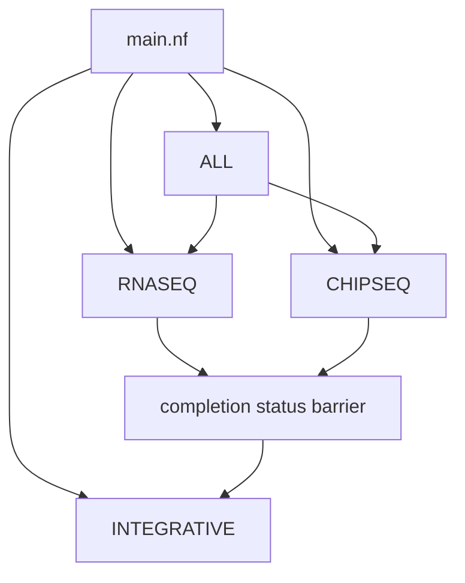
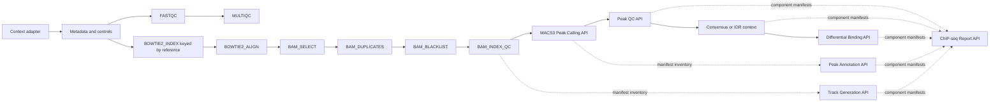

# HelixForge implementation architecture

HelixForge is a compatibility-first Nextflow DSL2 platform. Native APIs exchange
typed channels and versioned manifests; unchanged pipeline coordinators remain
behind `LEGACY_STEP` only where migration or scientific validation is pending.

## Top-level composition

`ALL` starts RNA-seq and ChIP-seq independently, waits for both completion
channels, then invokes Integrative. The current Integrative coordinator is a
legacy boundary and resolves its scientific inputs from the unchanged
integrative configuration. Completion status is therefore synchronization,
not an artifact API; semantic RNA+ChIP manifest coupling remains a final
validation item.

## RNA-seq native DAG

```mermaid
flowchart LR
    CTX["RNA context adapter"] --> META["RNASEQ_METADATA"]
    META --> REF["REFERENCE_BUNDLE"]
    META --> PLAN["Native QC plan"]
    PLAN --> RAW["FASTQC raw"]
    RAW --> TRIM["TRIM_GALORE"]
    TRIM --> POST["FASTQC trimmed"]
    POST --> MERGE["MERGE_FASTQ"]
    MERGE --> MQC["MULTIQC"]
    MQC --> FAN{"analysis mode"}
    FAN -->|alignment or both| SI["STAR_INDEX"]
    SI --> SA["STAR_ALIGN"]
    FAN -->|quantification or both| QI["SALMON_INDEX"]
    QI --> SQ["SALMON_QUANT"]
    SA --> IMP{"Import provider"}
    SQ --> IMP
    IMP -->|STAR| STARIMP["STAR_IMPORT"]
    IMP -->|Salmon| TX2["TX2GENE_BUILD"]
    TX2 --> TXI["TXIMPORT"]
    STARIMP --> DE["Differential Expression API"]
    TXI --> DE
    DE --> PRE["preflight"]
    PRE --> MODEL["DESEQ2_MODEL"]
    MODEL --> CONTRAST["DESEQ2_CONTRAST"]
    CONTRAST --> AGG["DE_AGGREGATE"]
```

The default production path executes Salmon. `rnaseq_run_mode=alignment`
explicitly selects the experimental STAR stage; `quant`/`quantification`
executes only Salmon. `rnaseq_analysis_mode=both` fans the same merged reads to
independent providers. `config` retains legacy `QUANT_METHOD` compatibility but
is not the production default. Import and DE
never infer the provider from filenames: they consume provider manifests and
channels. Metadata validation and Reference Bundle construction are native;
the small context adapter only translates the existing shell configuration.
Data acquisition is outside the scientific DAG. `rnaseq_native_import=false` has no supported fallback
because the former tximport wrapper was intentionally removed.

## ChIP-seq native DAG

Records and Bowtie2 indices are paired by an explicit reference key, preventing
cross-reference Cartesian products. Each BAM transformation records the hash
of its upstream manifest, so the final BAM can be traced back to alignment.
Standalone `annotation`, `tracks`, and `report` modes require explicit inventory
manifests and do not search result directories.

Native staged modes are `qc`, `alignment`, `post_alignment`, `peaks`,
`peak_qc`, `consensus`, `idr`, `differential_binding`, `annotation`, `tracks`,
and `report`. The ChIP-seq `full` mode deliberately retains the unchanged legacy
coordinator until end-to-end equivalence is run on real data. IDR validates its
request but honestly reports `not_implemented`; it does not fabricate a result.

## Contracts and provenance

All new modules follow [module contracts](module_contracts.md). API manifests
use the common envelope in `schemas/manifest-v1.schema.json`:
`schema_version`, `type`, stable `id`, and honest `status`. Cross-API lineage is
recorded with upstream manifest checksums. Scientific outputs keep the legacy
names and locations where compatibility requires them.

Scientific parameters remain explicit in `nextflow.config` and are all exposed
by `nextflow_schema.json`. Scheduler queues, resources and environment engines
remain orchestration concerns; scientific defaults stay in the authoritative
pipeline configuration until their controlled migration.

## Deliberate legacy boundaries

- RNA final report and optional exploratory batch-effect assessment.
- ChIP-seq `full` compatibility execution.
- Integrative execution and its configured input discovery.
- Final RNA reporting and any analysis not yet represented by a native API.

These boundaries are not described as scientifically validated native paths.
Their replacement requires the mandatory comparisons in
[final validation plan](final-validation-plan.md).
