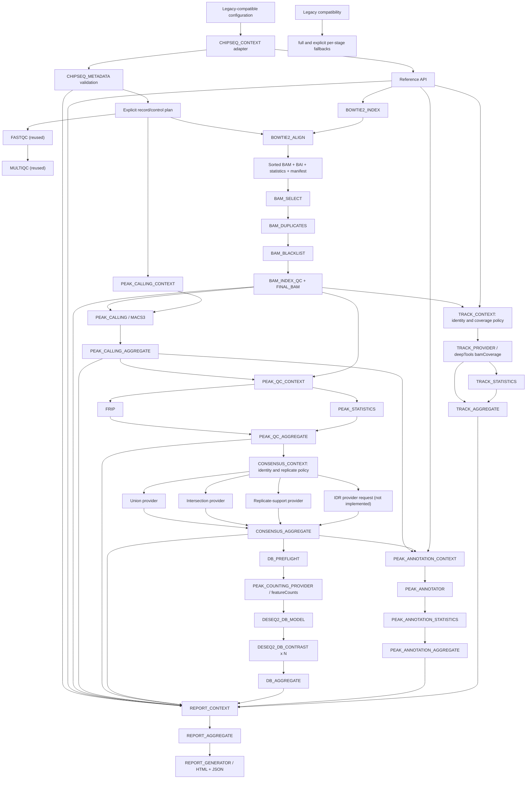

# Native ChIP-seq architecture

The native foundation is deliberately smaller than the legacy workflow. It
implements explicit filtering contracts, stable final-BAM semantics and a
provider-neutral Peak Calling API.

## Boundaries

- `CHIPSEQ_CONTEXT` is a compatibility adapter: it sources the existing project
  config and writes a content-tracked settings snapshot.
- `CHIPSEQ_METADATA` is provider-neutral validation and planning. It resolves
  FASTQs, models controls and distinguishes biological from technical identity.
- Existing `FASTQC` and `MULTIQC` modules are reused unchanged.
- Generic `REFERENCE_INDEX` and `ALIGNMENT` dispatch by `meta.aligner`; Bowtie2
  joins STAR as a provider without creating a ChIP-specific alignment API.
- `CHIPSEQ_BAM_PROCESSING` owns independent selection, duplicate, blacklist and
  final integrity/index boundaries. Policies are values/files, never aligner
  side effects.
- `PEAK_CALLING_CONTEXT` resolves one treatment/control request per replicate;
  `PEAK_CALLING` dispatches MACS3 and aggregation publishes caller-neutral roles.
- `PEAK_QC_CONTEXT` safely joins final BAM and peaks by stable identity. `FRIP`
  and `PEAK_STATISTICS` remain independent cache boundaries and the final
  aggregator preserves one row per replicate.
- `CONSENSUS_CONTEXT` joins peak and Peak QC manifests by stable IDs, validates
  complete grouping identity and makes biological/technical replicate policy
  explicit. Consensus providers operate on atomic segments; IDR remains a
  separate non-result provider request until its runtime is validated.
- `DB_PREFLIGHT` creates a recorded cross-condition peak universe and validates
  statistical units, design, covariates, filters and contrasts. featureCounts,
  model fitting, each contrast and aggregation are independent cache boundaries.
- `PEAK_ANNOTATION_CONTEXT` consumes an existing Peak Calling or Consensus
  manifest plus reference/annotation identity. Provider execution, annotation
  statistics, and provider-neutral aggregation are separate boundaries and
  never trigger peak calling or differential binding.
- `TRACK_CONTEXT` consumes only an external final-BAM inventory and reference
  manifest. It validates identity and explicit coverage semantics before a
  provider creates individual and optional non-control aggregate BigWigs.
  Statistics and aggregation are independent cache boundaries; tracks mode
  never triggers alignment or BAM processing.
- `REPORT_CONTEXT` is a terminal manifest-only integration boundary. It accepts
  optional components, preserves explicit status, and validates project,
  dataset, build, record/sample identity, and version compatibility.
  `REPORT_AGGREGATE` owns scientific structure; `REPORT_GENERATOR` owns only
  presentation and cannot schedule an upstream producer.
- Large data remain Nextflow outputs. Lightweight reports and provenance are
  published under `pipeline_info` and optional legacy-compatible target paths.
- `annotation`, `tracks`, and `report` are standalone manifest-inventory modes;
  the arrows above describe semantic dependencies, not implicit reruns.
- `full` deliberately remains the unchanged legacy graph until real-data
  equivalence is complete. The staged native graph must not be described as
  scientifically validated by lint or stub success.

The Nextflow executor owns all scheduling. Modules contain no Slurm submission,
partition, account or host-specific path logic. Profiles select local, Slurm,
Docker, Conda, Singularity or Apptainer execution.

## Incremental migration order

1. metadata + raw QC + Bowtie2 alignment (foundation 0.1);
2. BAM selection, duplicate policy, blacklist and final QC (foundation 0.2);
3. explicit MACS3 provider and caller-neutral peak outputs (foundation 0.3);
4. explicit FRiP/Peak QC API and per-replicate aggregation (foundation 0.4);
5. Consensus API and IDR provider boundary (foundation 0.5);
6. Differential Binding API with explicit design/contrasts (foundation 0.6);
7. manifest-driven Peak Annotation API (foundation 0.7);
8. manifest-driven Track Generation API (foundation 0.8);
9. manifest-driven Report/Integration API (foundation 0.9; functional DAG complete).
