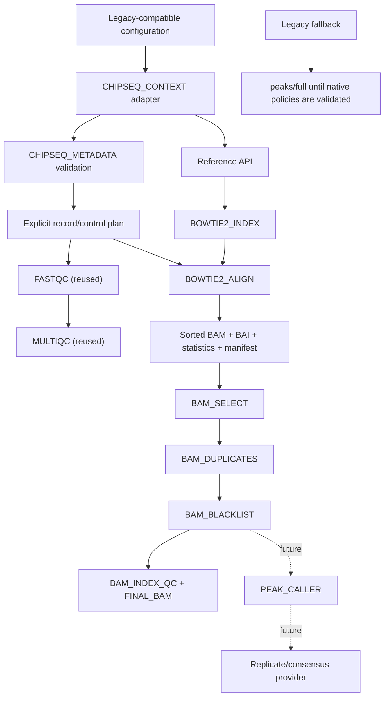

# Native ChIP-seq architecture

The native foundation is deliberately smaller than the legacy workflow. It
implements explicit filtering contracts and establishes stable final-BAM
semantics before native peak-calling policies are introduced.

## Boundaries

- `CHIPSEQ_CONTEXT` is a compatibility adapter: it sources the existing project
  config and writes a content-tracked settings snapshot.
- `CHIPSEQ_METADATA` is provider-neutral validation and planning. It resolves
  FASTQs, models controls and distinguishes biological from technical identity.
- Existing `FASTQC` and `MULTIQC` modules are reused unchanged.
- Generic `REFERENCE_INDEX` and `ALIGNMENT` dispatch by `meta.aligner`; Bowtie2
  joins STAR as a provider without creating a ChIP-specific alignment API.
- `CHIPSEQ_BAM_PROCESSING` owns independent selection, duplicate, blacklist and
  final integrity/index boundaries. Policies are values/files, never aligner
  side effects.
- Large data remain Nextflow outputs. Lightweight reports and provenance are
  published under `pipeline_info` and optional legacy-compatible target paths.

The Nextflow executor owns all scheduling. Modules contain no Slurm submission,
partition, account or host-specific path logic. Profiles select local, Slurm,
Docker, Conda, Singularity or Apptainer execution.

## Incremental migration order

1. metadata + raw QC + Bowtie2 alignment (foundation 0.1);
2. BAM selection, duplicate policy, blacklist and final QC (foundation 0.2);
3. explicit MACS3 provider and peak QC/FRiP;
4. reproducibility/consensus provider;
5. annotation, tracks and reporting;
6. differential binding only after a separate statistical design review.
