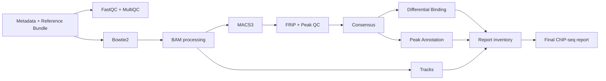

# Validação do coordenador ChIP-seq `full` nativo

## Escopo

Em 13 de agosto de 2026, o modo `chipseq_run_mode=full` foi executado como uma
única sessão Nextflow no Slurm institucional. O teste usou o fixture sintético e
`-stub-run`; portanto, valida a composição do DAG, contratos, associação de
canais, submissão e produção do relatório final, mas não constitui validação
científica ou biológica.

## Runtime e limites

- commit validado: `539ddb3`;
- Nextflow: `25.10.7` (JAR explícito);
- Java: Temurin/OpenJDK 21;
- executor: Slurm, fila `general`;
- `executor.queueSize=5`;
- workdir e resultados no scratch do usuário;
- nenhuma submissão aninhada nos scripts científicos.

## Caminho exercitado

Annotation e Tracks foram alimentados diretamente pelos canais de Consensus,
FINAL_BAM e Reference Bundle. O inventário do relatório foi construído a partir
dos manifests e artefatos com checksum da mesma execução; não houve descoberta
de arquivos publicados nem invocação recursiva do Nextflow.

## Resultado

- 68 tarefas registradas no trace;
- 68 tarefas com status `COMPLETED` e saída zero;
- quatro Track contexts, providers e coletores de estatísticas executados: três
  trilhas individuais e uma trilha agregada;
- `Execution complete` registrado no log;
- relatório final HTML/JSON e manifest produzidos;
- fila do usuário vazia após o término.

Quatro falhas de integração foram encontradas e corrigidas antes da execução
final: aridade opcional da blacklist, achatamento da identidade
dataset/genoma/organismo por `collect()`, fan-out incorreto do Reference Bundle
e ordenação mutável de um intervalo imutável no agrupamento de tracks. Nenhuma
ferramenta científica foi executada nesse stub-run.

## Evidência

A evidência leve de auditoria foi preservada na home institucional em
`helixforge-validation-audits/chipseq-full-native-stub-final-20260813.zip`, com
README em português. Workdirs e resultados temporários do scratch não são
evidência permanente.

## Atualização: execução real com IDR

O caso reduzido `chipseq-production-idr-real-07` executou o caminho completo
com ferramentas reais no Slurm usando Nextflow 25.10.7, fila máxima de cinco
jobs e IDR 2.0.4.2 em ambiente Conda isolado. As 105 tarefas concluíram sem
falhas. O validador aprovou 12 grupos de verificações, incluindo 12 regiões IDR
para controle, 15 para tratado, differential binding, annotation, sete tracks
e o relatório HTML final de 37.472 bytes.

## Pendências

- regressão com dataset biológico revisado após aposentadoria do legado;
- execução top-level com o perfil Docker;
- execução Apptainer em infraestrutura que disponibilize o runtime.

Os runtimes OCI restantes foram construídos/fixados por digest e passaram
testes funcionais reduzidos no GitHub Actions `32368534261`. A referência
Apptainer usa as mesmas imagens OCI, mas não foi executada no cluster.
