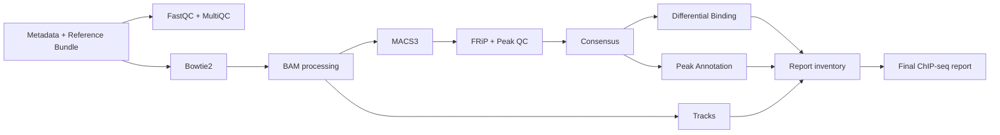

# Validação do coordenador ChIP-seq `full` nativo

## Escopo

Em 13 de agosto de 2026, o modo `chipseq_run_mode=full` foi executado como uma
única sessão Nextflow no Slurm institucional. O teste usou o fixture sintético e
`-stub-run`; portanto, valida a composição do DAG, contratos, associação de
canais, submissão e produção do relatório final, mas não constitui validação
científica ou biológica.

## Runtime e limites

- commit científico validado: `5fec75d`;
- Nextflow: `25.10.7` (JAR explícito);
- Java: Temurin/OpenJDK 21;
- executor: Slurm, fila `general`;
- `executor.queueSize=5`;
- workdir e resultados no scratch do usuário;
- nenhuma submissão aninhada nos scripts científicos.

## Caminho exercitado

Annotation e Tracks foram alimentados diretamente pelos canais de Consensus,
FINAL_BAM e Reference Bundle. O inventário do relatório foi construído a partir
dos manifests e artefatos com checksum da mesma execução; não houve descoberta
de arquivos publicados nem invocação recursiva do Nextflow.

## Resultado

- 59 tarefas registradas no trace;
- 59 tarefas com status `COMPLETED` e saída zero;
- `Execution complete` registrado no log;
- relatório final HTML/JSON e manifest produzidos;
- fila do usuário vazia após o término.

Duas falhas de integração foram encontradas e corrigidas antes da execução
final: aridade opcional da blacklist e achatamento da identidade
dataset/genoma/organismo por `collect()`. Nenhuma ferramenta científica foi
executada nesse stub-run.

## Evidência

A evidência leve de auditoria foi preservada na home institucional em um ZIP
com README em português. Workdirs e resultados temporários do scratch não são
evidência permanente e podem ser removidos depois da conferência do arquivo.

## Pendências

- execução real top-level com os runtimes científicos certificados;
- implementação estatística do provider IDR;
- regressão com dataset biológico revisado após aposentadoria do legado;
- certificação OCI/Apptainer dos runtimes ChIP-seq restantes.
