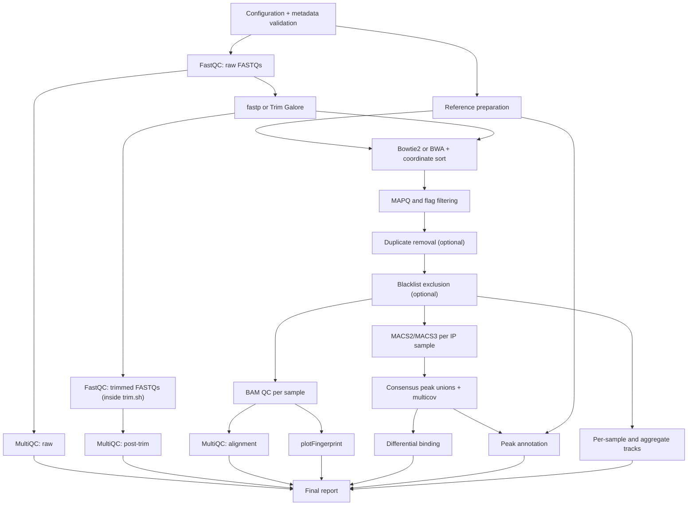

# ChIP-seq legacy analysis

This audit is based on the commands executed by
`pipelines/chipseq/legacy/chipseq_pipeline.sh` and the scripts it dispatches.
The legacy implementation is evidence of current behaviour, not the scientific
specification for the native workflow.

## Real execution graph

The Slurm orchestrator submits sample arrays by default. In individual-job
mode it adds the matched control filtering job as a peak-calling dependency.
In array mode peak calling depends on the complete filtering array. Native
Nextflow tasks must never call `sbatch` themselves.

## Steps and contracts found

| Step | Executed tools | Inputs | Principal outputs | Legacy defaults/resources |
|---|---|---|---|---|
| Reference | gzip, samtools, Bowtie2/BWA, Python | FASTA, GTF/GFF | staged reference, `.fai`, chromosome sizes, aligner index, annotation BEDs | 8 CPUs, 32 GB, 12 h |
| Raw QC | FastQC, MultiQC | metadata FASTQs | per-read ZIP/HTML, raw MultiQC | 8 CPUs, 32 GB, 12 h |
| Trimming | fastp or Trim Galore, FastQC | raw FASTQs | named trimmed FASTQs, tool reports, post-trim FastQC | fastp default; quality 20, minimum length 20 |
| Alignment | Bowtie2 or BWA, samtools | trimmed reads, or raw fallback; index | coordinate-sorted BAM, BAI, flagstat, idxstats, stats | Bowtie2 `--very-sensitive`; 8 CPUs, 32 GB, 12 h |
| Filtering | samtools, bedtools or Picard | sorted BAM, optional blacklist | final filtered BAM/BAI and statistics | MAPQ 30; remove secondary/supplementary; remove duplicates |
| BAM QC | samtools, deepTools, MultiQC | final BAMs | BAM statistics, fragment-size reports, fingerprint, MultiQC | paired fragment size when available |
| Peak calling | MACS3 or MACS2 | IP BAM, matched control BAM, genome size | narrowPeak or broadPeak and MACS reports | q=0.01; peak type inferred when `auto` |
| Consensus | sort, bedtools | all replicate peaks and IP BAMs | merged BED unions and headerless multicov matrices | group by condition + target, and target-wide |
| Differential binding | R, optionally DESeq2 | consensus matrices, metadata | DE tables and QC plots | design `~ condition`; minimum two replicates |
| Annotation | custom R | sample/consensus peaks, generated BEDs | annotated tables and class summary | promoter -2000/+500 |
| Tracks | samtools, deepTools | final BAMs | sample and merged-group BigWigs | CPM, bin size 10 |
| Report | custom R | selected reports and tables | final HTML/report artifacts | wrapper remains optional |

Package versions are not pinned in `envs/chipseq.yml`; the environment names
packages but does not provide a reproducible lock. The configuration exposes a
single broad resource default for most steps and concurrency limits for each
Slurm array. These values are compatibility baselines, not measured optima.

## Metadata observed

The validator currently requires all of these columns:

`sample_id`, `fastq_1`, `fastq_2`, `layout`, `assay`, `mark_or_factor`,
`condition`, `replicate`, `batch`, `treatment`, `control_id`, `is_control`,
`organism`, and `genome_id`.

It verifies unique sample IDs, layouts, boolean controls, FASTQ existence and
control references. It counts replicates by `condition + mark_or_factor`.
There is no distinct biological/technical replicate model, no lane/run model,
and no validation that an IP and its control use the same dataset, organism or
genome build.

## Scientific and technical findings

- Trimming is always scheduled by `--all`, but alignment silently falls back to
  raw reads when trimmed reads are missing. The native graph must make the read
  source explicit.
- Reference preparation combines reference staging, aligner indexing and
  annotation BED generation in one cache boundary.
- Filtering combines MAPQ/flag selection, duplicate removal, blacklist
  exclusion, indexing and QC. These are separate scientific policies.
- Duplicate removal defaults to enabled. That is not universally defensible for
  strong focal ChIP enrichment and must become an explicit experiment policy.
- The flag mask excludes unmapped, secondary and supplementary alignments but
  does not require proper pairs. Mitochondrial, alternative-contig and fragment
  filters are absent.
- Peak type `auto` is a target-name regex. Genome size `auto` is the sum of
  contig lengths, rather than an explicit effective/mappable genome size.
- The consensus implementation merges the union of every peak. It has no
  minimum replicate support, reciprocal-overlap rule or IDR.
- Consensus count matrices have no header; their sample identity depends on an
  implicit global metadata/BAM order.
- Differential binding uses `~ condition` only. If DESeq2 is unavailable it can
  emit log2 mean differences with missing p-values instead of failing.
- Peak annotation uses the first overlapping feature and overwrites classes in
  the order gene, downstream, intron, exon, promoter. It is not nearest-gene
  annotation.
- Several scripts skip unavailable optional programs and still create done
  markers. Native contracts must represent missing outputs explicitly.
- Result group names concatenate unescaped metadata values with `__`, allowing
  ambiguous names and collisions.

### Exact post-alignment command audit

`filter.sh` performs `samtools view -q MIN_MAPQ -F FLAG_FILTER` first. The mask
is `4` (unmapped) or `2308` (`4 + 256 + 2048`) when secondary/supplementary
removal is enabled. Paired duplicate removal uses name sort, `fixmate -m`,
coordinate sort and `markdup -r`; single-end uses `markdup -s -r`. Optional
blacklist filtering then uses alignment-level `bedtools intersect -v -abam`.
Only the resulting BAM is indexed and quickchecked. `bam_qc.sh` repeats
flagstat/idxstats/stats and optionally runs paired fragment-size, fingerprint
and MultiQC reports. Every filtering and BAM-QC task inherits the broad legacy
8 CPU, 32 GB, 12 h defaults.

### Exact peak-calling command audit

`080-peak-calling/call_peaks.sh` skips controls and runs one task per IP sample.
It obtains treatment/control BAMs from the filtering directory, selects
`BAMPE` for paired metadata and `BAM` otherwise, then invokes
`PEAK_CALLER callpeak -t ... [-c ...] -f FORMAT -g GENOME_SIZE -n SAMPLE
--outdir ... -q MACS_QVALUE [--broad] MACS_EXTRA_OPTS`. Genome-size `auto`
sums `chrom.sizes`; peak-type `auto` applies `BROAD_MARK_REGEX` to the target.
The environment lists unpinned `macs3`, so its exact version cannot be
reconstructed from the legacy YAML. MACS duplicate behavior and signal-track
generation are not explicit in the command.

## Result directories

The stable legacy layout is numbered from `010-reference` through
`130-reports`, with logs in `000-logs` and metadata in `020-metadata`. Native
providers may materialize compatibility outputs there, but semantic channels
and manifests—not directory discovery—must connect native stages.
