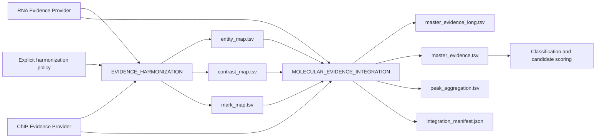

# Cross-Assay Harmonization and Molecular Evidence Integration v1

Contract identifiers:

- `helixforge.cross_assay_harmonization` version `1.0`
- `helixforge.molecular_evidence_integration` version `1.0`

This stage consumes one RNA-seq and one ChIP-seq Evidence Model 1.1 bundle. It
does not inspect result directories, infer meaning from filenames, rerun peak
annotation, classify regulation, score candidates, or perform enrichment.

## Architecture

The long table is the lossless primary representation. The gene-level master
table is a compact full-outer summary over the union of RNA and ChIP genes.
Region-only peaks and differential-binding records stay in the long table and
are never assigned to a gene without an explicit Peak-Gene Evidence record.

## Compatibility gate

Cross-assay integration requires Evidence Model 1.1. Before harmonization, the
two complete reference objects must agree on `reference_id`, `genome_id`,
`organism`, `assembly`, and `annotation_id`. Missing identity or a mismatch is
a hard error. This is stricter than merely sharing a reference display name.

## Canonical Entity Model

The canonical entity in v1 is a gene identifier. Source identity and the rule
that produced the canonical identity are retained in `entity_map.tsv`.

| Rule | Default | Safety classification |
|---|---:|---|
| Exact identifier | enabled | safe |
| Remove literal leading `gene:` | enabled | safe, legacy-compatible |
| Explicit alias map | opt-in | domain decision |
| Remove terminal version such as `.1` | opt-in | domain decision; collisions fail |
| Case folding, punctuation cleanup, fuzzy matching | forbidden | unsafe |

An explicit alias policy maps a source ID to a canonical ID; it never guesses.
If two distinct identifiers collapse after version removal, harmonization
fails rather than silently merging biological entities.

### Audit of legacy transformations

| Legacy behavior | Classification | v1 decision |
|---|---|---|
| Preserve exact gene IDs | `SAFE_CANONICALIZATION` | retained |
| Remove literal `gene:` GTF prefix | `SAFE_CANONICALIZATION` | retained and recorded |
| Stage vocabulary and reviewed mark aliases | `DOMAIN_RULE` | retained in explicit maps |
| Version stripping or study-specific gene aliases | `DOMAIN_RULE` | opt-in policy with collision checks |
| Search arbitrary stage/mark tokens inside free text | `LEGACY_HEURISTIC` | replaced by explicit metadata/vocabulary |
| Drop every gene-list value beginning with the text `gene` | `POTENTIAL_BUG` | not reproduced |
| Globs, basenames and sample substrings used to infer identity | `UNNECESSARY_WITH_NEW_API` | removed; manifests and channels supply identity |
| Remap BED peaks to a discovered GTF when annotation is absent | `UNNECESSARY_WITH_NEW_API` | not repeated; unassociated evidence remains regional |

## Contexts, contrasts, and marks

Stages use a small documented alias vocabulary inherited from the characterized
legacy behavior. Unknown values remain explicit normalized tokens; they are not
matched by substring. Contrasts are matched by the semantic tuple `factor`,
`numerator`, and `denominator`, while every producer contrast ID is preserved.
The map records `MATCHED`, `RNA_ONLY`, or `CHIP_ONLY`.

Mark identity is normalized separately from interpretation. The legacy aliases
`HP1`, `SmHP1`, `Smp_179650`, and `CBX` map to `SmHP1`; this says they identify
the configured factor, not that a regulatory consequence has been established.

## Evidence states and joins

The gene universe is a full outer union. Unilateral evidence is retained.
States are explicit:

- `MEASURED`: an observation and its value exist;
- `MISSING`: an observation exists but its scientific value is unavailable;
- `NO_PEAK`: the ChIP peak-gene dataset was measured but has no association for
  this gene;
- `NOT_MEASURED`: that assay has no gene-level dataset for the entity;
- `NOT_APPLICABLE`: a context or field does not apply to the observation.

The engine does not manufacture a `MEASURED_NOT_SIGNIFICANT` state because v1
does not apply a new significance cutoff. Original p-values, adjusted p-values,
effects and source evidence IDs remain available for later interpretation.

## Peak aggregation

Every explicit peak-gene association is retained. Aggregation groups by
canonical gene, canonical mark, and canonical context, then reports total,
promoter, gene-body and distal counts together with all peak and evidence IDs.
No best-peak rule is applied. Differential-binding rows are linked to genes
only through an explicit gene ID or an existing peak-gene association; otherwise
they remain regional observations.

## Example

If RNA reports `gene:geneA.1`, ChIP reports `oldGeneA`, the policy enables
version removal and declares `oldGeneA -> geneA`, both become canonical
`geneA`. Their original IDs and rules remain in `entity_map.tsv`. A ChIP-only
`chipOnly` and an RNA-only `geneV` both remain in `master_evidence.tsv`, with
the opposite assay represented by an explicit absence state.

## Legacy correspondence

The regression fixture compares Stage 4 with the frozen IntegrateSeq
`harmonize`, `map-peaks`, and pre-classification `integrate` outputs. It verifies
the gene universe, RNA effects/p-values, contrast and mark aliases, and peak
counts by gene/mark/context. Intentional differences are:

- paths and filenames never provide scientific identity;
- existing Peak-Gene Evidence replaces legacy nearest-gene remapping;
- region-level observations are retained instead of being dropped;
- missingness is explicit rather than encoded as zero or an empty join;
- integration class, candidate score and ranking are deferred.

## Outputs and provenance

`harmonization_manifest.json` and `integration_manifest.json` record input
Evidence Manifest IDs, reference identity, policy, record counts, SHA-256 for
every table, provider/model versions, and execution provenance. The schemas are
under `schemas/integration-engine/` and semantic/filesystem validation is
available through `bin/validate_molecular_integration.py`.

## Stage 5 boundary

Regulatory classification, candidate scoring/ranking, enrichment, Fisher tests,
correlations and final integrated figures/reports are deliberately outside v1.
They must consume this evidence contract without changing its measurements or
turning absence into evidence.
