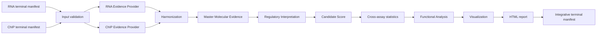

# Integrative workflow

The Integrative workflow consumes one complete RNA-seq terminal bundle
and one complete ChIP-seq terminal bundle. It never discovers files in a
published results directory. Independent re-entry requires the two portable
terminal manifests and their sibling `integration_artifacts/` directories.



## Interface

Run independently:

```bash
nextflow run . --workflow integrative -profile local \
  --rna_manifest /path/rna/rnaseq_run_manifest.json \
  --chip_manifest /path/chip/chipseq_run_manifest.json
```

Both source manifests must be `complete`, declare compatible `reference_id`,
`genome_id`, `annotation_id`, organism and assembly, and bind each consumed
artifact explicitly. The certified portable form uses `manifest_relative`
locations in `integration_artifacts/`. RNA-only and ChIP-only executions are
rejected in v1 because they do not satisfy the cross-assay contract.

`workflow all` passes the real `terminal_bundle` emissions from RNA-seq and
ChIP-seq directly to this workflow. Completion tokens are not scientific
inputs.

## Products

- validated and checksummed source bindings;
- standardized RNA and ChIP molecular evidence;
- harmonization maps and compatibility report;
- Master Molecular Evidence Table;
- regulatory classes and directional patterns;
- decomposed Candidate Score and deterministic ranking;
- Fisher/BH tests and descriptive cross-assay statistics;
- legacy-compatible descriptive `functional_enrichment.tsv` plus the separate
  inferential `functional_tests.tsv`;
- checksummed SVG summaries and per-candidate panels;
- searchable, presentation-only HTML report and structured report manifest;
- `integrative_run_manifest.json`, containing input/component lineage,
  reference, policies, model versions and checksums for terminal artifacts.

The functional background is the complete Candidate Score universe. Missing
functional annotation yields an honest `complete_empty` manifest and does not
invent zero-row enrichment products. The HTML renderer only presents existing
structured products; it does not recalculate statistics.

## Compatibility decisions

The characterized legacy evidence classes, twelve Candidate Score components,
ranking order and descriptive functional table are preserved. Formal
right-tailed Fisher tests with global Benjamini-Hochberg correction are an
additive product and do not change classification or score. SVG replaces the
old optional R plotting boundary; plots are deterministic structured-product
renderings and are not used as scientific inputs.

## Validation

The reduced fixture validates source checksums, early reference rejection,
legacy functional equivalence, formal statistics, empty annotation, figures,
HTML report, terminal schema and absence of active legacy dependencies. The
real local run completed all 12 processes with Nextflow 25.10.7. A subsequent
top-level `workflow all -stub-run` also completed 108 tasks, including native
RNA-seq and ChIP-seq terminal-manifest production and Integrative consumption.
A subsequent
resume reused the same session UUID, but the newly created cache LevelDB
contained no task entries (`000011.log` was empty), so selective cache reuse
remains an external operational limitation already tracked for the certified
runtime/filesystem combination.

## Current limitations

- v1 requires both assays and one compatible reference identity;
- the bundled functional annotation is a template, not a curated organism
  database or pathway provider;
- externally generated absolute paths require matching mounts; portable
  manifest-relative bundles are the certified re-entry mechanism;
- reviewed biological benchmark validation remains part of the v1 validation
  cycle;
- `-resume` semantics are implemented normally but not operationally certified
  on the affected shared/WSL filesystem because its Nextflow task database may
  persist with zero entries.
