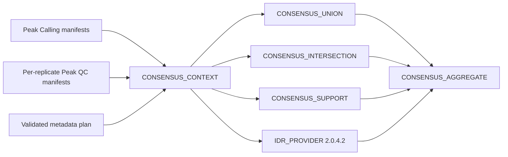

# Native ChIP-seq Consensus / IDR

Foundation 0.5 adds a provider-neutral consolidation layer after native Peak
Calling and Peak QC. The formal scientific contract is
`docs/consensus_idr_api.md`.



## Run modes

```bash
nextflow run . -profile local --workflow chipseq \
  --chipseq_config /path/to/pipeline_config.sh \
  --chipseq_run_mode consensus \
  --chipseq_consensus_method replicate_support \
  --chipseq_min_replicates 2
```

Other consensus methods are `union` and `intersection`. Biological mode is the
v1 default and requires `replicate_policy=require_premerged`; HelixForge does not
silently merge technical replicates. Technical evidence can instead be retained
with `replicate_mode=technical` and `replicate_policy=preserve`.

`--chipseq_run_mode idr` additionally requires explicit
`--chipseq_idr_threshold` and `--chipseq_idr_rank_metric`. It checks for exactly
two premerged biological narrowPeak inputs from a compatible caller and runs
the pinned statistical provider. The same optional branch is selected inside
`chipseq_run_mode=full` with `--chipseq_consensus_method idr`.

## Outputs and provenance

Consensus providers publish a BED4, a tabular atomic-segment result, original
replicate evidence, statistics, command log, execution metadata, versions and a
manifest. Grouping identity, strategy, support threshold, replicate policy,
input manifest checksums, resources and Nextflow version are tracked. Changes to
peaks, manifests, QC evidence or strategy invalidate the deep-cache boundary.

## Validation performed in this stage

- pure-Python contract and downstream-compatibility tests;
- Nextflow lint of the new modules/subworkflow;
- isolated stub graphs for union and IDR provider selection;
- JSON schema syntax validation;
- a dedicated GitHub Actions certification that pulls the immutable IDR OCI
  image and executes the provider on two deterministic ranked peak lists;
- a complete reduced Slurm execution from FASTQ through the final ChIP-seq
  report using IDR for both condition-level consensus groups.

The immutable OCI provider passed GitHub Actions run `31751053286`.
The union/support interval runtime (Python 3.12.4, samtools 1.20 and BEDTools
2.31.1) was subsequently published by digest and passed reduced Docker
certification in run `32368534261`.

The complete Slurm case `chipseq-production-idr-real-07` passed with Nextflow
25.10.7 and at most five queued jobs. Its 105-process trace produced 12 control
and 15 treated IDR regions, one differential-binding contrast, seven tracks,
two aggregate tracks, 27 annotated peaks and a 37,472-byte final HTML report.
The top-level validator reported `status=pass` for all 12 check groups.

The reduced fixture validates runtime and contracts, not biological equivalence.
A reviewed biological regression remains scheduled after legacy retirement.
