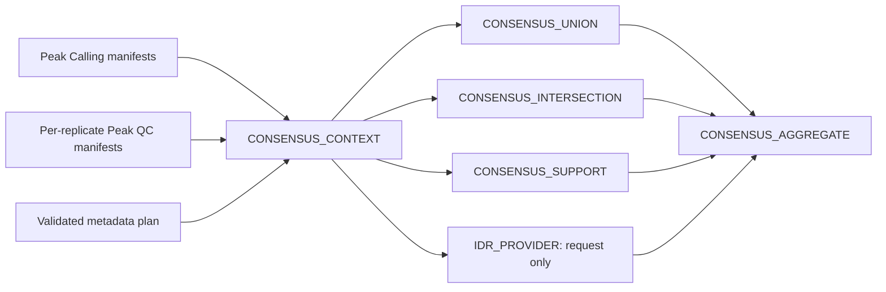

# Native ChIP-seq Consensus / IDR

Foundation 0.5 adds a provider-neutral consolidation layer after native Peak
Calling and Peak QC. The formal scientific contract is
`docs/consensus_idr_api.md`.



## Run modes

```bash
nextflow run . -profile local --workflow chipseq \
  --chipseq_config /path/to/pipeline_config.sh \
  --chipseq_run_mode consensus \
  --chipseq_consensus_method replicate_support \
  --chipseq_min_replicates 2
```

Other consensus methods are `union` and `intersection`. Biological mode is the
v1 default and requires `replicate_policy=require_premerged`; HelixForge does not
silently merge technical replicates. Technical evidence can instead be retained
with `replicate_mode=technical` and `replicate_policy=preserve`.

`--chipseq_run_mode idr` additionally requires explicit
`--chipseq_idr_threshold` and `--chipseq_idr_rank_metric`. It currently checks
for exactly two premerged biological narrowPeak inputs from a compatible caller
and records a provider request. It returns `status=not_implemented` and
`consolidated_peaks.available=false`; this is not an IDR analysis.

## Outputs and provenance

Consensus providers publish a BED4, a tabular atomic-segment result, original
replicate evidence, statistics, command log, execution metadata, versions and a
manifest. Grouping identity, strategy, support threshold, replicate policy,
input manifest checksums, resources and Nextflow version are tracked. Changes to
peaks, manifests, QC evidence or strategy invalidate the deep-cache boundary.

## Validation performed in this stage

- six pure-Python contract tests;
- Nextflow lint of the new modules/subworkflow;
- isolated stub graphs for union and IDR provider selection;
- JSON schema syntax validation.

No real BEDTools consensus, IDR runtime, legacy scientific regression, cache
benchmark or complete ChIP-seq execution was run. Those tests require a Linux/HPC
environment with validated tools and representative biological fixtures.
