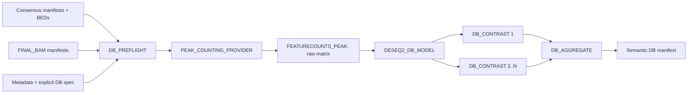

# Native ChIP-seq Differential Binding

Foundation 0.6 implements the orchestration and contracts required to replace
the legacy differential-binding step after later biological validation.



## Run

```bash
cp assets/chipseq_db_spec.example.json chipseq_db_spec.json
nextflow run . -profile local --workflow chipseq \
  --chipseq_config /path/to/pipeline_config.sh \
  --chipseq_run_mode differential_binding \
  --chipseq_consensus_method union \
  --chipseq_db_spec chipseq_db_spec.json
```

The schema is `schemas/differential-binding-v1.schema.json`. V1 supports
featureCounts, DESeq2 Wald, `~ condition` or `~ batch + condition`, explicit
condition contrasts and `none`/`minimum_count` filtering. Interactions,
technical records as independent samples, inferred contrasts, count
pre-normalization, ComBat, multimapping, fractional/multiple assignment and IDR
results are rejected.

Set `--chipseq_native_differential_binding false` to execute the unchanged
legacy `differential` step in this dedicated mode. `full` remains the complete
legacy graph.

## Cache behavior

- peak/BAM/count-policy changes invalidate counting and downstream tasks;
- filter/design/model changes invalidate model and contrasts;
- each contrast is an independent task and reuses the fitted model;
- aggregation changes never recompute inference.

An isolated `-resume` stub cached all six boundaries, including two contrast
tasks sharing one model.

## Validation performed

- six pure-Python tests for design, contrasts, biological replication,
  sample/BAM identity, rank-deficient batch and counting contracts;
- JSON/schema syntax validation and Nextflow lint;
- isolated stub with two contrasts;
- top-level `chipseq --chipseq_run_mode differential_binding` stub;
- exact isolated `-resume` with every process cached;
- scheduler-token audit for new native code.

No featureCounts or DESeq2 scientific execution, container build, Slurm run,
legacy regression, biological dataset, statistical comparison or benchmark was
performed. This stage establishes executable contracts, not biological
validation or legacy equivalence.
