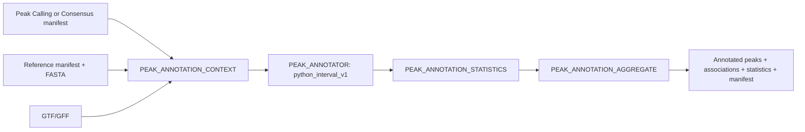

# Native ChIP-seq Peak Annotation

Foundation 0.7 introduces Peak Annotation API v1 as an independent,
manifest-driven workflow. It does not call Peak Calling or Differential
Binding and does not modify the legacy implementation.



## Legacy audit and provider decision

The legacy `annotate_peaks.sh` calls `r/annotate_peaks.R`. Reference
preparation converts GTF/GFF into gene, exon, intron, promoter, and downstream
BED files with `create_annotation_beds.py`. The R script performs manual
any-base overlap, keeps the first overlapping gene, assigns intergenic when no
overlap exists, and writes one annotated table per peak set plus a summary.
Its effective priority is promoter > exon > intron > downstream > gene >
intergenic.

Promoters default to 2,000 bp upstream and 500 bp downstream. The legacy code
does not calculate nearest-TSS distance, use strand during peak overlap, or
report multiple genes. These are explicit compatibility defaults, not hidden
universal rules.

`python_interval_v1` was selected because the legacy itself implements interval
overlap directly rather than using ChIPseeker or BEDTools. The provider parses
GTF/GFF, builds the same conceptual feature classes, applies deterministic
genomic sorting and explicit priority, and exposes `first|all` gene assignment.
It uses no scheduler, wrapper, or scientific dependency beyond Python.

## Run

```bash
nextflow run . -profile local --workflow chipseq \
  --chipseq_run_mode annotation \
  --chipseq_native_peak_annotation true \
  --chipseq_annotation_peaks /results/peaks.bed \
  --chipseq_annotation_peak_manifest /results/peak_manifest.json \
  --chipseq_annotation_reference /reference/genome.fa \
  --chipseq_annotation_reference_manifest /reference/manifest.json \
  --chipseq_annotation_gtf /reference/annotation.gtf
```

The dedicated mode consumes existing artifacts and never calls peaks again.
Set `--chipseq_native_peak_annotation false` for the unchanged legacy
`annotate` fallback. Native `full` passes Consensus and Reference Bundle outputs
directly to this API and does not permit fallback.

## Validation and outputs

Context validation checks IDs, record/sample identity, source manifest type,
declared checksums, genome/build, FASTA/GTF/GFF/peak coordinates, seqnames,
parameters, and output identity. Contigs, builds, coordinates, IDs, and
annotation versions are never rewritten.

Provider outputs are `annotated_peaks.tsv`,
`peak_gene_associations.tsv`, auxiliary tables, versions, execution metadata,
provenance, and a partial manifest. Statistics derive only from those semantic
tables. Aggregation joins by manifest ID and shields downstream consumers from
provider filenames. The output schema is
`schemas/peak-annotation-v1.schema.json`; the formal scientific contract is
`docs/peak_annotation_api.md`.

## Deliberate differences and limitations

- deterministic genomic sorting removes incidental GTF-row-order dependence
  under `gene_assignment=first`;
- `gene_assignment=all` and explicit intergenic policy are extensions;
- unsupported nearest-TSS and strand-aware modes fail instead of being
  approximated;
- `distance_to_tss` is unavailable in v1 and is never fabricated;
- the top-level mode accepts one external peak set per invocation; the reusable
  subworkflow/aggregate already support multiple manifest-ID records.

These are architectural improvements, not a claim of legacy equivalence.

## Lightweight validation

- Nextflow lint: no errors; one pre-existing legacy `projectDir` warning;
- schema JSON syntax passed; full `jsonschema` validation was not installed
  automatically because the validator is absent from this environment;
- seven Python tests, including a complete three-peak
  context/provider/statistics/aggregate chain;
- invalid coordinate, build mismatch, nearest-TSS, feature-priority, and
  strand-aware cases;
- isolated subworkflow stub completed all four boundaries;
- isolated `-resume` reused all four boundaries;
- scheduler-token audit found no `sbatch`, `srun`, or `qsub` in new modules;
- no legacy ChIP-seq file was modified.

The later complete reduced Slurm DAG produced 27 annotated peaks. Docker
certification run `32368534261` repeated the lightweight
context/provider/statistics/aggregate chain inside the immutable Python image.
A biological dataset, legacy regression, benchmark and scientific comparison
remain deferred.

## Next step

Validate a production reference bundle and a small real peak set against the
legacy tables, then add a batch-input manifest. Tracks and final reporting can
then consume this provider-neutral annotation manifest.
