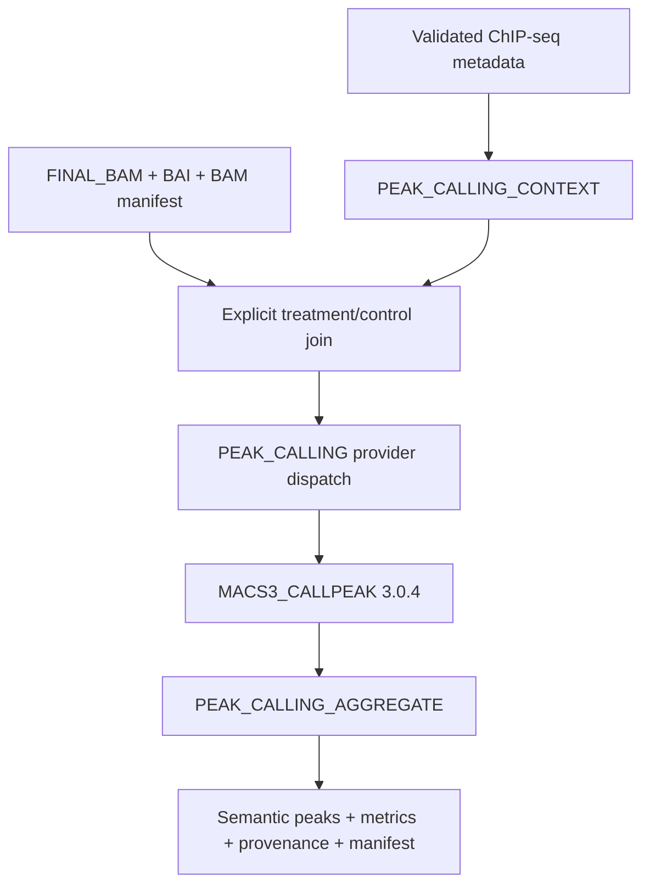

# Native ChIP-seq peak calling

## Architecture

Every IP record produces its own peak set. Controls are never peak-called and biological replicates are not pooled. Consensus and IDR remain future consumers of these independent manifests.

## Scientific decisions

| Question | Native decision | Reason |
|---|---|---|
| Narrow or broad? | Required explicitly | Target names are not reliable scientific classifiers. |
| Effective genome size? | Required as a positive numeric value | Avoid organism-specific aliases and the legacy sum-of-contigs approximation. |
| Paired-end input? | `BAMPE` | MACS3 then models observed fragments rather than only first-mate tags. |
| Duplicate handling? | Default `--keep-dup all` | Duplicate policy is already explicit in `BAM_DUPLICATES`; MACS3 must not add a hidden second policy. |
| Control association? | Exact record ID, or a unique control sample ID | Multiple possible control records fail instead of being selected by order. |
| No-control experiments? | Allowed explicitly for MACS3 | The manifest records the absence; no synthetic control is created. |
| FRiP? | Deferred | A reproducible denominator and overlap policy must be specified first. |

## MACS3 provider

MACS3 is pinned to version 3.0.4. Conda uses `macs3=3.0.4`; Docker and Apptainer use the matching Bioconda Python 3.12 build `3.0.4--py312h71493bf_0`. Resources start conservatively at 2 CPUs, 8 GB and 4 hours and require production benchmarking.

The command is constructed as an argument vector by a small Python runner, never evaluated as an arbitrary shell command. Complete command, input checksums, control checksum, reference identifier/checksum, caller environment, parameters and timing are recorded.

## Legacy comparison

The legacy caller uses MACS2/MACS3 without a fixed version, derives genome size from chromosome lengths when configured as `auto`, infers broad marks from a regular expression, and leaves MACS duplicate behavior implicit. Native v1 deliberately rejects those implicit decisions. Both retain per-IP calling, optional matched input, BAM/BAMPE selection and q-value support.

`--chipseq_run_mode peaks` always uses the native API. The legacy caller is
preserved only in the `chipseq-legacy-v1.0.0` tag.

## Validation status

Validated in this development environment:

- Nextflow lint and top-level `peaks` stub;
- two independent treatment replicates joined to one explicit control;
- unit tests for caller/type/genome-size/cutoff validation, ambiguous or incompatible controls, duplicate identities and collisions;
- narrowPeak and broadPeak structural/coordinate validation;
- missing treatment/control BAM failures;
- isolated provider/aggregate stub and resume wiring.

Subsequent consolidation executed MACS3 in the complete reduced Slurm DAG. The
pinned BioContainer digest also completed reduced `callpeak` and emitted a
non-empty narrowPeak in GitHub Actions run `32368534261`. Apptainer execution,
selective cache invalidation and a production benchmark remain pending.

The deterministic paired-end fixture and scripts are ready under `tests/native_chipseq_peaks/`; `run_functional.sh` and `run_cache_tests.sh` exit 77 with the explicit missing-runtime reason instead of downloading software automatically.

## Out of scope

Motifs, GREAT and advanced visualization remain outside this API. Consensus,
optional IDR, Differential Binding, annotation, tracks and FRiP are implemented
as downstream APIs.
