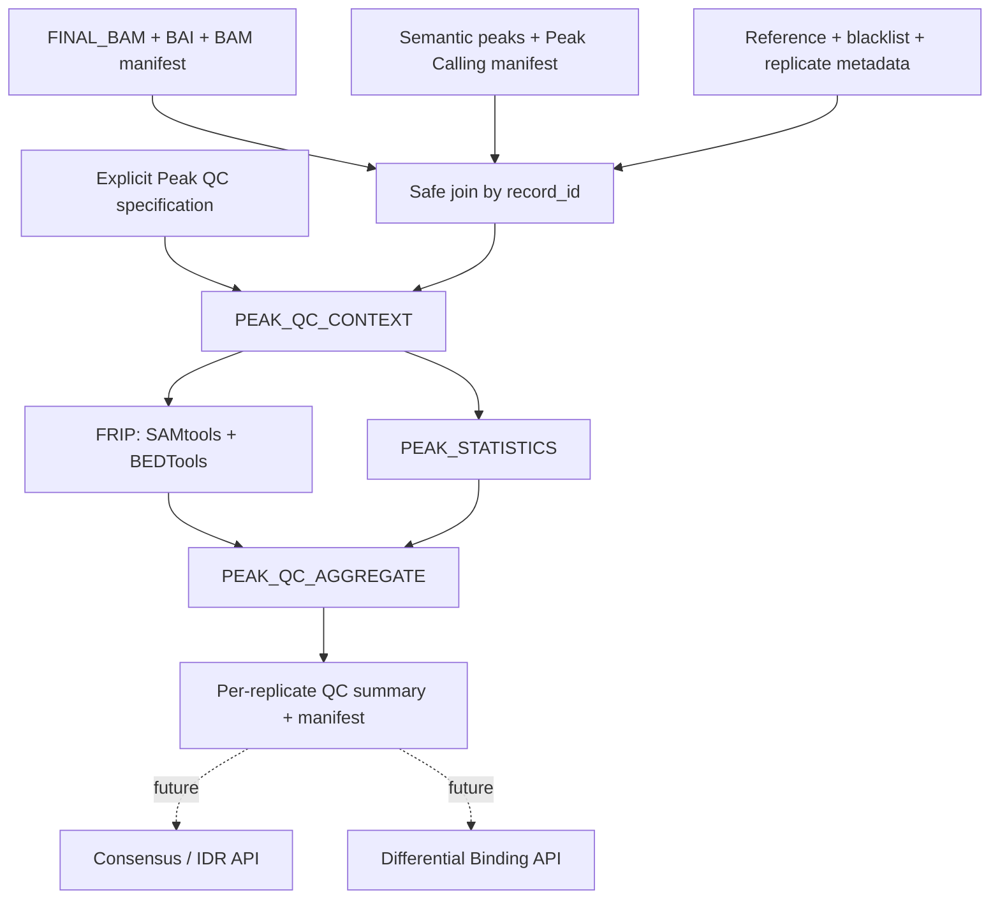

# Native ChIP-seq Peak QC

> **Historical implementation record.** The current contract is documented in
> [Peak QC API v1](peak_qc_api.md).

Foundation 0.4 implements a caller-neutral Peak QC API after final BAM
processing and per-replicate peak calling. The implementation is native
Nextflow DSL2 and contains no scheduler submission or legacy wrapper.

## Execution graph



## Modules

- `PEAK_QC_CONTEXT`: validates identity, manifests, reference bounds, peak
  format, resolved unit, filters, duplicate policy, overlap policy, and
  blacklist provenance before scientific tools run.
- `FRIP`: uses SAMtools for explicit flag/MAPQ selection and BEDTools for peak
  sorting/merging, BAM-to-BED conversion, and overlap counting.
- `PEAK_STATISTICS`: emits exact peak counts, width/score/signal summaries,
  complete width distribution, and counts per chromosome.
- `PEAK_QC_AGGREGATE`: joins matching manifests and produces one row per
  replicate without ranking, pooling, outlier removal, consensus, or IDR.

## Scientific policy

The formal definition is in `docs/peak_qc_api.md`. Defaults are:

- `unit=layout`: reads for single-end and fragments for paired-end;
- paired fragments require properly paired primary templates and count one
  QNAME/template once;
- exclude unmapped, secondary, supplementary, and QC-failed records;
- `min_mapq=0` at Peak QC because the final BAM already records its upstream
  MAPQ selection;
- include duplicate-marked records, respecting the upstream BAM policy;
- `any_base` overlap against a temporary union of peaks;
- `bam_preprocessed` blacklist policy, with the tracked upstream blacklist
  recorded but not applied a second time.

Every option is a schema-validated parameter. Invalid coordinates, unknown
reference contigs, coordinates beyond reference bounds, mismatched sample
identity, ambiguous units, and zero denominators fail explicitly.

## Execution

```bash
nextflow run . -profile local --workflow chipseq \
  --chipseq_run_mode peak_qc \
  --chipseq_peak_type narrow \
  --chipseq_effective_genome_size 2913022398 \
  --chipseq_peak_q_value 0.01
```

The numerical genome size above is only an example; no organism or assembly is
selected automatically. Use `--chipseq_run_mode peaks` to stop before Peak QC.

The pinned Conda environment contains Python 3.12.4, SAMtools 1.20, and BEDTools
2.31.1. `peak_qc_container` now points to the joint image published and tested
by digest in GitHub Actions run `32368534261`; the Apptainer parameter consumes
that same OCI artifact through `docker://`.

## Validation state

Validated in this stage:

- 27 unit tests across Peak QC, Peak Calling, and ChIP metadata;
- JSON schema parsing;
- Nextflow lint with no new warnings;
- isolated two-replicate stub-run;
- exact isolated `-resume`, with all seven Peak QC processes cached;
- top-level `chipseq --chipseq_run_mode peak_qc` stub through aggregation.

After this initial stage, real FRiP, MACS3, consensus/IDR and Differential
Binding completed in the reduced top-level Slurm DAG. The joint
SAMtools/BEDTools image also passed a reduced Docker functional test. Apptainer,
a large dataset and a biological legacy regression remain pending.
