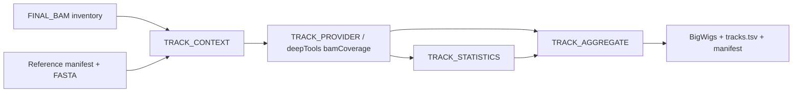

# Native ChIP-seq track generation

Track Generation API v1 is the first native implementation of the legacy
ChIP-seq `tracks` stage. It starts from an explicit inventory of already
produced `FINAL_BAM`/BAI artifacts, their manifests, and one reference
manifest. It cannot schedule alignment, BAM processing, peak calling,
consensus, differential binding, or annotation.

## Legacy evidence preserved

The legacy `tracks.sh` uses deepTools `bamCoverage` to produce BigWig files for
each final BAM. Its default is CPM normalization with bin size 10; RPGC adds an
effective genome size. Aggregate tracks merge non-control BAMs grouped by
condition and mark/factor before running the same coverage command.

The native provider preserves those explicit scientific choices while replacing
path discovery with manifest identity. Every input record, including controls,
receives an individual track. Aggregate requests contain only declared
non-control members grouped by dataset, condition, target, genome, and build.
No treatment/control subtraction, extra filtering, extension, strand split,
or inferred scale factor is introduced.

## Execution

Copy `assets/chipseq_tracks_input.example.json`, replace its paths and metadata,
then run:

```bash
nextflow run . -profile local --workflow chipseq \
  --chipseq_run_mode tracks \
  --chipseq_native_tracks true \
  --chipseq_tracks_input_manifest /path/to/tracks_input.json
```

The legacy fallback remains available without changing its scripts:

```bash
nextflow run . -profile local --workflow chipseq \
  --chipseq_run_mode tracks \
  --chipseq_native_tracks false
```

RPGC must be explicit:

```bash
--chipseq_track_normalization RPGC \
--chipseq_track_effective_genome_size 2913022398
```

Unsupported scientific options fail during `TRACK_CONTEXT`; they are not
silently ignored. The module Conda environment pins deepTools 3.5.5 and
samtools 1.20. The production image additionally pins Python 3.11.9 and
pyBigWig 0.3.23 and is selected by immutable OCI digest.

## Native graph and outputs



Provider artifacts are published below `chipseq/tracks/<track-id>.track_result`.
The aggregate inventory is below `chipseq/tracks/track_aggregate`. Lightweight
context, command, version, execution, provenance, and statistics records are
also published below `pipeline_info/native_chipseq/tracks`.

## Validation completed

- six unit tests cover defaults, rejected hidden behavior, RPGC requirements,
  exact contigs, manifest association, and order-independent aggregation;
- isolated DSL2 stub execution completed for four requests;
- a repeated `-resume` execution recovered all 13 processes from cache;
- top-level native and legacy-fallback modes completed in `-stub-run`;
- Nextflow lint completed without errors;
- the input schema and example are valid JSON;
- no scheduler command is present in native modules.

The later consolidated Slurm pass produced seven individual and two aggregate
tracks in the complete real reduced DAG. Docker certification run
`32368534261` independently created a BigWig with deepTools and reopened it with
pyBigWig from the immutable production image. A legacy-vs-native biological
BigWig comparison and IGV review remain deferred to the reviewed dataset.

## Next step

Run one small paired legacy/native dataset with the same deepTools version.
Compare BigWig chromosome sets, bin summaries, global coverage statistics, and
visual loci; then record runtime, peak memory, CPU efficiency, and cache reuse.
Only after that regression should native tracks be considered scientifically
validated or enabled by default.
