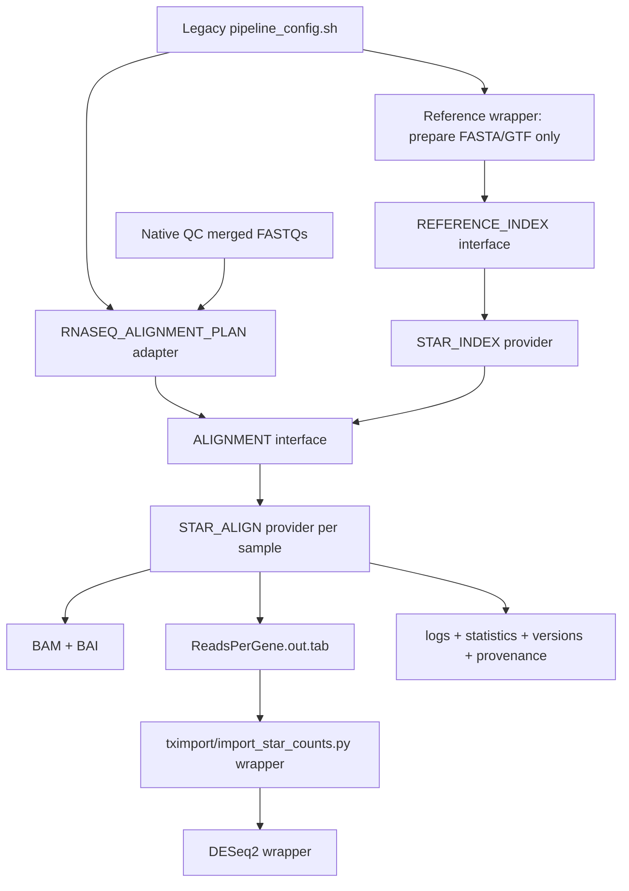

# Native RNA-seq alignment

The RNA-seq STAR path now implements Alignment API 1.0. Workflows call the
generic `REFERENCE_INDEX` and `ALIGNMENT` subworkflows; they do not call STAR
modules directly. Salmon, tximport, DESeq2, batch correction, and final reports
remain unchanged compatibility steps.

## Legacy audit

The legacy graph prepares `REF_GENOME_FA` and `REF_GTF`, builds the annotated
index at `STAR_QUANT_INDEX_DIR`, generates one CSV plan row per biological
sample, and aligns merged paired FASTQs into
`STAR_QUANT_DIR/<dataset>/<sample>/`. `import_star_counts.py` consumes
`ReadsPerGene.out.tab`; no downstream script consumes a renamed native path.

The preserved STAR commands are:

```text
STAR --runMode genomeGenerate --runThreadN 16 \
  --genomeDir <index> --genomeFastaFiles <fasta> --sjdbGTFfile <gtf> \
  --genomeSAindexNbases <legacy value> \
  --limitGenomeGenerateRAM <legacy value>

STAR --genomeDir <index> --readFilesIn <R1> <R2> --runThreadN 8 \
  --outFileNamePrefix <sample directory>/ \
  --outSAMtype BAM SortedByCoordinate --quantMode GeneCounts \
  [--readFilesCommand <legacy value>] [STAR_EXTRA_ARGS]
```

Index resources remain 16 CPUs, 180 GB, and 8 hours. Alignment resources
remain 8 CPUs, 64 GB, and 24 hours. Queue selection is delegated to Nextflow.
No native module invokes `sbatch`.

## Execution graph



When `QUANT_METHOD=salmon`, the existing Salmon alignment wrapper is selected
and no STAR task is created. Set `--rnaseq_native_alignment false` to select
the complete legacy alignment path.

## Modules and outputs

| Component | Responsibility | Principal outputs |
|---|---|---|
| `RNASEQ_ALIGNMENT_PLAN` | Translate the authoritative legacy config and unchanged STAR CSV plan into the API input tuple | settings TSV, STAR plan CSV |
| `REFERENCE_INDEX` | Dispatch index requests by `meta.aligner` | provider-neutral index channels |
| `STAR_INDEX` | Build one annotated STAR index per unique target/reference | STAR index, reports, versions, execution JSON, manifest |
| `ALIGNMENT` | Dispatch alignment requests and expose semantic channels | BAM, BAI, logs, statistics, provenance |
| `STAR_ALIGN` | Run the exact legacy STAR alignment command per sample and add non-mutating SAMtools summaries | legacy STAR files plus BAI, stats, flagstat, idxstats, MAPQ summary |

`Aligned.sortedByCoord.out.bam`, `ReadsPerGene.out.tab`, `SJ.out.tab`, and all
three STAR logs retain their legacy names and directory. SAMtools creates the
BAI and summary files after STAR and never rewrites the BAM.

The formal channel contract, provider rules, cache boundaries, and provenance
fields are defined in [alignment_api.md](alignment_api.md).

## Software and provenance

The reproducible environment pins STAR 2.7.11b, SAMtools/HTSlib 1.21, and gawk
5.1.0. Docker, Apptainer, and Conda definitions use the same versions. The
legacy Conda specification named STAR but did not pin a version; consequently,
the regression runs both implementations with the pinned native image.

Every task records the executed command, parameters, software versions,
resources, elapsed time, index path, and SHA-256 checksums for reads, reference,
annotation, index, BAM, and BAI. The command is also written as plain text; its
JSON representation is base64-encoded to avoid lossy shell escaping.

## Validation and benchmark

The reduced paired-end fixture runs the legacy commands and native modules
against the same image. The automated comparison passes for:

- gene-count categories (`ReadsPerGene.out.tab`);
- BAM alignment records, including flags, positions, CIGAR, and MAPQ;
- BAI semantics via `idxstats`;
- `flagstat` and MAPQ distribution;
- normalized `Log.final.out` mapping counts and percentages;
- presence of `Log.out` and `Log.progress.out`.

The preliminary local Docker measurement was 13,033 ms for direct legacy
commands and 28,997 ms for the native workflow. This tiny fixture measures
JVM/container startup overhead, not production STAR throughput.

Cache tests with official Nextflow 26.04.2 pass these cases:

1. identical resume: index and alignment cached;
2. changed STAR argument: index cached, alignment recomputed;
3. changed FASTQs: index cached, alignment recomputed.

The locally installed 26.04.6 development artifact did not restore even a
one-line cache probe, so 26.04.2 is the validated runtime for this stage.

## Reuse for ChIP-seq

Add `BOWTIE2_INDEX` and `BOWTIE2_ALIGN` providers that implement the same two
contracts, then extend only the dispatcher branches for `meta.aligner ==
'bowtie2'`. The ChIP-seq workflow will translate its sample metadata into the
same tuples and consume `aligned_bam`, `bam_index`, `logs`, and `statistics`.
Existing ChIP filtering and peak-calling scripts need not change.

## Next migration

Define a separate Quantification API before migrating Salmon or tximport.
Keep transcriptome indexing separate from quantification, preserve the current
Salmon directory and `quant.sf` contract, and let STAR gene counts and Salmon
transcript abundance become independent providers. Only after regression
fixtures exist for both paths should the tximport wrapper be replaced.
