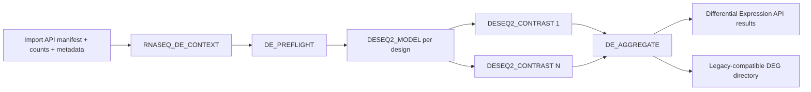

# Native RNA-seq differential expression

## Implemented flow

`DE_PREFLIGHT` checks Import manifest checksums, sample identity, design
fields, missing values, replicate counts, contrast levels, uniqueness, count
validity, filtering policy and matrix rank. Only the Wald test is accepted.
`DESEQ2_MODEL` applies the explicit fractional-count and filter policies,
preserves formula ordering, and runs default `DESeq()` fitting, normalized
counts, DDS, PCA, and heatmap behavior.
`DESEQ2_CONTRAST` preserves `results(..., alpha=0.05)`, contrast direction,
annotation, table layout, volcano plot, and significance thresholds.

The model and each contrast have independent deep-cache keys. The aggregate
restores `dds_<variable>.rds`, `normalized_counts_<variable>.tsv`,
`contrasts/DEG_*.tsv`, plots, `deg_summary.tsv`, `DEGs_all_results.tsv`,
`DEGs_significant.tsv`, and `analysis_summary.txt` under the unchanged
`DEG_DIR/all_projects/raw` target. Provider-neutral results use `statistic`
while compatibility tables retain DESeq2's `stat`.

## Legacy mapping

| Legacy responsibility | Native implementation |
|---|---|
| user DE JSON + validation | `RNASEQ_DE_CONTEXT` + `DE_PREFLIGHT` |
| DESeq2 fit inside `deseq2_analysis.R` | `DESEQ2_MODEL` |
| pairwise `results()` loop | one `DESEQ2_CONTRAST` per comparison |
| concatenation and summary writes | `DE_AGGREGATE` |
| Slurm array submission | Nextflow executor and `de_*` labels |

The original scripts are archived in `rnaseq-legacy-v1.0.0`. The current
workflow rejects `--rnaseq_native_de false` rather than silently selecting an
uncertified fallback.

## Validation record

- Nextflow 26.04.2 lint: passed; no new native-DE warnings.
- Full hybrid RNA-seq `stub-run`: passed through the report wrapper.
- Isolated native DE `stub-run`: passed.
- Preflight cases for valid input, duplicate samples, unavailable contrast
  level, missing design/contrast values, negative counts, and unsupported LRT:
  passed.
- R parse validation for both provider scripts: passed.
- Contrast-only cache regression: prepared in `run_cache_tests.sh`; not run
  locally because it requires the same complete image as scientific regression.
- Scientific legacy-versus-native regression: prepared in
  `tests/native_de/run_regression.sh`, but not executed locally. The exact
  DESeq2 1.42.0 BioContainer was verified; the derived image build failed while
  compiling `rtracklayer` because `XML` lacked system headers. The Dockerfile
  was corrected, but its second build was intentionally stopped to avoid more
  compute and credit use.

No scientific-equivalence claim is made until `run_regression.sh` passes. No
real benchmark is reported; stub timing is not scientifically useful.

## Next step

Run the golden regression and cache test on a runner that already has the
pinned image. Batch should be represented as a design covariate; matrix
correction must remain a separate exploratory output and must not be inserted
automatically before inference. Final reporting should remain downstream of
the stable Differential Expression manifest.
