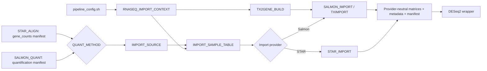

# Native RNA-seq Import API

Import API v1 removes the RNA-seq tximport compatibility wrapper. The selected
Alignment or Quantification provider now hands a manifest and a semantic
artifact directly to a native DSL2 subworkflow. No import module searches the
legacy output tree.

## Execution graph

`RNASEQ_IMPORT_CONTEXT` is an adapter only: it reads the authoritative legacy
configuration and stages metadata and annotation. Scientific transformation
begins in the native providers.

## Native modules

- `IMPORT_SOURCE`: validates schema/provider/role/sample and artifact SHA-256.
- `IMPORT_SAMPLE_TABLE`: joins legacy metadata to validated sources in stable
  dataset/sample order.
- `TX2GENE_BUILD`: builds `tx2gene.tsv` independently from GTF/GFF.
- `TXIMPORT`, exposed as `SALMON_IMPORT`: imports Salmon with the exact legacy
  tximport arguments.
- `STAR_IMPORT`: normalizes STAR GeneCounts into counts and CPM.

The removed wrapper chain is `RNASEQ_IMPORT_STEP` ->
`quantification_job.sh` -> `run_quantification.sh` -> `txtimport_quant.R` or
`import_star_counts.py`. Those files remain preserved under
`pipelines/rnaseq/legacy` for regression and direct legacy operation.

## Scientific comparison

The reduced Salmon regression compares `counts_matrix.tsv`, `tpm_matrix.tsv`,
`quant_samples.tsv`, and `tx2gene.tsv` with the unchanged legacy R importer.
It validates the new effective-length matrix and `SummarizedExperiment`
semantically. The STAR regression compares counts, CPM, metadata, and selected
count-column behavior with the unchanged Python importer. Numerical matrices
use a relative/absolute tolerance of `1e-8`; IDs, order, and metadata remain
exact.

The legacy Salmon R script cannot import more than one sample because its
scalar `ifelse` recycles the first `import_id`. Therefore the literal
legacy-versus-native regression uses one sample, while the independent native
functional fixture exercises two samples and verifies unique IDs.

The preliminary reduced-fixture benchmark includes Nextflow/container startup
and is not a throughput claim:

| Provider | Legacy | Native Import API | Threads |
|---|---:|---:|---:|
| STAR | 44.711 s | 28.408 s | 1 |
| Salmon | 29.413 s | 84.907 s | 1 |

Salmon's native timing includes the additive length matrix,
`SummarizedExperiment`, `sessionInfo()`, checksums, and provenance. On this tiny
fixture startup dominates; production benchmarking requires representative
sample and gene counts on the target Slurm cluster.

Validation with Nextflow 26.04.2 passed: DSL2 lint, both provider stubs, real
legacy-versus-native regressions, semantic RDS validation, complete `rnaseq`,
`chipseq`, `integrative`, and `all` stub graphs, full resume, provider-parameter
invalidation, manifest invalidation, and GTF/tx2gene invalidation.

## Runtime and reproducibility

The R image is fixed at `ghcr.io/gmiguelalves/omicsflow-import:1.0.0` and the
Python adapter image at
`ghcr.io/gmiguelalves/omicsflow-import-python:1.0.0`. The matching Conda files
pin R 4.3.2, Bioconductor 3.18, tximport 1.30.0, rtracklayer 1.62.0,
SummarizedExperiment 1.32.0, readr 2.1.4, and data.table 1.14.8. Each R task
writes `sessionInfo.txt`; every provider emits `versions.yml`, execution
metadata, checksums, and a partial manifest.

## Extending providers

Kallisto and RSEM can map their manifests to validated sources and reuse the
TXIMPORT contract with a provider-specific `type`. featureCounts can follow the
direct gene-count pattern used by STAR. StringTie needs an adapter that binds
its tables to the common counts/abundance roles. The RNA workflow and DESeq2
consumer do not change when a provider is added.

## Next migration: DESeq2

Create a Differential Expression API that accepts only the Import manifest,
counts matrix, and normalized sample metadata. First characterize all contrast,
design, filtering, reference-level, and output-name behavior in
`deseq2_analysis.R`; then wrap that unchanged R entry point as a native process.
Do not make DESeq2 read Salmon, STAR, or physical quantification directories.
