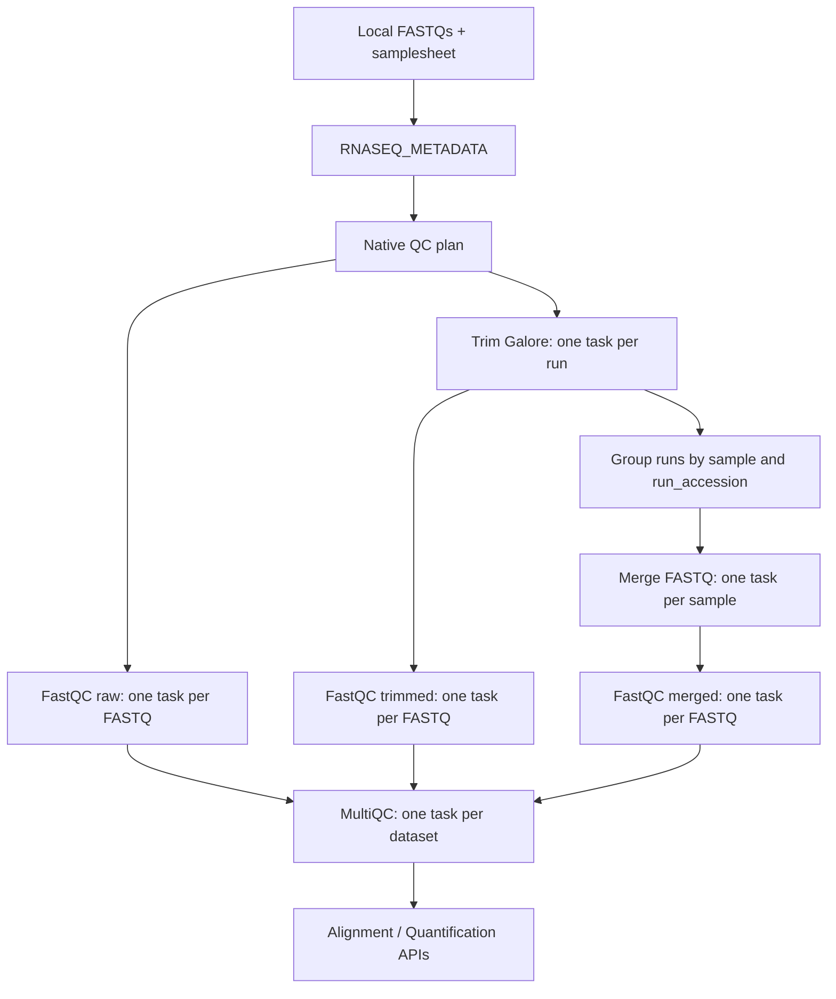

# Native RNA-seq quality control

The RNA-seq QC layer is fully native in Nextflow DSL2 while preserving the
scientific commands, resource requests, filenames, compression, and result
directories of step 030 in the existing pipeline.

## Execution graph

Raw FastQC and trimming can run concurrently, matching the dependency graph of
the former Slurm coordinator. Nextflow now owns all scheduling inside QC; none
of the native processes invokes `sbatch`.

## Native modules

| Process | Granularity | Legacy-compatible destination | Resources |
|---|---:|---|---|
| `FASTQC_RAW` | FASTQ | `fastqc_raw/` | 4 CPUs, 8 GB, 4 h |
| `TRIM_GALORE` | technical run | `trimmed_runs/` | 8 CPUs, 24 GB, 8 h |
| `FASTQC_TRIMMED` | FASTQ | `fastqc_trimmed_runs/` | 4 CPUs, 8 GB, 4 h |
| `MERGE_FASTQ` | biological sample | `trimmed_merged/` | 2 CPUs, 16 GB, 6 h |
| `FASTQC_MERGED` | FASTQ | `fastqc_merged/` | 4 CPUs, 8 GB, 4 h |
| `MULTIQC` | dataset | `multiqc_030/` | 2 CPUs, 8 GB, 2 h |

`FASTQC` and `MULTIQC` are generic modules. Their interfaces contain no
RNA-seq path assumptions, so they can be reused by ChIP-seq. Every module
implements the contract in `docs/module_contracts.md`.

## Removed wrappers

The native branch no longer calls these step-030 wrappers:

- `run_qc_project.sh`
- `fastqc_raw_plan.sh`
- `trim_runs_plan.sh`
- `fastqc_trimmed_runs_plan.sh`
- `merge_samples_plan.sh`
- `merge_sample_from_plan.py`
- `fastqc_merged_plan.sh`
- `multiqc_plan.sh`

They remain unchanged in `pipelines/rnaseq/legacy` only as a regression
reference. `RNASEQ_DOWNLOAD_STEP`, `RNASEQ_METADATA_STEP`, `RNASEQ_QC_PLAN`,
and the complete QC fallback are no longer scheduled. STAR remains optional;
Salmon, Import, and DESeq2 are native. Batch assessment and final reports are
separate retirement items.

## Compatibility details

- FastQC uses the same input FASTQ names and `--threads` value.
- Trim Galore keeps `--paired`, quality, minimum length, cores, and output names.
- Runs are sorted by `run_accession` before merge.
- Merge uses direct byte concatenation of gzip members, without recompression.
- MultiQC keeps `<dataset>_multiqc_030.html` and its associated data directory.
- MultiQC 1.17 uses the certified BioContainer pinned at OCI digest
  `sha256:fb7d6625fb5adaed43ced8bd051a875038714180bcfcd7c8e467204f72882de9`.
- Compatibility copies are written through a temporary name and atomically
  renamed where a native process creates external scientific outputs.
- Existing `pipeline_config.sh` is translated once by `RNASEQ_CONTEXT` while a
  declarative run manifest is prepared.

Setting `--rnaseq_native_qc false` or `--rnaseq_native_trim_galore false` now
fails explicitly because the legacy QC fallback has been retired.

## Validation status

- Nextflow lint: no new errors or warnings in native modules/subworkflow.
- Full RNA-seq `stub-run`: passed, including the downstream wrapper barrier.
- Two-run mock integration: passed all native QC processes without stubs.
- Regression: merged FASTQs, 10 FastQC HTML reports, and MultiQC table matched
  the equivalent legacy command sequence by SHA-256.
- Real MultiQC certification: GitHub Actions run `31726522504` executed the
  reusable process with Java 21, Nextflow 25.10.7, Docker, the immutable OCI
  reference, and two deterministic FastQC records. HTML, data tables, version,
  process status, trace, and container digest passed validation.
- Mock benchmark: legacy commands 1.743 s; Nextflow graph 25.827 s. This tiny
  fixture measures JVM/scheduler startup, not scientific throughput.

The development host has no Docker executable. Real MultiQC validation is
therefore performed by its dedicated Linux GitHub Actions workflow; the broad
biological regression remains a separate release gate.

## Downstream status

STAR now implements the generic Alignment API and Salmon implements the
independent Quantification API. See
[native-rnaseq-alignment.md](native-rnaseq-alignment.md) and
[native-rnaseq-quantification.md](native-rnaseq-quantification.md) for their
contracts, regressions, and benchmarks.
