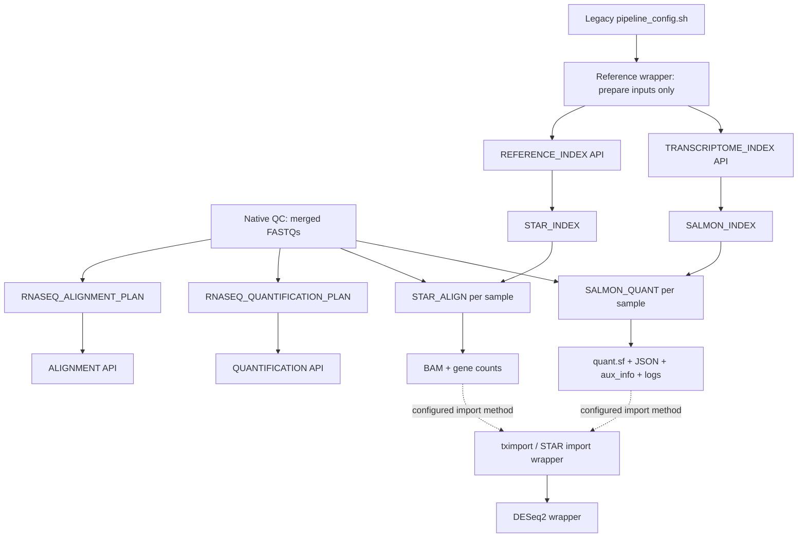

# Native RNA-seq quantification

The RNA-seq Salmon path implements Quantification API 1.0. Workflows call the
generic `TRANSCRIPTOME_INDEX` and `QUANTIFICATION` subworkflows; they do not
call Salmon processes directly. tximport, DESeq2, batch correction, and final
reports remain unchanged compatibility steps.

## Legacy audit

The unchanged legacy path uses `REF_TRANSCRIPTS_FA`, builds
`SALMON_INDEX_DIR`, generates one plan row per biological sample from the QC
plan, and quantifies merged paired FASTQs into
`QUANT_DIR/<dataset>/<sample_id>/`.

The preserved commands are:

```text
salmon index -t <transcriptome> -i <index> -p 16 -k <SALMON_KMER_SIZE>

salmon quant -i <index> -l A -1 <R1> -2 <R2> -p 8 \
  --validateMappings -o <QUANT_DIR>/<dataset>/<sample_id>
```

Index resources remain 16 CPUs, 64 GB, and 12 hours. Quantification resources
remain 8 CPUs, 32 GB, and 12 hours. `SALMON_KMER_SIZE` remains 31 by default.
Nextflow owns local or Slurm scheduling; neither native module submits jobs.

Salmon produces `quant.sf`, `cmd_info.json`, `lib_format_counts.json`,
`aux_info/`, and `logs/salmon_quant.log`. The tximport wrapper reads only
`quant.sf` plus metadata and GTF, resolving the fixed path
`QUANT_DIR/<dataset>/<sample_id>/quant.sf`. That path and every Salmon filename
are preserved.

## Execution graph



`--rnaseq_analysis_mode both` fans the same QC outputs into STAR and Salmon.
The two APIs have no edge between them. tximport waits only for the method in
`QUANT_METHOD`, allowing the other provider to continue independently.

## API and modules

| Component | Responsibility | Semantic outputs |
|---|---|---|
| `RNASEQ_QUANTIFICATION_PLAN` | Translate the authoritative config and unchanged Salmon plan into API tuples | settings TSV, Salmon plan CSV |
| `TRANSCRIPTOME_INDEX` | Dispatch by `meta.quantifier` | provider-neutral index, reports, versions, provenance |
| `SALMON_INDEX` | Build one content-tracked Salmon index | complete Salmon index and checksums |
| `QUANTIFICATION` | Dispatch providers and project tool files into stable roles | quantification, command info, library format, auxiliary, logs, statistics |
| `SALMON_QUANT` | Execute the preserved Salmon command once per sample | complete legacy-compatible Salmon directory plus provenance |

The formal input/output contract and future-provider rules are defined in
[quantification_api.md](quantification_api.md).

## Software and provenance

Salmon is fixed at 1.10.3. Docker uses Biocontainers build
`1.10.3--h6dccd9a_2` at OCI digest
`sha256:f83ebb158845ee8138d793347f83b92c75e83c58dd8f4600c6fea2a2453ef08e`.
The Apptainer image and Conda environment use the same build/version.

Each task records command, parameters, version, container, CPUs, memory, time,
elapsed seconds, transcriptome checksum, index checksum, read checksums, output
checksums, normalized statistics, `versions.yml`, execution JSON, and a small
partial manifest. These files are published under `pipeline_info`; none are
inserted into the legacy Salmon result directory.

## Validation and benchmark

The reduced paired-end fixture runs the exact legacy commands and native
modules with the same image. Automated comparison passes for:

- all `quant.sf` identities and columns (`Length`, `EffectiveLength`, `TPM`,
  and `NumReads`);
- semantic `cmd_info.json` after path normalization;
- all library-format counts and fragment statistics;
- the exact `aux_info` file set, `ambig_info.tsv`, and semantic
  `meta_info.json`;
- presence of the native Salmon log;
- the fragment-length distribution total and mean within a 1%/1-nt stochastic
  tolerance.

On the tiny local Docker fixture, direct legacy commands took 6,253 ms and the
native workflow took 31,894 ms. The latter includes JVM startup, two Nextflow
tasks, container startup, checksums, publication, and provenance. It is a
startup-overhead benchmark, not a production throughput comparison. The trace
records task CPU and peak RSS; configured production resources remain the
legacy 16/64 GB for index and 8/32 GB for quantification.

Cache tests with official Nextflow 26.04.2 pass:

1. identical resume: index and quantification cached;
2. changed quantification parameter: index cached, quantification recomputed;
3. changed FASTQs: index cached, quantification recomputed;
4. changed transcriptome: index rebuilt and its dependent quantification
   recomputed.

## Future providers

Kallisto, RSEM, featureCounts, or another quantifier must implement the same
two envelopes and semantic emissions. Adding a provider requires a new module
and one dispatcher branch; RNA-seq workflow wiring and downstream consumers do
not change. Providers without a native equivalent for a semantic file must
emit a documented stable placeholder rather than leak a tool-specific branch
into callers.

## Recommended tximport migration

Treat tximport as a separate import/aggregation layer, not as part of Salmon:

1. split transcript-to-gene extraction from matrix import;
2. consume Quantification API manifests/channels instead of searching result
   directories;
3. preserve the current transcript/gene ID normalization exactly;
4. keep `countsFromAbundance="no"`, `ignoreTxVersion=TRUE`, and
   `ignoreAfterBar=TRUE` unchanged;
5. regress counts, TPM, sample table, and `tx2gene.tsv` before removing the
   wrapper.

The main risks for that stage are metadata/sample ordering, missing-sample
behavior, GTF normalization, and accidental coupling to Salmon-only filenames.
