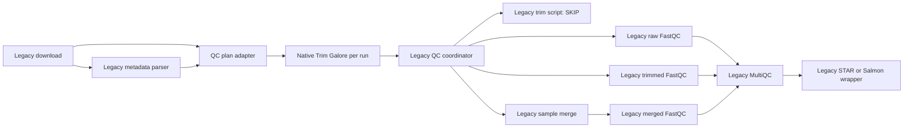

# Native Trim Galore migration

## Scope

Only RNA-seq run-level Trim Galore is native. Reference preparation, download,
metadata parsing, FastQC, sample merge, MultiQC, STAR, Salmon, tximport, batch
correction, DESeq2, and reporting remain behind existing scripts.

The legacy `pipeline_config.sh` is authoritative. The native process consumes
the unchanged values of `TRIM_QUALITY`, `TRIM_LENGTH`, `SCRATCH_ROOT`, project
accessions, metadata paths, and the filenames generated by
`generate_qc_plan.py`.

## Hybrid DAG



## Compatibility contract

For each QC-plan row, the native task produces exactly the configured
`trimmed_run_r1` and `trimmed_run_r2` paths. It also preserves the two Trim
Galore `*_trimming_report.txt` files in the same directory. Copy-to-target uses
a temporary filename followed by an atomic rename, so downstream wrappers do
not observe partial files.

The task command is equivalent to the legacy command:

```text
trim_galore --paired --quality TRIM_QUALITY --length TRIM_LENGTH \
  --cores CPUS --output_dir DIR RAW_R1 RAW_R2
```

## Software environments

- Conda: `modules/local/trim_galore/environment.yml`, Trim Galore 0.6.10.
- Docker: `quay.io/biocontainers/trim-galore:0.6.10--hdfd78af_0`.
- Apptainer/Singularity: the same OCI image through Nextflow.
- Local/Slurm without environment management: the `trim_galore` available on
  `PATH`, matching the legacy deployment.

Before production validation, confirm that the selected native version matches
the version currently installed on the cluster. The legacy environment did not
pin or record Trim Galore, so its historical version cannot be inferred from
the repository.

## Reuse

Other paired-end workflows can include `TRIM_GALORE` and provide a tuple of:

```text
meta, raw_r1, raw_r2
```

`meta` carries sample identifiers, quality/length values, and exact target
paths. No RNA-specific algorithm is embedded in the module.
