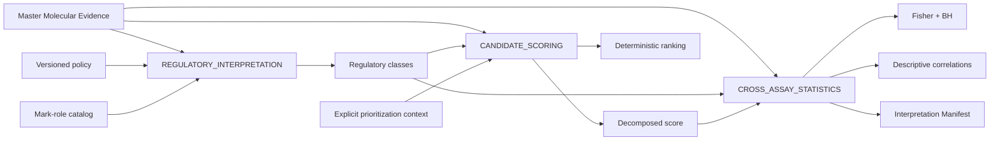

# Regulatory Interpretation and Candidate Prioritization v1

Contract versions:

- Interpretation Model: `1.0`
- Regulatory Classification: `1.0`
- HelixForge Candidate Score: `1.0`

The native interpretation layer converts Master Molecular Evidence into structured interpretation,
cross-assay statistics and an explainable ranking. Observations are never
rewritten: classification refers to source evidence IDs, and score components
remain separate from inferential statistics.



## Observation, interpretation and prioritization

`master_evidence_long.tsv` contains observations such as RNA effect, adjusted
p-value, differential-binding effect and peak location. `regulatory_classes.tsv`
contains interpretations of those observations. `candidate_score.tsv` is a
deterministic prioritization heuristic. A score is not a p-value, probability,
confidence or inferential statistic.

## Thresholds

The policy `assets/integration/interpretation_policy.v1.json` contains the
characterized legacy thresholds:

- RNA significant: `padj <= 0.05` and `abs(log2FC) >= 1`;
- differential binding significant: `padj <= 0.05` and
  `abs(log2FC) >= 1`.

Direction and significance are independent fields. A peak can be present while
differential binding is absent, measured but not significant, or significant.

## Historical evidence classes

The exact legacy taxonomy is retained as `legacy_evidence_class`:

| Precedence | Class | Rule |
|---:|---|---|
| 1 | `DEG_with_differential_peak` | significant RNA and any significant gene-linked differential peak |
| 2 | `DEG_with_promoter_peak` | significant RNA and at least one promoter peak |
| 3 | `DEG_with_gene_body_peak` | significant RNA and at least one gene-body peak |
| 4 | `DEG_with_distal_peak` | significant RNA and at least one distal peak |
| 5 | `DEG_only` | significant RNA without the ChIP conditions above |
| 6 | `ChIP_only` | no significant RNA but at least one associated peak |
| 7 | `unchanged` | neither significant RNA nor associated peak |

This historical class is positional/evidence-scope classification. It did not
use mark roles or RNA–ChIP directional concordance.

## Directional regulatory pattern

An orthogonal `regulatory_pattern` adds the requested directional interpretation
without changing the historical class:

- `CONCORDANT_ACTIVATION`: significant RNA increase agrees with a significant
  activating-mark gain or repressive-mark loss;
- `CONCORDANT_REPRESSION`: significant RNA decrease agrees with an activating-
  mark loss or repressive-mark gain;
- `DISCORDANT`: supported RNA and ChIP directions disagree with the mark role;
- `RNA_ONLY` or `CHIP_ONLY`: significant unilateral evidence;
- `INSUFFICIENT_CROSS_ASSAY_EVIDENCE`: peak presence without supported
  differential binding, or another incomplete pairing;
- `INSUFFICIENT_MARK_SEMANTICS`: directional evidence exists, but the mark role
  is context-dependent/unknown;
- `NO_REGULATORY_INTERPRETATION`: no defensible regulatory interpretation.

`classification_reason` and JSON `evidence_support` expose the exact effects,
padj values, peak counts, role and decision for each gene/contrast/mark.
`NO_PEAK` remains distinct from `NOT_MEASURED`.

## Mark-role catalog

`assets/integration/mark_roles.v1.tsv` is versioned and checksummed. It separates
mark identity from biological role:

| Role | Marks in v1 |
|---|---|
| `ACTIVATING` | H3K27ac, H3K4me3, H3K9ac, ATAC |
| `REPRESSIVE` | H3K27me3, H3K9me3 |
| `CONTEXT_DEPENDENT` | SmHP1 |
| `UNKNOWN` | unknown or unlisted marks |

SmHP1 is intentionally not forced into an activating/repressive category.

## Candidate Score v1

For a gene `g`, the exact legacy-compatible score is:

```text
S(g) = min(10, -log10(max(min_padj, 1e-300))) when min_padj < 1, else 0
     + min(5, max_abs_RNA_log2FC)
     + 2   if any promoter peak
     + 2   if any significant differential-binding peak
     + 1   if gene of interest
     + 2   if epigenetic machinery
     + min(3, 0.5 * number of significant RNA contrasts)
     + min(2, 0.5 * number of ChIP marks)
     + 2   if WGCNA hit
     + 1.5 if Mfuzz hit
     + 1   if DTU hit
     + 1   if splicing hit
```

The theoretical range is 0–32.5. Every term is a separate column; `raw_score`
and `final_score` are currently identical. Candidate Score v1 has bonuses and
saturation caps but no negative penalty component. Functional descriptions and pathway
enrichment are not score prerequisites.

The Master Molecular Evidence does not contain the six curated/network/isoform
annotations used by the historical score. They enter through one explicit
`prioritization_context.tsv`, staged by Nextflow and recorded by checksum. If a
gene has no context row, those components are zero and `context_status` is
`NOT_PROVIDED`.

## Ranking

Ranking is deterministic:

```text
final_score DESC
statistical_support DESC
canonical_entity_id ASC
```

`statistical_support` is the sum of the DE adjusted-p component and differential-
peak component. Reordering input rows cannot alter scores or ranking.

## Cross-assay statistics

### Fisher enrichment

The v1 regression preserves the legacy right-tailed hypergeometric/Fisher
calculation for `DEG` and `epigenetic_machinery` target sets against any-peak
and promoter-peak sets, per mark/context and pooled across observed contexts.
The universe is all genes in the Master Evidence. `n11`, `n10`, `n01`, `n00`,
expected overlap, fold enrichment and overlap IDs are explicit. Odds ratios use
the legacy Haldane–Anscombe `+0.5` correction.

BH correction is applied over the single historical family
`legacy_mark_enrichment_all`. This mixes target sets and peak scopes and is
preserved as `LEGACY_BEHAVIOR`; a future version may define narrower scientific
families, but cannot silently change v1.

### Correlations

For every gene/mark with linked peak evidence, mean TPM is correlated across
assayed contexts with total and promoter peak counts using Pearson and
Spearman. Minimum `n=2`; NA/absent expression contexts are omitted. Constant
vectors are reported without a coefficient. The legacy implementation did not
calculate correlation p-values, so v1 records empty `pvalue`/`padj` and
`inference_status=NOT_COMPUTED_LEGACY` rather than fabricating inference.

## Characterized behavior and deviations

- `LEGACY_BEHAVIOR`: the adjusted-p score component rewards every `padj < 1`,
  even when it exceeds the DE threshold. This explains the non-zero historical
  score of otherwise unchanged genes and is preserved in v1.
- `LEGACY_BEHAVIOR`: one global BH family covers all Fisher target/scope rows.
- `LEGACY_BEHAVIOR`: correlations are descriptive and have no p-values.
- `POTENTIAL_BUG` corrected: score ties previously inherited input order. v1
  adds documented statistical-support and gene-ID tie breakers; component and
  final scores do not change.
- Mark biological roles did not affect the legacy evidence class or score.
  Directional interpretation is additive and independently versioned.

## Outputs

```text
interpretation/
├── interpretation_manifest.json
├── regulatory_classes.tsv
├── mark_role_catalog.tsv
├── candidate_score.tsv
├── candidate_ranking.tsv
├── fisher_tests.tsv
├── correlations.tsv
└── prioritization_context.tsv
```

The manifest records the Integration Manifest checksum, component manifests,
thresholds, score formula/version, mark catalog, optional context, statistical
methods, datasets, record counts and SHA-256 checksums.

## Downstream boundary

This API does not render the final HTML report or alter its own evidence model.
The active native Integrative workflow consumes its products in Candidate
Scoring, Cross-Assay Statistics, Functional Analysis, Visualization and Report
APIs. Public/reviewed biological benchmarks remain a separate release-
validation activity.
