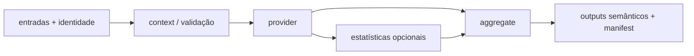

# APIs e contratos

APIs do HelixForge definem papéis semânticos entre subworkflows. Providers
implementam esses papéis sem obrigar o workflow consumidor a conhecer nomes de
arquivos específicos da ferramenta.

| API | Providers/implementações atuais | Papel principal |
|---|---|---|
| QC | FastQC, Trim Galore, merge, MultiQC | qualidade e preparação de reads |
| Reference Index | STAR_INDEX, BOWTIE2_INDEX | índice rastreado por referência/provider |
| Alignment | STAR_ALIGN, BOWTIE2_ALIGN | BAM/BAI, logs e estatísticas |
| Quantification | SALMON_INDEX, SALMON_QUANT | abundância em nível de transcrito |
| Import | TXIMPORT/Salmon, STAR_IMPORT | matrizes gene-level comuns |
| Differential Expression | DESeq2 Wald | modelo, contrasts e agregação RNA |
| BAM Processing | SAMtools + blacklist policy | final BAM explícito |
| Peak Calling | MACS3 3.0.4 | picos por réplica |
| Peak QC | FRiP + peak statistics | QC caller-neutral por réplica |
| Consensus/IDR | union, intersection, replicate_support; IDR pendente | consolidação explícita de réplicas |
| Differential Binding | featureCounts + DESeq2 Wald | counts/modelo/contrasts de picos |
| Peak Annotation | `python_interval_v1` | associação pico–feature/gene |
| Track Generation | `deeptools_bamcoverage_v1` | BigWig individual/agregado |
| ChIP-seq Report | `html_v1` | agregação terminal e apresentação |

## Contrato comum de módulo

Itens de dados carregam `meta` como primeiro elemento. `meta.id` é obrigatório;
campos como `dataset`, `sample_id`, `record_id`, `condition`, `target`,
réplicas, `genome_id` e `build` devem ser preservados quando disponíveis.

Emissões comuns, quando aplicáveis:

```nextflow
tuple val(meta), path(primary_artifacts), emit: artifacts
tuple val(meta), path(report_artifacts),  emit: reports
tuple val(meta), path(version_file),      emit: versions
tuple val(meta), path(status_file),       emit: status
```

Cada responsabilidade científica deve ter parâmetros explícitos, ambiente
reprodutível, recursos, cache, stub e testes proporcionais. Um provider não
pode fabricar valores apenas para preencher um papel indisponível; o manifest
declara `available: false` ou um estado correspondente.

## Context, provider e aggregate

Muitas APIs seguem uma composição concreta:



Esse padrão existe onde o código exige validação e normalização separadas; não
é uma obrigação de criar processos vazios para APIs simples.

## Especificações técnicas

- [Contrato comum de módulos](https://github.com/GMiguelAlves/HelixForge/blob/master/docs/module_contracts.md)
- [Alignment API](https://github.com/GMiguelAlves/HelixForge/blob/master/docs/alignment_api.md)
- [Quantification API](https://github.com/GMiguelAlves/HelixForge/blob/master/docs/quantification_api.md)
- [Import API](https://github.com/GMiguelAlves/HelixForge/blob/master/docs/import_api.md)
- [Differential Expression API](https://github.com/GMiguelAlves/HelixForge/blob/master/docs/differential_expression_api.md)
- [APIs ChIP-seq](https://github.com/GMiguelAlves/HelixForge/blob/master/docs/chipseq-api.md)
- [Peak Calling](https://github.com/GMiguelAlves/HelixForge/blob/master/docs/peak_calling_api.md),
  [Peak QC](https://github.com/GMiguelAlves/HelixForge/blob/master/docs/peak_qc_api.md) e
  [Consensus/IDR](https://github.com/GMiguelAlves/HelixForge/blob/master/docs/consensus_idr_api.md)
- [Differential Binding](https://github.com/GMiguelAlves/HelixForge/blob/master/docs/differential_binding_api.md),
  [Annotation](https://github.com/GMiguelAlves/HelixForge/blob/master/docs/peak_annotation_api.md),
  [Tracks](https://github.com/GMiguelAlves/HelixForge/blob/master/docs/track_generation_api.md) e
  [Report](https://github.com/GMiguelAlves/HelixForge/blob/master/docs/chipseq_report_api.md)
