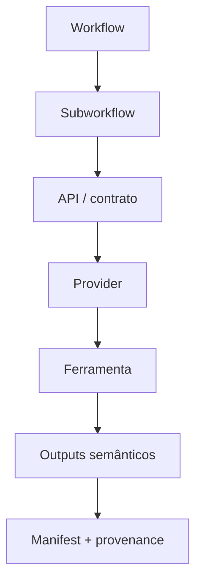

# Visão geral da arquitetura

O HelixForge separa orquestração, contratos científicos e implementação de
ferramentas. A hierarquia observável no código é:

Uma API é um contrato entre componentes; ela não precisa corresponder a um
único processo. Por exemplo, a Differential Expression API separa preflight,
modelo, contrasts e agregação, enquanto a Alignment API possui dispatchers de
índice/alinhamento e providers distintos para STAR e Bowtie2.

## Responsabilidades

| Camada | Responsabilidade |
|---|---|
| Workflow | Selecionar modo, coordenar grandes ramos e decidir native/fallback. |
| Subworkflow | Compor processos, joins e cache boundaries de uma função. |
| API/contrato | Definir identidades, entradas, papéis semânticos e saídas. |
| Provider | Implementar o contrato com uma ferramenta ou estratégia concreta. |
| Processo | Executar uma responsabilidade com recursos e ambiente declarados. |
| Manifest | Descrever identidade, estado e artefatos sem depender do diretório. |
| Provenance | Relacionar comando, parâmetros, versões, inputs e checksums disponíveis. |
| Report | Agregar resultados existentes; não executar produtores upstream. |

## Reutilização existente

- `FASTQC` e `MULTIQC` são usados por RNA-seq e ChIP-seq.
- `REFERENCE_INDEX` e `ALIGNMENT` são dispatchers comuns: STAR atende RNA-seq;
  Bowtie2 atende ChIP-seq.
- DESeq2 aparece em APIs estatísticas separadas para expressão e binding, com
  modelos e contrasts como cache boundaries distintos.
- O contrato comum de módulo e o envelope de manifest são compartilhados.

A reutilização não elimina as diferenças científicas: Salmon não depende de
STAR; filtros de BAM ChIP-seq não ficam dentro de Bowtie2; FRiP não é uma saída
implícita de Peak Calling.

## Orquestração e ambientes

Nextflow controla execução local ou Slurm. Módulos nativos não submetem
`sbatch`, `srun` ou jobs aninhados. `cpus`, `memory`, `time`, queue, containers
e Conda são declarados na camada de execução. Parâmetros científicos são
entradas explícitas ou continuam no `pipeline_config.sh` autoritativo.

## Limites atuais

- Integrative ainda é uma fronteira legada.
- `all` sincroniza RNA-seq e ChIP-seq por conclusão, não por um manifest
  integrativo comum.
- O modo ChIP-seq `full` continua legado.
- Preparação de referência/download/metadata e alguns relatórios RNA ainda
  possuem adapters/wrappers.
- IDR valida a requisição, mas o provider estatístico está `not_implemented`.

Esses limites estão detalhados em [Migração e legado](Migration-and-Legacy.md).

Referências: [arquitetura técnica](https://github.com/GMiguelAlves/HelixForge/blob/master/docs/architecture.md),
[contratos de módulos](https://github.com/GMiguelAlves/HelixForge/blob/master/docs/module_contracts.md) e
[mapeamento de scripts](https://github.com/GMiguelAlves/HelixForge/blob/master/docs/script-mapping.md).
