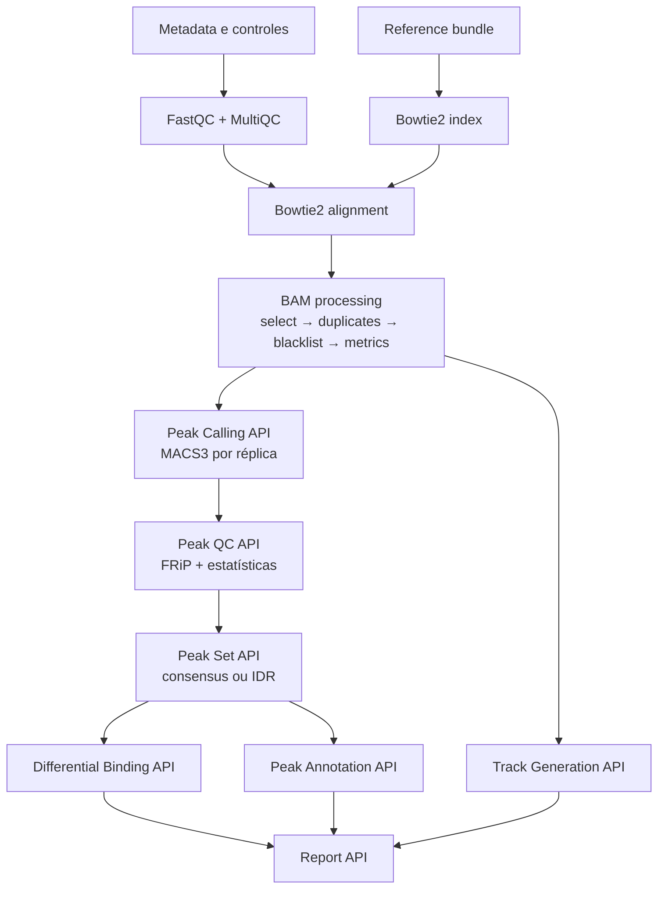

# ChIP-seq

O ChIP-seq possui estágios nativos selecionáveis desde metadata/QC até o
relatório. O modo `full`, porém, ainda executa o grafo legado; ele não é um
atalho para todos os modos nativos. Consulte [Modos de workflow](Workflow-Modes.md).

> A presença do DAG funcional não equivale à conclusão da validação científica
> final. As comparações que exigem dados e runtime HPC permanecem no
> [plano de validação](https://github.com/GMiguelAlves/HelixForge/blob/master/docs/final-validation-plan.md).

## Fluxo nativo por estágios

Esse diagrama representa composição conceitual. `annotation`, `tracks` e
`report` são modos standalone: recebem manifests/inventários explícitos de
artefatos existentes e não reexecutam produtores upstream.

## Fundação: metadata, QC e Alignment API

`CHIPSEQ_METADATA` valida amostras, réplicas biológicas e associação entre
IP e controles. FastQC e MultiQC usam os mesmos módulos genéricos do RNA-seq.

O dispatcher da Alignment API seleciona Bowtie2 para ChIP-seq. Índice e
alinhamento são processos separados; Bowtie2 2.5.4 produz BAM/BAI, métricas,
logs, versões, metadata de execução e manifest. Nextflow, e não os scripts,
controla recursos e agendamento.

## Processamento de BAM

O BAM alinhado passa por responsabilidades independentes:

1. `BAM_SELECT`: seleção por MAPQ e flags SAM;
2. `BAM_DUPLICATES`: política de duplicatas;
3. `BAM_BLACKLIST`: exclusão de regiões blacklist;
4. `BAM_INDEX_METRICS`: índice e métricas do BAM final.

Valores não informados podem ser resolvidos pelo adapter a partir da
configuração legada autoritativa. Os defaults da interface incluem
`include_flags=0` e política de duplicatas `none`; os valores efetivos são
registrados no request/manifest. Essa separação torna cada alteração uma
fronteira de cache observável.

## Peak Calling e Peak QC

O provider inicial da Peak Calling API é MACS3 3.0.4. Cada réplica recebe seu
BAM final, controle explicitamente associado, tipo de pico, tamanho efetivo do
genoma e cutoff declarados. A agregação publica peak set, métricas e manifest
sem esconder os outputs do provider.

Peak QC calcula FRiP e estatísticas sem alterar o peak set. Os defaults atuais
da interface são unidade `layout`, MAPQ mínimo 0, remoção de reads unmapped,
secondary, supplementary e QC-fail, duplicatas incluídas, proper pair exigido,
overlap `any_base` e blacklist já aplicada no BAM. Esses valores são
provenance, não uma recomendação universal para novos experimentos.

## Peak Set: consensus e IDR

Consensus suporta providers de union, intersection e replicate support,
mantendo a identidade das réplicas no manifest. IDR aceita exatamente duas
réplicas narrowPeak premerged e exige threshold/rank metric explícitos.

O provider IDR atual está deliberadamente `not_implemented`: ele valida a
requisição e emite status/manifest sem fabricar um peak set e sem fallback
estatisticamente diferente.

## Differential Binding API

O caminho nativo usa `FEATURECOUNTS_DB`, `DESEQ2_DB_MODEL`, contrasts explícitos
e agregação. O peak set é uma entrada versionada; BAMs biológicos devem estar
premerged conforme o contrato. A API 1.0 implementa somente Wald, fórmula
aditiva declarada e contrasts explícitos. Ela não cria comparações implícitas.

## Peak Annotation API

A annotation recebe peak/consensus manifest, referência, reference manifest e
GTF/GFF explícitos. O provider atual `python_interval_v1` usa, por padrão,
modo `overlap_priority`, overlap `any`, janela promotora 2.000 bp upstream e
500 bp downstream, atribuição `first`, sem orientação de strand e retenção de
intergênicos. Outputs incluem picos anotados, associações, estatísticas,
versions, execution metadata e manifests parciais/agregados.

## Track Generation API

O provider `deeptools_bamcoverage_v1` consome um inventário de BAMs finais.
Os defaults atuais são BigWig, bin 10, normalização CPM, scale factor 1.0,
sem extensão de reads, modo `reads`, unstranded e sem filtros adicionais.
Agregação está habilitada no escopo `condition_target`. Para RPGC, o tamanho
efetivo do genoma precisa ser explícito.

## Report API

O relatório recebe um inventário explícito de componentes. Ele agrega o que já
existe e classifica cada componente como `available`, `not_requested`,
`not_implemented`, `failed` ou `incomplete`. O provider `html_v1` gera HTML
self-contained, JSON, manifest, versões e provenance; não chama alignment,
peaks, annotation ou tracks.

## Contratos e referência técnica

- [ChIP-seq API](https://github.com/GMiguelAlves/HelixForge/blob/master/docs/chipseq-api.md)
- [BAM processing](https://github.com/GMiguelAlves/HelixForge/blob/master/docs/native-chipseq-bam-processing.md)
- [Peak Calling](https://github.com/GMiguelAlves/HelixForge/blob/master/docs/peak_calling_api.md)
- [Peak QC](https://github.com/GMiguelAlves/HelixForge/blob/master/docs/peak_qc_api.md)
- [Peak Set](https://github.com/GMiguelAlves/HelixForge/blob/master/docs/consensus_idr_api.md)
- [Differential Binding](https://github.com/GMiguelAlves/HelixForge/blob/master/docs/differential_binding_api.md)
- [Peak Annotation](https://github.com/GMiguelAlves/HelixForge/blob/master/docs/peak_annotation_api.md)
- [Track Generation](https://github.com/GMiguelAlves/HelixForge/blob/master/docs/track_generation_api.md)
- [Report](https://github.com/GMiguelAlves/HelixForge/blob/master/docs/chipseq_report_api.md)

Próximo: [Execução](Execution.md) · [Desenvolvimento](Development-Guide.md) ·
[Migração e legado](Migration-and-Legacy.md)
