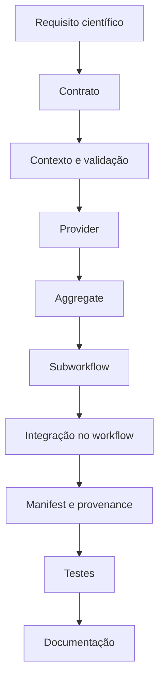

# Guia de desenvolvimento

Uma nova etapa começa pela decisão científica explícita e termina em uma
interface observável. Não comece pelo comando de uma ferramenta.

Nem toda API exige todos esses processos. Use somente as separações que
representam fronteiras reais de validação, provider, cache ou agregação.

## Contrato antes do provider

Defina identidade, entradas, outputs semânticos, estados e erros suportados.
Depois implemente um provider que obedeça a esse contrato. O workflow deve
conhecer a API; detalhes como STAR, Salmon, MACS3 ou DESeq2 permanecem no
dispatcher/provider.

Todo módulo novo segue o contrato comum descrito em
`docs/module_contracts.md`: tuples com `meta`, canais semânticos, reports,
versions e status; execution metadata e manifest quando exigidos pela API;
resources/labels, container/Conda e stub declarados conforme o módulo.

## Regras de composição

- associe records por IDs declarados, nunca por posição no canal;
- consumidores selecionam artefatos por papel e identidade no manifest;
- evite glob para descobrir inputs e não dependa da ordem de execução;
- mantenha parâmetros científicos explícitos e registráveis;
- não esconda filtros, cutoffs, controles ou políticas dentro do alinhador;
- preserve outputs específicos do provider apenas como artefatos adicionais;
- desenhe fronteiras de cache a partir dos inputs que realmente mudam;
- não execute `sbatch` ou `srun` dentro de módulos;
- em funcionalidades ausentes, use estado explícito como `not_implemented` em
  vez de produzir um substituto cientificamente diferente.

## Adicionando um provider

1. confirme que o contrato existente comporta o novo provider;
2. implemente o provider em `modules/local/` sem alterar consumidores;
3. conecte-o no dispatcher/subworkflow da API;
4. transforme outputs específicos nos papéis semânticos existentes;
5. produza versions, execution metadata, checksums suportados e manifest;
6. teste seleção, entradas inválidas, stub, output e cache;
7. atualize a especificação em `docs/` e esta Wiki somente onde o estado mudou.

Se o contrato não comportar o requisito, documente a incompatibilidade antes
de versioná-lo. Não expanda silenciosamente a semântica de uma API existente.

## Revisão mínima

Antes do commit, confira `git diff --check`, referências a scripts/paths,
parâmetros contra `nextflow_schema.json`, links de documentação e ausência de
alterações acidentais em `pipelines/*/legacy/`. Execute somente testes
proporcionais ao risco e registre runtimes indisponíveis em vez de baixar
ambientes pesados implicitamente.

Referências: [arquitetura](https://github.com/GMiguelAlves/HelixForge/blob/master/docs/architecture.md),
[contratos](https://github.com/GMiguelAlves/HelixForge/blob/master/docs/module_contracts.md),
[mapeamento de scripts](https://github.com/GMiguelAlves/HelixForge/blob/master/docs/script-mapping.md) e
[APIs e contratos](APIs-and-Contracts.md).
