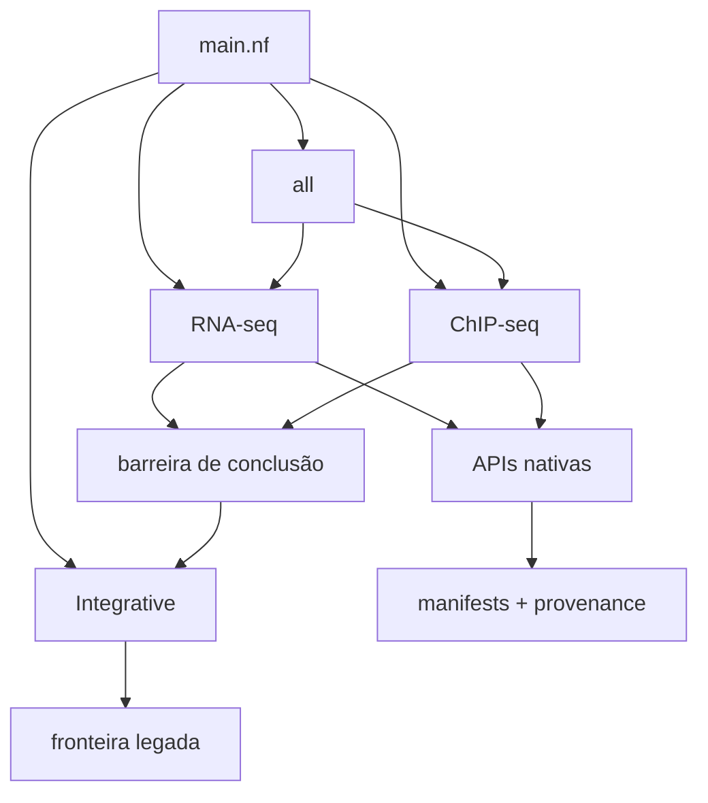

# HelixForge

HelixForge é um framework de workflows bioinformáticos baseado em Nextflow
DSL2. Ele organiza análises de RNA-seq, ChIP-seq e integração, preservando a
lógica científica e os formatos dos pipelines existentes enquanto componentes
legados são migrados gradualmente para processos nativos, reutilizáveis e
rastreáveis.

RNA-seq possui camadas nativas de QC, alinhamento, quantificação, importação e
expressão diferencial. ChIP-seq possui modos nativos desde QC e alinhamento até
processamento de BAM, picos, QC de picos, consenso, binding diferencial,
anotação, tracks e relatório. O workflow Integrative e algumas fronteiras de
compatibilidade ainda utilizam o legado.

> A arquitetura está consolidada, mas a equivalência científica completa entre
> os caminhos nativo e legado ainda depende do plano de validação final. Esta
> Wiki não classifica o projeto como cientificamente validado ou pronto para
> produção/publicação.

## Visão do sistema

No modo `all`, RNA-seq e ChIP-seq iniciam de forma independente. Seus canais de
conclusão sincronizam o início do Integrative; eles ainda não constituem uma
API semântica conjunta de artefatos.

## Por onde começar

- [Primeiros passos](Getting-Started.md): instalação, configuração e primeiro comando.
- [Arquitetura](Architecture-Overview.md): workflows, subworkflows, APIs e providers.
- [Modos de workflow](Workflow-Modes.md): o que cada modo realmente executa.
- [RNA-seq](RNA-seq.md) e [ChIP-seq](ChIP-seq.md): DAGs e camadas implementadas.
- [Execução](Execution.md): local, containers, Conda e Slurm.
- [Desenvolvimento](Development-Guide.md): como estender a implementação sem quebrar contratos.
- [Migração e legado](Migration-and-Legacy.md): limites atuais e fallbacks.

Referências técnicas: [arquitetura](https://github.com/GMiguelAlves/HelixForge/blob/master/docs/architecture.md),
[contrato de módulos](https://github.com/GMiguelAlves/HelixForge/blob/master/docs/module_contracts.md) e
[plano de validação final](https://github.com/GMiguelAlves/HelixForge/blob/master/docs/final-validation-plan.md).
