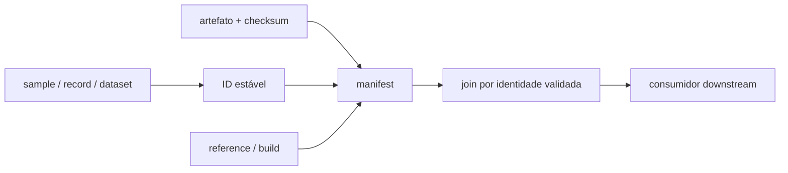
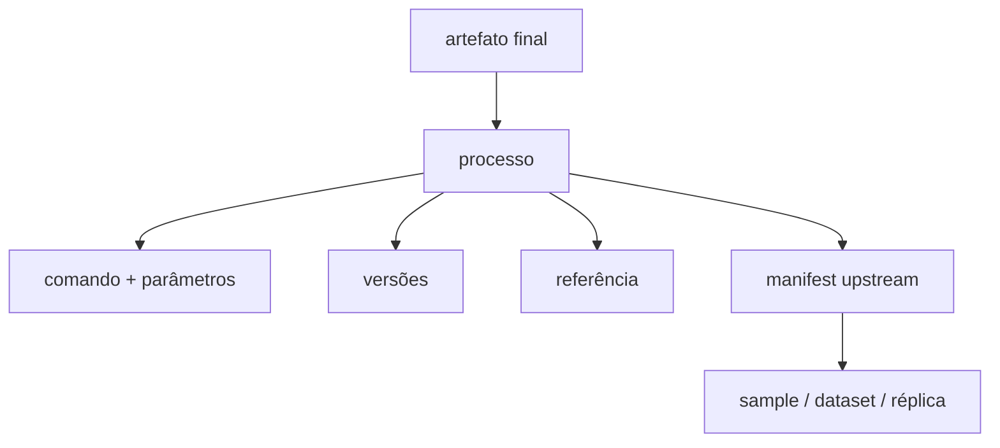

# Manifests e provenance

## Por que usar manifests

Um caminho informa onde um arquivo está; um manifest informa o que ele é, a
qual entidade pertence, seu estado e como pode ser relacionado a outros
artefatos. Isso permite que consumidores selecionem entradas por identidade,
sem depender de glob, posição no canal, ordem de execução ou convenções de
diretório.

O envelope comum exige `schema_version`, `type`, `id` e `status`. Campos de
domínio incluem, quando produzidos pela etapa: `sample_id`, `record_id`,
`dataset`, `condition`, `target`, controle, réplicas, `genome_id`, `build`,
parâmetros, artefatos e checksums.

Exemplo reduzido, baseado no manifest de alinhamento existente:

```json
{
  "schema_version": "1.1",
  "type": "alignment",
  "id": "dataset.record.alignment",
  "status": "complete",
  "aligner": "bowtie2",
  "dataset": "dataset",
  "sample_id": "sample_1",
  "record_id": "record_1",
  "artifacts": {
    "bam": {"path": "record_1.bam", "sha256": "..."},
    "bai": {"path": "record_1.bam.bai", "sha256": "..."}
  },
  "reference_sha256": "...",
  "index_sha256": "..."
}
```

Nem todo tipo possui todos os campos. Ausência de um valor científico não deve
ser convertida em zero. Papéis indisponíveis podem declarar `available: false`;
IDR usa `not_implemented` enquanto não há provider estatístico.

## Associação segura



No ChIP-seq, controles e réplicas são associados por IDs explícitos. Índices
Bowtie2 são associados aos records por chave de referência. Annotation, tracks
e report recebem inventários com manifests, em vez de buscar diretórios.

## Como um artefato foi produzido?

Provenance é distribuída entre manifest, `versions.yml`, execution metadata,
logs/command e relatórios de checksum. Conforme o módulo, ela pode registrar:

- ferramenta/provider e versão;
- comando e parâmetros;
- CPUs, memória, tempo solicitado e duração observada;
- checksums de reads, BAM, referência, anotação, índice e outputs;
- identidade de sample, record, dataset, condição, target e réplica;
- manifest upstream e seu checksum.



A cadeia de BAM ChIP-seq registra checksums de manifests desde alinhamento,
seleção, duplicatas e blacklist até o final BAM. Outras APIs registram os
checksums relevantes em seus próprios contratos. A cobertura não é uniforme em
todos os componentes legados; consulte o manifest e a especificação do módulo,
sem presumir campos não emitidos.

Referências: [schema comum](https://github.com/GMiguelAlves/HelixForge/blob/master/schemas/manifest-v1.schema.json),
[exemplo](https://github.com/GMiguelAlves/HelixForge/blob/master/assets/manifests/manifest.example.json) e
[auditoria arquitetural](https://github.com/GMiguelAlves/HelixForge/blob/master/docs/architecture-consolidation-audit.md).
