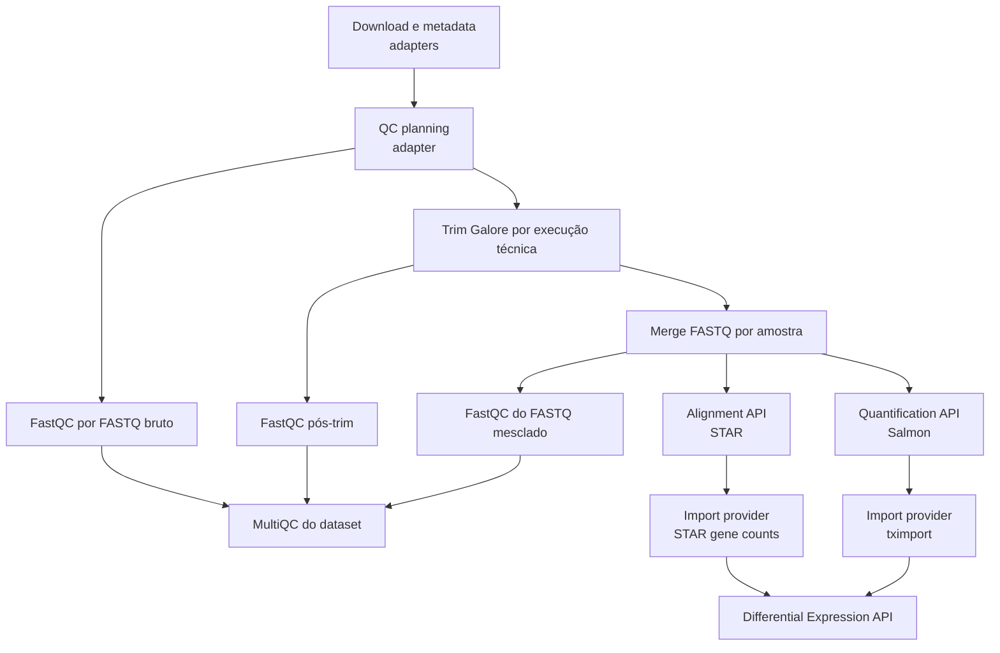
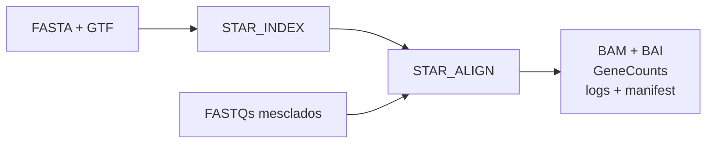

# RNA-seq

O workflow RNA-seq combina adapters de compatibilidade nas fronteiras de
entrada com APIs nativas para QC, alinhamento, quantificação, importação e
expressão diferencial. A seleção do estágio é feita por
`--rnaseq_run_mode`; consulte [Modos de workflow](Workflow-Modes.md).

> O estado "nativo" descreve a implementação e a interface. Não constitui,
> por si só, equivalência científica completa com o pipeline legado. A
> validação pendente está registrada no
> [plano final](https://github.com/GMiguelAlves/HelixForge/blob/master/docs/final-validation-plan.md).

## Fluxo atual

FastQC bruto e Trim Galore podem ser agendados de forma independente depois do
planejamento. STAR e Salmon também não possuem dependência artificial entre
si. Quando ambos são executados, a Import API usa o método autoritativo
selecionado na configuração.

## Quality Control API

- `FASTQC` cria uma tarefa por FASTQ e é reutilizado pelo ChIP-seq.
- `TRIM_GALORE` preserva os nomes, parâmetros científicos e relatórios
  definidos pelo plano de compatibilidade.
- `MERGE_FASTQ` concatena, em ordem determinística de execução técnica, os
  membros gzip pertencentes à mesma amostra. Não descomprime nem renomeia o
  produto esperado pelo legado.
- `MULTIQC` recebe um conjunto genérico de resultados compatíveis; não conhece
  conceitos exclusivos de RNA-seq.

Download, preparação de metadata e planejamento ainda são adapters. O QC
legado completo permanece acessível por `--rnaseq_native_qc false`.

## Alignment API: STAR

O dispatcher genérico separa índice e alinhamento:

O índice é compartilhável e possui sua própria fronteira de cache. O provider
STAR emite o BAM ordenado por coordenada, índice, contagens gênicas, logs,
estatísticas, versões, metadata de execução e manifest. O modo `alignment`
exige que esse provider nativo esteja habilitado.

## Quantification API: Salmon

`SALMON_INDEX` e `SALMON_QUANT` são processos independentes. O primeiro
consome o transcriptoma; o segundo consome o índice e os FASTQs paired-end.
A configuração atual expõe `salmon_lib_type=A` e
`salmon_validate_mappings=true`, preservando-os na provenance.

Os artefatos incluem `quant.sf`, `cmd_info.json`,
`lib_format_counts.json`, `aux_info/`, logs, estatísticas, versões, metadata de
execução e manifest. A imagem e o ambiente fixam Salmon 1.10.3. Alterar reads
não reconstrói o índice; alterar o transcriptoma invalida a fronteira de índice.

## Import API

A camada de importação impede que análises downstream procurem arquivos em
diretórios específicos de STAR ou Salmon.

| Provider | Entrada específica | Representação comum |
|---|---|---|
| Salmon | manifest de quantificação, `tx2gene` e sample table | counts, abundance, lengths quando disponíveis, metadata e manifest |
| STAR | manifest de alinhamento e GeneCounts | counts, abundance CPM, metadata e manifest |

Para Salmon, `TX2GENE_BUILD` permanece separado de `TXIMPORT`. A estratégia
preserva `ignoreTxVersion=TRUE`, `ignoreAfterBar=TRUE` e o
`countsFromAbundance` declarado. Para STAR, `STAR_IMPORT` transforma
GeneCounts diretamente. A Import API não aceita FASTQ, BAM ou caminhos
reconstruídos como interface pública.

## Differential Expression API

O caminho nativo é composto por `DE_PREFLIGHT`, `DESEQ2_MODEL`, uma tarefa
`DESEQ2_CONTRAST` por contraste explícito e `DE_AGGREGATE`.

- a fórmula é aditiva, explícita e ordenada;
- contrasts não são inventados pelo workflow;
- somente o teste Wald está implementado;
- interações e LRT não são suportados na API 1.0;
- IDs de amostras, níveis, réplicas, valores e posto da matriz do modelo são
  verificados antes do ajuste;
- modelo e contrasts são fronteiras de cache separadas.

O fallback `--rnaseq_native_de false` ainda chama o DEG legado e pode possuir
comportamentos implícitos que não fazem parte do contrato nativo. Batch
correction e relatório RNA continuam nas fronteiras legadas documentadas.

## Contratos e referência técnica

- [Alignment API](https://github.com/GMiguelAlves/HelixForge/blob/master/docs/alignment_api.md)
- [Quantification API](https://github.com/GMiguelAlves/HelixForge/blob/master/docs/quantification_api.md)
- [Import API](https://github.com/GMiguelAlves/HelixForge/blob/master/docs/import_api.md)
- [Differential Expression API](https://github.com/GMiguelAlves/HelixForge/blob/master/docs/differential_expression_api.md)
- [Implementação RNA-seq nativa](https://github.com/GMiguelAlves/HelixForge/tree/master/subworkflows/local/rnaseq)

Próximo: [ChIP-seq](ChIP-seq.md) · [Execução](Execution.md) ·
[Manifests e provenance](Manifests-and-Provenance.md)
